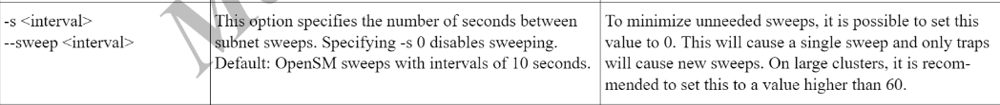
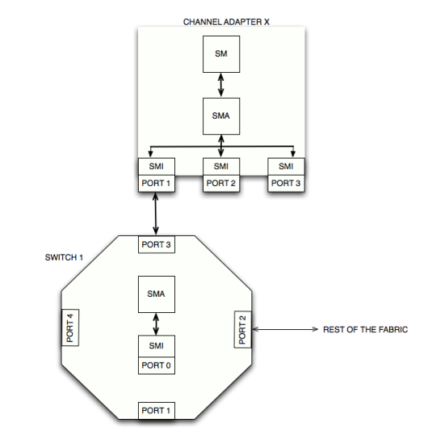
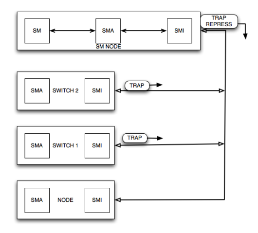

## opensm 简介

Opensm的默认设置是为了满足多达几百个节点的集群上的常见使用情况。因此，在这种默认模式下，opensm将`扫描IB fabric`，`初始化`它，并`偶尔扫描更改`。

`opensm连接到本地机器上的特定IB端口，并只配置与之连接的fabric`。(如果本地机器有其他IB端口，opensm将忽略连接到其他端口的fabric)。如果没有指定端口，opensm将选择第一个“最佳”可用端口。Opensm还可以显示可用的端口，并提示要附加的端口号。

默认情况下，opensm运行记录在两个文件中:/var/log/messages和/var/log/opensm.log。第一个文件将只记录一般的主要事件，而第二个文件将包括报告的错误的细节。第二个文件中报告的所有错误都应被视为IB子网健康问题的指示器。(注意，当出现致命且不可恢复的错误时，opensm将退出)。如果opensm能够正确地设置子网，那么两个日志文件都应该包含“SUBNET UP”消息。

> [QualityofServiceManagementinOpenSM](https://docs.mellanox.com/display/MLNXOFEDv461000/OpenSM#OpenSM-QualityofServiceManagementinOpenSM)
> **opensm** defaults were designed to meet the common case usage on clusters with up to a few hundred nodes. Thus, in this default mode, **opensm** will scan the IB fabric, initialize it, and `sweep occasionally for changes`.
>
> **opensm** attaches to a specific IB port on the local machine and configures only the fabric connected to it. (If the local machine has other IB ports, **opensm** will ignore the fabrics connected to those other ports). If no port is specified, **opensm** will select the first "best" available port. **opensm** can also present the available ports and prompt for a port number to attach to.
>
> By default, the **opensm** run is logged to two files: /var/log/messages and /var/log/ opensm.log. The first file will register only general major events, whereas the second file will include details of reported errors. All errors reported in this second file should be treated as indicators of IB fabric health issues. (Note that when a fatal and non-recoverable error occurs, **opensm** will exit). Both log files should include the message "SUBNET UP" if **opensm** was able to set up the subnet correctly.

### 拓扑扫描

**定时扫描**

 

默认 10s 一次，对于大集群，推荐设置大于60s的值

**信号**

当OpenSM接收到一个`SIGHUP信号`时，它会启动一个新的重扫描，就像收到了一个trap或者发现了一个拓扑变化一样。注意这里执行的是 heavy sweep。

另外，SIGUSR1还可以用于触发/var/log/opensm.log重新打开，用于logrotate目的。

**发生拓扑变化时**

opensm会定期轻扫整个网络拓扑，若发现变化，也会触发 heavy sweep，即重新扫描整个网络，并进行初始化。

### 初始化ib网络

#### 相关概念

**SM**：子网管理器，它进行网络发现，并对子网进行拓扑监控和管理，它将所有的拓扑数据存储在SMDB中。 OpenSM是其中的一个实现。

**SMA**：子网管理适配器，SMA驻留在填充子网的每个设备上，不管它是CA、路由器还是交换机。它监控和它关联的所有设备状态并在状态发生变化时使用SMP向SM汇报。SM和SMA之间的所有通信都采用SMP的形式通过管理专有虚拟通道(VL15)进行通讯，以免干扰正在进行的群集通讯。（SMA运行在内核中）

**SMI**：子网管理接口，它定制了SM和SMA通讯的标准。

**SMP**：子网控制数据包 control packets，SM 和 SMA 进行交互的专用报文。

#### 初始化步骤

1. `绑定`：OpenSM连接到本地机器上的特定IB端口，并只配置与之连接的fabric
2. `扫描`：发送 SMP 报文给所有的端口，然后处理回复消息。这将发现子网中的所有节点和交换机。
3. `lid指派`：为每个端口分配唯一的lid.(每次由于在拓扑中检测到的一些更改而导致大量扫描发生时，所有的lid都会被重新配置)
4. `计算路径`：计算所有源节点和目标节点之间的路径，这里有不同的算法进行计算，默认为[Min Hop](https://docs.mellanox.com/display/MLNXOFEDv461000/OpenSM#OpenSM-minhopalgorithmMinHopAlgorithm)，此算法选择跳数最少的那个。（可使用提供的选项选择其它算法）
5. `配置转发表`：此步骤配置每个交换机上的转发表。**注意，在更新转发表时，网络处于不稳定状态，可能导致正在传输的数据包之间发生死锁。因此，在此阶段通常不允许传输任何数据包。**
6. `监控`：设置子网为 ACTIVE 状态，SM定期监视子网的变化。

### 错误检查

在一个巨大的子网中，节点故障、交换机故障或端口故障是主要组成部分。在配置子网或子网进入ACTIVE状态后，会启动周期性光照扫描，以检查拓扑是否有任何变化。另一方面SMAs也会保持监控各自设备的任何状态变化。当被SMA检查到错误时，它通过一个`SubnTrap消息`通知SM这个事件的细节，主要包含 设备类型(switch/node), 设备 LID, trap number 和 说明信息。

在 trap number 字段中，主要包含两个重要的编号，128 和 144.

* 128 是SMA检测到至少一个端口的链路状态发生变化产生
* 144 是检测到SM运行的设备/端口发生变化时产生

#### 流程：

1. 端口异常
2. SMA检查到异常，发送 TRAP 信息
3. SM 接收 到 TRAP 信息，回复 TRAP REPRESS 说明 TRAP 已被接收
4. SM 判断 TRAP 信息，若 trap number 是 128 和 144 ，触发 heavy_sweep