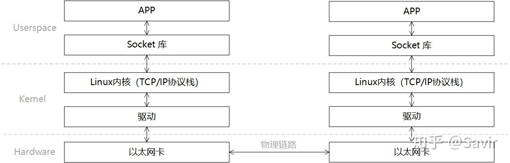
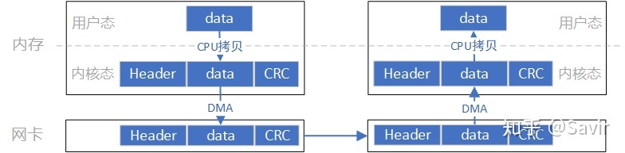
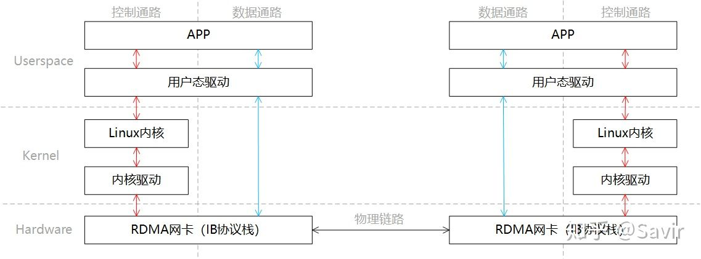
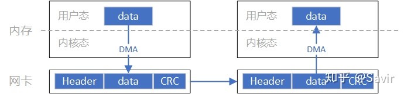

本篇的目的是通过对比一次典型的Socket和RDMA通信，直观的展示RDMA技术相比传统以太网的优势，尽量不涉及协议和软件实现细节。

假设本端的某个应用想把自己内存中的数据复制到对端某个应用可以访问的内存中（或者通俗的讲，本端要给对端发送数据），我们来看一下Socket和RDMA的SEND-RECV语义都做了哪些操作。

## Socket

在描述通信过程时的软硬件关系时，我们通常将模型划分为用户层Userspace，内核Kernel以及硬件Hardware。Userspace和Kernel实际上使用的是同一块物理内存，但是处于安全考虑，Linux将内存划分为用户空间和内核空间。用户层没有权限访问和修改内核空间的内存内容，只能通过系统调用陷入内核态，Linux的内存管理机制比较复杂，本文不展开讨论。

一次典型的Socket通信过程的可以如下图所示进行分层：

一次收-发过程的步骤如下：

1. 发送端和接收端通过Socket库提供的接口建立链接（就是在两个节点间建立了一条逻辑上的道路，数据可以沿这条道路从一端发送到另一端）并分别在内存中申请好发送和接收Buffer。
2. 发送端APP通过Socket接口陷入内核态，待发送数据经过TCP/IP协议栈的一层层封装，最后被CPU复制到Socket Buffer中。
3. 发送端通过网卡驱动，告知网卡可以发送数据了，网卡将通过DMA从Buffer中复制封装好的数据包到内部缓存中，然后将其发送到物理链路。
4. 接收端网卡收到数据包后，将数据包放到接收Buffer中，然后CPU将通过内核中的TCP/IP协议栈对报文进行层层解析，取出有效的数据。
5. 接收端APP通过Socket接口陷入内核态，CPU将数据从内核空间复制到用户空间。

Socket模型的数据流向大致是像上图这个样子，数据首先需要从用户空间复制一份到内核空间，这一次复制由CPU完成，将数据块从用户空间复制到内核空间的Socket Buffer中。内核中软件TCP/IP协议栈给数据添加各层头部和校验信息。最后网卡会通过DMA从内存中复制数据，并通过物理链路发送给对端的网卡。

而对端是完全相反的过程：硬件将数据包DMA拷贝到内存中，然后CPU会对数据包进行逐层解析和校验，最后将数据复制到用户空间。

上述过程中的关键点是需要CPU参与的把数据从用户空间拷贝到内核空间，以及同样需要CPU全程参与的数据包组装和解析，数据量大的情况下，这将对CPU将造成很大的负担。

下面我们看一下RDMA是如何将CPU“解放”出来的。

## RDMA

同样是一端发送，一端接收的场景，我们将RDMA的分层模型分成两部分“控制通路”和“数据通路”，控制通路需要进入内核态准备通信所需的内存资源，而数据通路指的是实际数据交互过程中的流程。这一过程的分层关系如下图所示：

同Socket一样，我们简单描述下通信的过程：

1. 发送端和接收端分别通过控制通路陷入内核态创建好通信所需要的内存资源。
2. 在数据通路上，接收端APP通知硬件准备接收数据，告诉硬件将接收到的数据放在哪片内存中。
3. 在数据通路上，发送端APP通知硬件发送数据，告诉硬件待发送数据位于哪片内存中。
4. 发送端RDMA网卡从内存中搬移数据，组装报文发送给对端。
5. 对端收到报文，对其进行解析并通过DMA将有效载荷写入内存。然后以某种方式通知上层APP，告知其数据已接收并妥善存放到指定位置。

这一过程中的数据流向大致如上图所示。通过和Socket的对比，我们可以明显看到，**数据收发绕过了内核并且数据交换过程并不需要CPU参与，报文的组装和解析是由硬件完成的**。

通过上面的对比，我们可以明显的体会到RDMA的优势，既将CPU从数据包封装和解析中解放出来，又减少了CPU拷贝数据的功率和时间损耗。需要注意的是，本文只描述了SEND-RECV流程，而RDMA技术所独有的，效率更高的WRITE/READ语义将在后续文章中介绍。