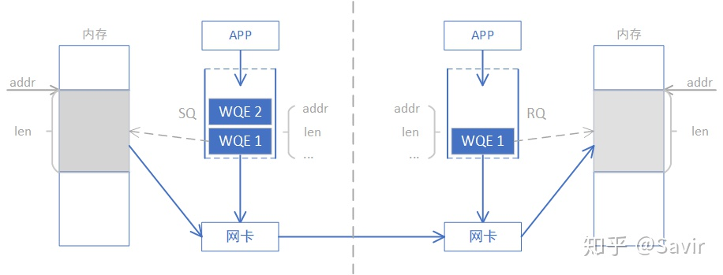
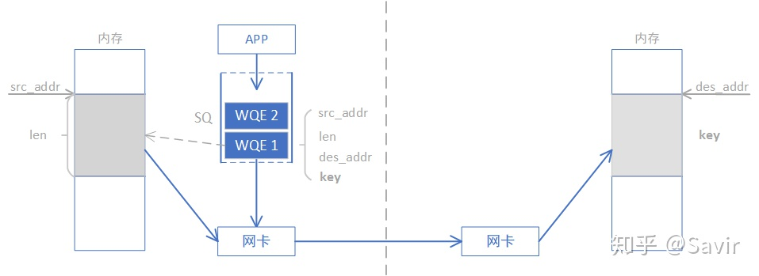
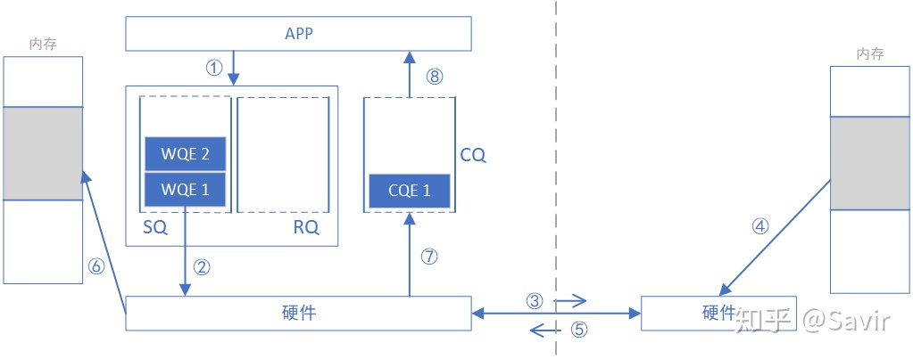

前面几篇涉及RDMA的通信流程时一直在讲SEND-RECV，然而它其实称不上是“**RDMA**”，只是一种加入了0拷贝和协议栈卸载的传统收发模型的“升级版”，这种操作类型没有完全发挥RDMA技术全部实力，常用于两端交换控制信息等场景。当涉及大量数据的收发时，更多使用的是两种RDMA独有的操作：WRITE和READ。

我们先来复习下双端操作——SEND和RECV，然后再对比介绍单端操作——WRITE和READ。

## SEND & RECV

SEND和RECV是两种不同的操作类型，但是因为如果一端进行SEND操作，对端必须进行RECV操作，所以通常都把他们放到一起描述。

为什么称之为“双端操作”？因为**完成一次通信过程需要两端CPU的参与**，并且收端需要提前显式的下发WQE。下图是一次SEND-RECV操作的过程示意图。原图来自于[1]，我做了一些修改。

上一篇我们讲过，上层应用通过WQE（WR）来给硬件下任务。在SEND-RECV操作中，不止发送端需要下发WQE，接收端也需要下发WQE来告诉硬件收到的数据需要放到哪个地址。发送端并不知道发送的数据会放到哪里，每次发送数据，接收端都要提前准备好接收Buffer，而接收端CPU自然会感知这一过程。

为了下文对比SEND/RECV与WRITE/READ的异同，我们将上一篇的SEND-RECV流程中补充内存读写这一环节，即下图中的步骤⑤——发送端硬件根据WQE从内存中取出数据封装成可在链路上传输数据包和步骤⑦——接收端硬件将数据包解析后根据WQE将数据放到指定内存区域，其他步骤不再赘述。另外再次强调一下，收发端的步骤未必是图中这个顺序，比如步骤⑧⑪⑫和步骤⑨⑩的先后顺序就是不一定的。

下面将介绍WRITE操作，对比之后相信大家可以理解的更好。

## WRITE

WRITE全称是RDMA WRITE操作，是本端主动写入远端内存的行为，除了准备阶段，远端CPU不需要参与，也不感知何时有数据写入、数据在何时接收完毕。所以这是一种单端操作。

通过下图我们对比一下WRITE和SEND-RECV操作的差异，本端在准备阶段通过数据交互，获取了对端某一片可用的内存的**地址**和“**钥匙**”，相当于获得了这片远端内存的读写权限。拿到权限之后，本端就可以像访问自己的内存一样**直接对这一远端内存区域进行读写**，这也是RDMA——远程直接地址访问的内涵所在。

WRITE/READ操作中的目的地址和钥匙是如何获取的呢？通常可以通过我们刚刚讲过的SEND-RECV操作来完成，因为拿到钥匙这个过程总归是要由远端内存的控制者——CPU允许的。虽然准备工作还比较复杂， 但是一旦完成准备工作，RDMA就可以发挥其优势，对大量数据进行读写。一旦远端的CPU把内存授权给本端使用，它便不再会参与数据收发的过程，这就解放了远端CPU，也降低了通信的时延。

需要注意的是，本端是通过**虚拟地址**来读写远端内存的，上层应用可以非常方便的对其进行操作。实际的虚拟地址—物理地址的转换是由RDMA网卡完成的。具体是如何转换的，将在后面的文章介绍。

忽略准备阶段key和addr的获取过程，下面我们描述一次WRITE操作的流程，此后我们不再将本端称为“发送”和“接收”端，而是改为“请求”和“响应”端，这样对于描述WRITE和READ操作都更恰当一些，也不容易产生歧义。

1. 请求端APP以WQE（WR）的形式下发一次WRITE任务。
2. 请求端硬件从SQ中取出WQE，解析信息。
3. 请求端网卡根据WQE中的虚拟地址，转换得到物理地址，然后从内存中拿到待发送数据，组装数据包。
4. 请求端网卡将数据包通过物理链路发送给响应端网卡。
5. 响应端收到数据包，解析目的虚拟地址，转换成本地物理地址，解析数据，将数据放置到指定内存区域。
6. 响应端回复ACK报文给请求端。
7. 请求端网卡收到ACK后，生成CQE，放置到CQ中。
8. 请求端APP取得任务完成信息。

## READ

顾名思义，READ跟WRITE是相反的过程，是本端主动读取远端内存的行为。同WRITE一样，远端CPU不需要参与，也不感知数据在内存中被读取的过程。

获取key和虚拟地址的流程也跟WRITE没有区别，需要注意的是**“读”这个动作所请求的数据，是在对端回复的报文中携带的**。

下面描述一次READ操作的流程，注意跟WRITE只是方向和步骤顺序的差别。

1. 请求端APP以WQE的形式下发一次READ任务。
2. 请求端网卡从SQ中取出WQE，解析信息。
3. 请求端网卡将READ请求包通过物理链路发送给响应端网卡。
4. 响应端收到数据包，解析目的虚拟地址，转换成本地物理地址，解析数据，从指定内存区域取出数据。
5. 响应端硬件将数据组装成回复数据包发送到物理链路。
6. 请求端硬件收到数据包，解析提取出数据后放到READ WQE指定的内存区域中。
7. 请求端网卡生成CQE，放置到CQ中。
8. 请求端APP取得任务完成信息。

### 总结

我们忽略各种细节进行抽象，RDMA WRITE和READ操作就是在利用网卡完成下面左图的内存拷贝操作而已，只不过复制的过程是由RDMA网卡通过网络链路完成的；而本地内存拷贝则如下面右图所示由CPU通过总线完成的：

RDMA标准定义上述几种操作的时候使用的单词是非常贴切的，“收”和“发”是需要有对端主动参与的语义 ，而‘读“和”写“更像是本端对一个没有主动性的对端进行操作的语义。

通过对比SEND/RECV和WRITE/READ操作，我们可以发现传输数据时不需要响应端CPU参与的WRITE/READ有更大的优势，缺点就是请求端需要在准备阶段获得响应端的一段内存的读写权限。但是实际数据传输时，这个准备阶段的功率和时间损耗都是可以忽略不计的，所以RDMA WRITE/READ才是大量传输数据时所应用的操作类型，SEND/RECV通常只是用来传输一些控制信息。

除了本文介绍的几种操作之外，还有ATOMIC等更复杂一些的操作类型，将在后面的协议解读部分详细分析。

## 参考资料

[1] part1-OFA_Training_Sept_2016.pdf