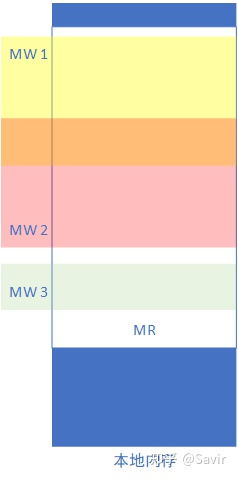
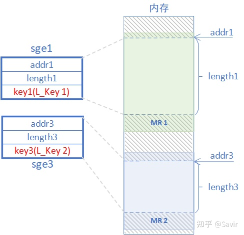
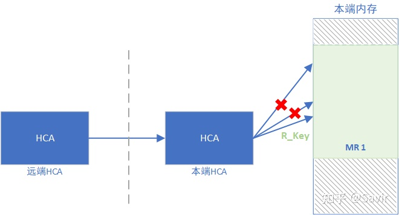
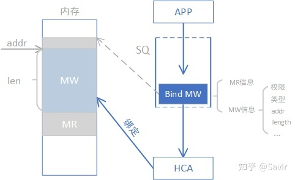
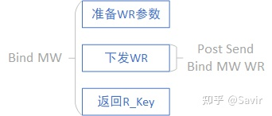
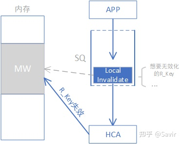
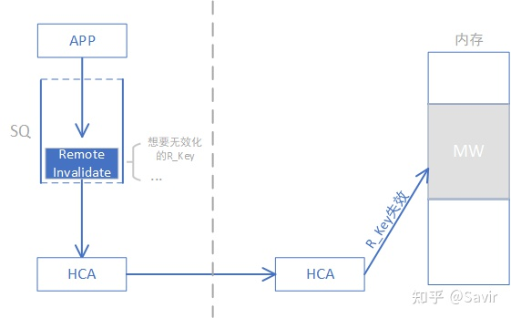

我们在[Memory Region](https://zhuanlan.zhihu.com/p/156975042)一文中介绍过Memory Region，它是一片由用户注册的特殊的内存区域：一方面其中的内容不会被换页到硬盘中，另一方面RDMA网卡中记录了它的地址转换关系，使得硬件拿到用户指定在WR中的虚拟地址之后找到对应的物理地址。

本文我们来讲解Memory Window的概念，它是一种基于Memory Region的、更灵活的内存管理单元。除了MW的概念之外，本文也会更详细的介绍一些RDMA领域的内存相关概念，比如L_Key/R_Key等。本文配合[Memory Region](https://zhuanlan.zhihu.com/p/156975042)阅读效果更佳，建议先读者温习一下。

## **Memory Window是什么**

Memory Window简称MW，中文就翻译成内存窗口吧。是一种由用户申请的，用于让远端节点访问本端内存区域的RDMA资源。每个MW都会绑定（称为bind）在一个已经注册的MR上，但是它相比于MR可以提供更灵活的权限控制。MW可以粗略理解为是MR的子集，一个MR上可以划分出很多MW，每个MW都可以设置自己的权限。MW和MR的关系如下图所示：

MR与MW的关系

## 内存的访问权限控制

为了后文说明为何设计MW，我们先来把MR和MW都涉及的权限控制讲解一下。

## MR/MW的权限配置

这里的权限，指的是本端/对端节点，对于本端内存的读/写权限，它们两两组合形成了四种权限：

|      | 本端        | 对端         |
| ---- | ----------- | ------------ |
| 读   | Local Read  | Remote Read  |
| 写   | Local Write | Remote Write |

除了这四种权限之外，还有Atomic权限等，不在本文讨论范围内。

上表中这四种权限中最低的是本地读（Local Read），是用户必须赋予MR/MW的权限，因为如果一块内存本地的用户都无法访问的话，那就失去意义了；另外还有个限制，如果某个MR需要配置远端写（Remote Write）或者还没介绍的远端原子操作权限（Remote Atomic），那么也一定要配置本地写（Local Write）权限。在此约束之下，每个MR或者MW都可以按需配置权限，比如我们注册的一个MR需要允许远端节点写入数据，而不允许读，那么我们就打开Remote Write权限，关闭Remote Read权限。这样HCA（网卡）收到对端发起的对这个MR范围内的某个地址的WRITE请求之后，就可以予以放行；而HCA收到对端对这个MR的READ操作时，就会拒绝这个请求，并返回错误信息给对端。

## Memory Key

上述的访问权限配置，并不能杜绝恶意用户对于本地或者远端内存的访问。比如某个节点给了一块内存区域的Remote Write权限，那么岂不是任意远端节点（进程）只要传入了合法的地址信息，都可以对这片区域进行写入了？因此，IB规范设计了Memory Key，简单理解它就是访问MR的钥匙机制，只有持有正确的钥匙，才能打开MR/MW的大门。

Key是一串数字，由两部分组成：24bit的Index以及8bit的Key：

L_Key/R_Key的组成

其中，Index用于HCA快速索引到本地的虚拟-物理地址转换表等MR相关的信息，而Key用于校验整个字段的合法性，以防止未授权的用户任意传递Index。

Memory Key按照用途分为两种，Local Key和Remote Key：

### L_Key

即Local Key，关联到一个MR上，用于HCA访问本端内存。当本端的某个进程试图使用一个已经注册的MR的内存时，HCA会校验其传递的L_Key。并且利用L_Key中的索引查找地址转换表，把虚拟地址翻译成物理地址然后访问内存。

我们在[SRQ](https://zhuanlan.zhihu.com/p/279904125)一文中描述过sge，sge由起始地址、长度和秘钥组成。用户在填写WR时，如果需要HCA访问本端内存，那么就需要通过一个sge的链表（sgl）来描述内存块，这里sge的秘钥填的就是L_Key，也就是下图中的key1和key3，他们分别是MR1的L_Key和MR2的L_Key。如果没有L_Key，那么任何一个本地用户进程都可以指挥硬件访问其他本地用户注册的MR的内容，硬件也难以高效的将虚拟地址翻译成物理地址。

L_Key的作用

### R_Key

即Remote Key，关联到一个MR或者MW上，用于远端节点访问本端内存。当远端节点试图访问本端的内存时，一方面本端的HCA会校验R_Key是否合法，另一方面会利用R_Key中的索引查地址转换表，把虚拟地址翻译成物理地址然后访问内存。

凡是RDMA操作（即Write/Read/Atomic），用户都要在WR中携带远端内存区域的R_Key。

R_Key的作用

IB规范通过上述两种机制，来确保MR可以按照用户的期望被正确且安全的访问。我们用一个比喻来总结下MR/MW权限控制相关的内容：

A给自己的房间（MR）配了两把钥匙（Memory Key），一把留作自用（L_Key），另一把钥匙（R_Key）邮寄（可以是任何通信方式）给了B。B可以在A不在家的时候（本端CPU不感知远端节点对本地内存的RDMA操作），通过钥匙（R_Key）打开门。打开门之后，可能B只能隔着玻璃查看房间的摆设（A只给了这个MR远程读权限），或者进入房间内发现漆黑一片什么也看不到，但是可以向房间里放物品（A只给了这个MR远程写权限），当然也有可能没有玻璃也开了灯（同时给了远程读写权限）。

## **为什么要有MW**

简而言之，设计MW的目的就是想更灵活的控制内存的远程访问权限。

[Memory Region](https://zhuanlan.zhihu.com/p/156975042)一文中我们介绍过用户注册MR的过程，需要从用户态陷入内核态，调用内核提供的函数pin住内存（防止换页），然后制作虚拟-物理地址映射表并下发给硬件。

因为MR是由内核管理的，如果用户想修改一个已经存在的MR的信息，比如我想收回某个MR的远端写权限，只保留远端读权限；或者想要使一个之前已经授权给远端节点的R_Key失效，那么用户需要通过重注册MR（Reregister MR）接口来进行修改，该接口等价于先取消注册MR（Deregister MR），然后注册MR（Register MR）。**上述流程需要陷入内核态来完成，而这个过程是耗时较长的**。

不同于需要通过控制路径修改权限的MR**，MW在创建好之后，可以通过数据路径（即通过用户态直接下发WR到硬件的方式）动态的绑定到一个已经注册的MR上，并同时设置或者更改其访问权限，这个过程的速度远远超过重新注册MR的过程。**

那么现在为了使一片内存能够被远端节点进行RDMA WRITE/READ操作，我们就拥有了注册MR以及注册MW然后绑定到一个已注册的MR两种方式，它们都会产生一个R_Key来提供给远端节点。前一种方式准备阶段的步骤简单，但是不够灵活，一旦注册之后修改起来会比较麻烦；后一种方式相比前一种多了注册MW和绑定MW到MR两种操作，但是可以方便迅速的控制远端访问权限。

## MW和MR权限的关系

也许有的读者会想到，MR申请时配置了自己的权限，MW绑定到MR时也会配置自己的权限，这两者的权限是什么关系呢？IB规范在10.6.7.2.2节有专门介绍：

> When binding a Memory Window, a Consumer can request any combination of remote access rights for the Window. However, if the associated Region does not have local write access enabled and the Consumer requests remote write or remote atomic access for the Window, the Channel Interface must return an error either at bind time or access time.

总结来说，**如果想要给MW配置远程写或者远程原子操作（Atomic）权限，那么它绑定到的MR必须有本地写权限，其他情况下两者权限互不干扰**：远端用户用MW，就要遵循MW的权限配置；远端用户用MR，就要遵循MR的权限配置。

## 用户接口

老样子，用户接口时我们按照控制路径和数据路径来分类：

## 控制路径

MW支持增、删和查，不能直接修改：

### 创建——Allocate MW

申请MW，主要是创建MW相关的软件结构和让硬件做好准备，用户需要指定后文中介绍的MW的类型。这个接口会产生一个Memory Window的句柄，用户以后可以用这个句柄指代这个MW。

注意此时MW没有绑定到MR上，处于不可从远端访问的状态。

### 删除——Deallocate MW

取消注册MW。很好理解，就是销毁相关资源。

### 查询——Query MW

查询MW的信息，包括R_Key及其状态、MW类型以及PD等。

需要再次强调的是，虽然这个Verbs在IB规范中有描述，但是并没有在RDMA软件栈中实现相关的API。类似情况的Verbs接口还有不少，RDMA软件栈以实用为原则，没有用户需求的接口一般都没有实现。

## 数据路径

MW在数据路径有一套独特的接口，分为Bind和Invalidate两类：

### 绑定——Bind

Bind(ing)意为“绑定”，指的是将一个MW“关联”到一个已经注册的MR的指定范围上，并配置一定的读写权限。绑定的结果会产生一个R_key，用户可以把这个R_Key传递给远端节点用于远程访问。注意一个MW可以被多次绑定，一个MR上也可以绑定多个MW。如果一个MR还有被绑定的MW，那么这个MR是不能被取消注册的。

Bind的软硬件交互

Bind有两种方式，一种是调用Post Send接口下发Bind MW WR，一种是调用Bind MW接口。

- Post Send Bind MW WR

前文我们讲过，相比于MR，MW最大的优势就是可以从数据路径快速的配置权限。Post Send Bind MW WR操作，指的就是用户通过post send接口（比如ibv_post_send()）下发一个WR到SQ中，这个WR的操作类型（比如SEND/RDMA WRITE/RDMA READ）被指定为BIND MW，此外WR中还携带有权限和要绑定到的MR的范围信息。与其他WR不同，下发Bind MW的WR之后，硬件并不会发送任何数据包，而是将MW绑定到了指定MR上。

这种方式仅适用于后文介绍的Type 2的MW。

- Bind MW

虽然这是一个独立的接口，但是实际是在Post Send Bind MW WR外面又封装了一层。用户传入MW绑定的相关信息，包括权限及要绑定的MR的信息，驱动程序负责组装和下发WR到硬件中。该接口成功后，会将新生成的R_Key返回给用户。

这种方式仅适用于后文介绍的Type 1的MW。

上述两种操作的关系是这样的：

两种Bind操作的关系

### 无效化——Invalidate

Invalidate意为无效化，指的是用户通过下发一个带有Invalidate操作码的WR到硬件而使一个R_Key无效的操作。

**需要强调的是，Invalidate操作的对象是R_Key而不是MW本身，即Invalidate之后的效果是：远端用户无法再使用这个R_Key访问对应的MW，而MW资源仍然存在，以后仍然可以生成新的R_Key给远端使用。**

Invalidate操作只能用于下文介绍的Type 2的MW。

按照Invalidate操作的发起方不同，又可以进一步分成两种：

- Local Invalidate

本地无效操作。上层用户如果想在不回收MW资源的情况下，收回某个远端的用户的R_Key的权限。那么就可以下发一个Local Invalidate操作到SQ中，硬件收到之后会对相应的MR的配置进行修改。成功执行之后，如果持有这个R_Key的远端用户想要对MW进行RDMA操作，将会被本地的硬件拒绝并返回错误。

因为是本地操作，所以硬件收到这个WR之后也不会发送消息到链路上。

Local Invalidate操作的软硬件交互

- Remote Invalidate

远端无效操作。当一个远端用户不再使用一个R_Key之后，可以主动发送消息，让本端回收这个R_Key。远端用户下发一个带有此操作码的WR到SQ中，其硬件收到后，将会组装一个报文并发送到本端。本端硬件收到远端的Remote Invalidate操作之后，将会把对应的R_Key置为不可用状态。同Local Invalidate一样，此后对端将无法使用这个R_Key对对应的MW进行RDMA操作。

Remote Invalidate操作的软硬件交互

Invalidate操作也可以用在一些特殊的MR类型身上（并非常规用户通过ibv_reg_mr()注册的MR），但超出了本文讨论范围，暂且不表。

## MW的类型

根据实现和应用场景的不同，IB规范对MW进行了分类：

## Type 1

Type 1的MW通过PD和一个QP关联，不会绑定到一个QP上，所以也不会影响销毁同一个PD下的QP。

Type 1的MW的R_Key的key域段由驱动和硬件掌握，这里“掌握”的意思是，由驱动和硬件分配key，而不是上层用户。这也是前文中说Type 1的MW不能被执行Invalidate操作的原因。如果Type 1 MW的用户想要使一个R_Key失效，那么重新通过Bind MW接口绑定一次这个MW，硬件或者驱动就回自动分配一个新的R_Key的key域段，原有的R_Key也就失效了。

此外，如果用户暂时想要使一个MW不再绑定到任何MR，但是又想保留相关的资源而不是销毁这个MW，那么可以通过调用Bind MW接口，并将MW长度设置为0来实现。

IB规范允许多个Type 1 MW绑定到同一个MR上，范围可以相互覆盖。

## Type 2

Type 2的MW赋予了用户更大的自由度，其R_Key的key域段由用户掌握，即用户想怎么分配就怎么分配。前文已经讲过，用户通过Post Send Bind MW WR操作来进行绑定，这个过程并不会返回R_Key。用户必须记住Allocate MW时的index，并且和其选择的8 bit key组成R_Key并发送给对端。

用户可以通过前文介绍过的Invalidate操作来使一个R_Key无效，如果想要分配一个新的R_Key到MW上，必须先通过Invalidate操作无效之前的R_Key。

与Type 1不同，Type 2的MW不支持0长度的绑定。

IB规范同样也允许多个Type 2绑定到同一个MR上，范围可以相互覆盖。

此外，根据绑定关系不同，Type 2还可以分为两种实现方式，它们的差异仅在于和QP的绑定关系上。

### Type 2A

通过QPN和一个QP关联，也就是说远端访问这个MW范围内的内存时候，除了R_Key之外，还必须指定正确的QPN。如果一个QP上还要绑定的Type 2A的MW，那么这个QP不可以被销毁。

### Type 2B

通过QPN和PD与一个QP关联，比Type 2A多了个PD的校验，即远端通过RDMA操作访问MW的内存时，除了QPN要正确之外，其指定的本端QP的PD要与绑定这个MW时的PD相同。另外，与Type 2A不同，QP如果还有Type 2B MW绑定关系时是可以被销毁的。

这里IB规范中原有的介绍就比较分散，我们来简单总结一下几种MW的异同：

|                        | Type 1                            | Type 2A                                              | Type 2B                                              |
| ---------------------- | --------------------------------- | ---------------------------------------------------- | ---------------------------------------------------- |
| 关联关系               | PD                                | QP                                                   | PD + QP                                              |
| R_Key的key域段归属     | 驱动+硬件                         | 用户                                                 | 用户                                                 |
| 绑定方式               | Bind MW 绑定后之前的R_Key自动失效 | Post Send Bind MW WR 绑定前需要先使之前的R_Key无效化 | Post Send Bind MW WR 绑定前需要先使之前的R_Key无效化 |
| 是否支持零长度         | 是                                | 否                                                   | 否                                                   |
| 是否支持Invalidate     | 否                                | 是                                                   | 是                                                   |
| 关联的QP是否可以被销毁 | -                                 | 否                                                   | 是                                                   |

此外，IB规范中对上述几种类型还有如下描述：HCA必须实现Type 1的MW，另外可以**仅**选择实现Type 2A和2B中的一种。Type 1和Type 2的MW可以同时关联到同一个MR上。因为我了解到的应用程序中使用MW的情况不多，所以具体在什么场景下应该使用哪种MW也说不出所以然来，如果读者有对这方面的了解欢迎一起交流。

好了，MW就讲到这里，到此为止RDMA技术中常见的资源就都介绍完了。

鉴于一般支持RDMA的设备都比较昂贵，下一篇我将介绍如何通过软件模拟设备的方式——即Soft-RoCE进行一些编程实验。

## IB规范相关章节

3.5.3 Memory Keys介绍

9.4.1.1 Invalidate操作

10.6.7 权限管理

11.2.10.9~12 相关Verbs介绍

## 参考文档

1. IB Specification Vol 1-Release-1.4
2. Linux Kernel Networking - Implementation and Theory. Chapter 13