我已经在基本概念篇里面跟大家对本领域的基本知识进行了科普，在对于基本的宏观概念有了认识之后，我们就可以开始更深入的研究RDMA的实现细节了。协议本身比较抽象，对着IB规范照本宣科估计大家也很难理解，最好的方式莫过于一边做一边学了。

但是支持RDMA的网卡都比较昂贵，拿Mellanox（现在是NVIDIA）来说，在其官网上最新一代支持Infiniband的网卡——[ConnectX-6](https://link.zhihu.com/?target=https%3A//store.mellanox.com/categories/infiniband/infiniband-vpi-adapters/connectx-6-vpi.html%23)最便宜的单端口型号也要795刀，这对于学生或者是不太富裕的大学实验室来说是一笔不小的开销。


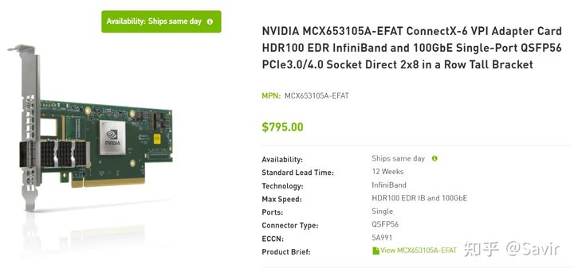


RDMA技术实际应用的话是得依赖网卡来完成大部分工作的，但是好在我们有Soft-RoCE。它通过软件代替硬件来将IB传输层的报文加在普通UDP报文中，从而得以让普通网卡也可以发送RoCE报文，这对于为我们学习IB传输层协议，以及编写调试基于Verbs的RDMA程序提供了一种非常低成本的方案。

本篇文章前半部分是讲解，后半部分是实验。首先我将介绍RoCE是什么、它的由来以及Soft-RoCE的实现原理，最后介绍如何**在只有一台没有IB网卡的PC的情况下搭建Soft-RoCE的实验环境，以后可以用来运行RDMA程序并通过抓包学习IB传输层协议**。

## RoCE是什么

我在“[RDMA概](https://zhuanlan.zhihu.com/p/138874738)述”一文中有简单介绍过RoCE，它是三大RDMA协议之一。RoCE全称是RDMA over Converged Ethernet，即基于融合以太网的RDMA。用通俗的话讲，就是基于传统以太网的部分下层协议，在其基础上实现Infiniband的部分上层协议。

RoCE本身分为两个版本，我们先简单讲一下发展历史：

1999年，由Compaq, Dell, HP, IBM, Intel, Microsoft和Sun公司组成了IBTA组织。愿景是**设计一种更高速的新的互联协议规范标准，来应对传统以太网在面对未来计算机行业的发展时可能遇到的瓶颈**。

2000年，IBTA组织设计并发布了Infiniband Architecture Specification 1.0（IB规范）。

2007年，IETF发布了iWARP（Internet Wide Area RDMA Protocol）的一系列RFC。

2010年，IBTA发布了RoCE v1规范。

2014年，IBTA发布了RoCE v2规范。

可以看出相比于上个世纪70年代左右诞生的TCP/IP协议族来说，RoCE协议本身还算比较“年轻的”。

## RoCE的协议层次

下面这张图之前出现过，它比较清晰的划分出了这几种协议的关系：


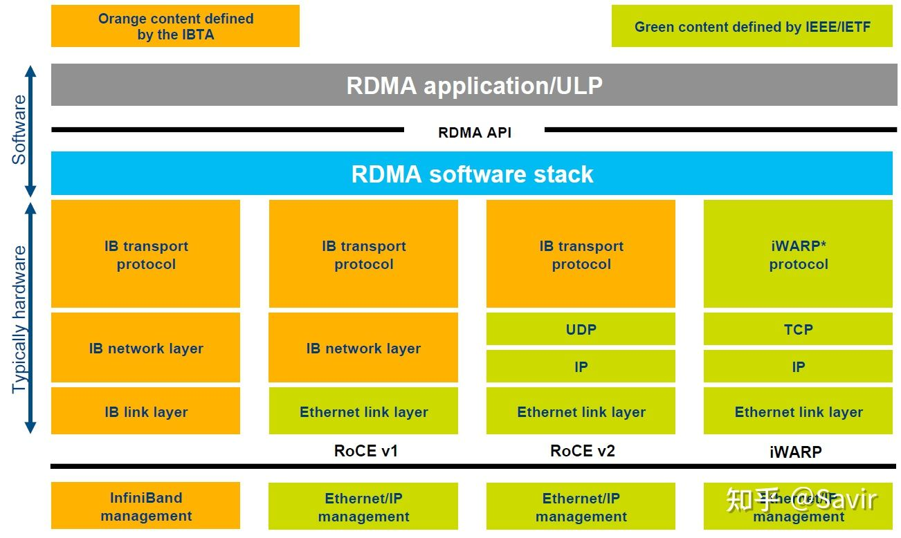


可能还不够直观，我们把RoCE v2的一个报文展开来看（没有画出物理层协议）：


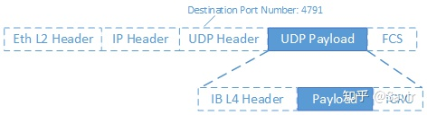


首先是二层的以太网链路帧，然后是IP报文头和UDP报文头，最后是各层级协议的校验。而Infiniband传输层报文实际上是UDP层的负载，也就是深蓝色背景的部分。UDP报文头中有一个字段Destination Port Number（目的端口号），对于RoCE v2来说固定是4791，当对端网卡收到报文后，会根据该字段识别是普通的以太网数据包，还是RoCE数据包，或者是其他协议的数据包，然后再进行解析。深蓝色背景的IB传输层部分又分成了IB报头，实际的用户数据（Payload）以及校验部分。IB传输层实际上有很多种报头以及对应的格式，我们以后再介绍。

## RoCE的优势

为什么我们有了Infiniband协议之后，还要设计RoCE协议呢？最主要的原因还是成本问题：由于Infiniband协议本身定义了一套全新的层次架构，从链路层到传输层，都无法与现有的以太网设备兼容。也就是说，如果某个数据中心因为性能瓶颈，想要把数据交换方式从以太网切换到Infiniband技术，那么需要购买全套的Infiniband设备，包括网卡、线缆、交换机和路由器等等。商用级设备由于对可靠性有比较高的要求，所以这一套下来是非常昂贵的。

而RoCE协议的出现解决了这一问题，如果用户想要从以太网切换到RoCE，那么只需要购买支持RoCE的网卡就可以了，线缆、交换机和路由器（RoCE v1不支持以太网路由器）等网络设备都是兼容的——因为我们只是在以太网传输层基础上又定义了一套协议而已。

所以RoCE相比于Infiniband，主要还是省钱，当然性能上相比Infiniband还是有一些损失，毕竟人家是全套重新设计的。

至于iWARP，相比于RoCE协议栈更复杂，并且由于TCP的限制，只能支持可靠传输，即无法支持UD等传输类型。所以目前iWARP的发展并不如RoCE和Infiniband。

**如果没有特别说明，本专栏后续文章中的RoCE都特指RoCE v2。**

------

## Soft-RoCE

虽然RoCE相比Infiniband具有兼容性优势，价格也便宜，但是**实际应用**的时候**依然需要专用的网卡支持**。有的读者可能会问，TCP/IP协议栈不是由软件实现的吗，只是在UDP层基础上加了层内容，为什么会对硬件有依赖？

RoCE本身确实可以由软件实现，也就是本节即将介绍的Soft-RoCE，但是商用的时候，几乎不会有人用软件实现的RoCE。RDMA技术本身的一大特点就是“硬件卸载”，即把本来软件（CPU）做的事情放到硬件中实现以达到加速的目的。CPU主要是用来计算的，让它去处理协议封包和解析以及搬运数据，这是对计算资源的浪费。所以RoCE网卡会把TCP/IP协议栈放到硬件中实现以解放CPU，让它去做更重要的事。

我们说回Soft-RoCE，它由IBM和Mellanox牵头的IBTA RoCE工作组实现。本身的设计初衷有几点：

- 降低RoCE部署成本

Soft-RoCE可以使不具备RoCE能力的硬件和支持RoCE的硬件间进行基于IB语义的交流，这样可以免于替换网络中的一些非关键节点的旧型号网卡。

- 相比TCP提升性能

虽然软件实现IB传输层带来了一定的开销，但是相比基于Socket-TCP/IP的传统通信方式，Soft-RoCE因为减少了系统调用（只在软件通知硬件下发了新SQ WQE时才会使用系统调用），发送端的零拷贝以及接收端的只需要单次拷贝等原因，仍然带来了性能上的提升。

- 便于开发和测试RDMA程序

有了Soft-RoCE，我们基于Verbs API编写的程序，就可以不依赖于硬件执行起来，也可以很方便的跑在虚拟机里。

### 实现原理

Soft-RoCE就是把本来应该卸载到硬件的封包和解析工作，又拿到软件来做。其本身是基于Linux内核的TCP/IP协议栈实现的，网卡本身并不感知收发的数据包是RoCE报文，其驱动程序按照IB规范中的报文格式将用户数据封装成IB传输层报文，然后把报文整体当做数据填入Socket Buffer当中，由网卡进行下一步收发包处理。

下面这张图取自IBTA对于Soft-RoCE的介绍文章[1]，左边是需要硬件的普通RoCE，右边是Soft-RoCE。可以看出普通RoCE是把协议栈卸载到RoCE NIC网卡实现的，而Soft-RoCE则是在软件协议栈中实现的。


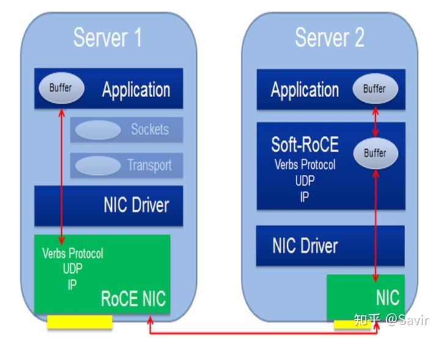


*因为我们使用Soft-RoCE的目的是为了学习协议而不是实现原理，对于其细节待我有时间再写。感兴趣的读者可以查阅参考文献[2]和[3]。*

------

## 如何做实验

下面我们开始实操部分。

建议Linux使用经验不多的读者使用与我相同的Ubuntu 20.04.2 LTS（Long-term Support，即会长期保持更新）版本，因为该版本只需要很简单的配置就可以跑RDMA的程序了，并且比较新。对于想部署最新的RDMA软件栈的读者，我将会在另外一篇文章中详细讲解内核和用户态的编译和部署方法。

### 准备环境

我们测试的网络拓扑很简单，一台PC，以及其上运行的两台Ubuntu虚拟机都连接到一个虚拟子网上，两台虚拟机上将运行Soft-RoCE，我们在宿主机上通过Wireshark抓取数据包。


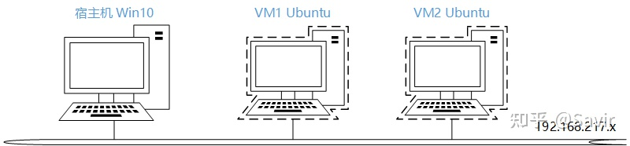


### 宿主机

操作系统：

Windows 10 64位

软件：

VMware Workstation 15 Pro 15.5.7

[Wireshark Version 3.4.4 64位](https://link.zhihu.com/?target=https%3A//www.wireshark.org/download.html)

### 虚拟机 * 2

操作系统：

[Ubuntu 20.04.2.0 desktop amd64](https://link.zhihu.com/?target=https%3A//releases.ubuntu.com/20.04/)

**注意最后我们会通过克隆虚拟机来实现快速部署第二台的目的，所以下面几个步骤只需要配一台虚拟机就可以了。**

### 安装系统

关于虚拟机如何安装，网上有一大堆教程，就不在本文赘述了，仅对几个细节对读者做一下提示：

1）建议配置国内的软件源，否则下软件会慢的出奇。比如我用的华为云的源：

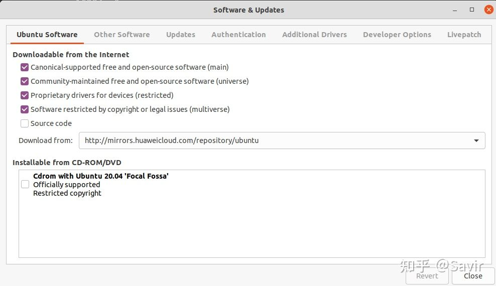

2）建议安装VMware Tools，这样在虚拟机和宿主机之间复制粘贴文字/文件会比较方便。我的Ubuntu版本建议通过以下方式安装：

```bash
sudo apt-get install open-vm-tools
sudo apt-get install open-vm-tools-desktop
```

出现重新安装VMware Tools的选项就说明已经装好了，安装完了之后可以试试复制粘贴功能是否正常。

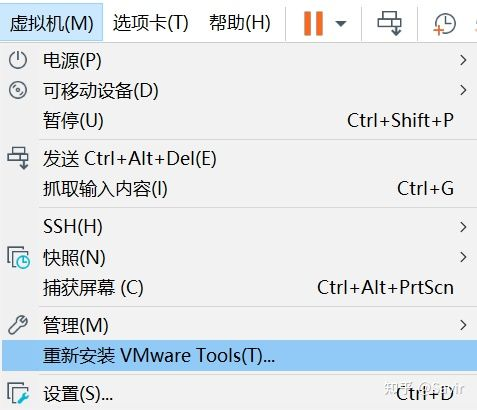


### 部署RDMA软件栈*

> 如果读者使用的是相同的Ubuntu版本，那么内核已经打开了Infiniband和RXE（即Soft-RoCE功能的软件实体）的相关选项，用户态也已经部署了rdma-core，那么此步骤可以跳过。

如果读者使用的虚拟机操作系统与我不同，那么请按照如下步骤确认：

### 确认当前内核是否支持RXE

```bash
cat /boot/config-$(uname -r) | grep RXE
```

如果CONFIG_RDMA_RXE的值为y或者m，表示当前的操作系统可以使用RXE。

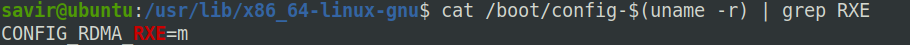

如果该选项值为n或者搜索不到RXE，那么很遗憾你可能需要重新编译内核。编译内核时需要使能以下几个选项：

```bash
CONFIG_INET
CONFIG_PCI
CONFIG_INFINIBAND
CONFIG_INFINIBAND_VIRT_DMA
```

至于具体的重新编译内核的方法，读者可以先自行查找，以后我也会在另外的文章详细的讲解。

### 安装用户态动态链接库

我们在“[RDMA概述](https://zhuanlan.zhihu.com/p/138874738)”一文中提到过，用户态库指的就是rdma-core。但是在Ubuntu等操作系统中它可能不是一个而是多个软件包组成的。我使用的Ubuntu 20.04 LTS版本使用默认的安装参数的情况下，已经装有这几个软件包。

如果版本跟我不一致的话，那么可以尝试安装一下以下几个软件包：

```bash
sudo apt-get install libibverbs1 ibverbs-utils librdmacm1 libibumad3 ibverbs-providers rdma-core
```

这几个软件包的作用如下：

| 软件包名          | 主要功能                           |
| ----------------- | ---------------------------------- |
| libibverbs1       | ibverbs动态链接库                  |
| ibverbs-utils     | ibverbs示例程序                    |
| librdmacm1        | rdmacm动态链接库                   |
| libibumad3        | ibumad动态链接库                   |
| ibverbs-providers | ibverbs各厂商用户态驱动（包括RXE） |
| rdma-core         | 文档及用户态配置文件               |

如果读者想看一下软件包里都包括哪些内容，那么可以使用dpkg命令查看包内容，比如：

```bash
dpkg -L libibverbs1
```

可以看到版本是28.0（截至3月28日，rdma-core的最新版本是v34.0）：

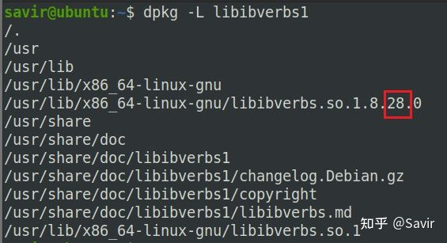

安装完上述软件之后，可以执行ibv_devices看看有没有报错：

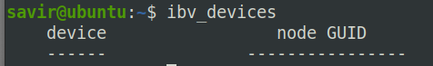

这是个基于verbs接口编写的小程序，用来获取并打印出当前系统中的RDMA设备列表（现在当然是空的，因为我们还没有添加Soft-RoCE设备）。

### 安装其他工具

除了软件栈之外，还有两个工具要安装：

### iproute2

iproute2是用来替代net-tools软件包的，是一组开源的网络工具集合，比如用更强大ip命令替换了以前常用的ifconfig。我们需要其中的rdma工具来对RXE进行配置。一般的操作系统都已经包含了，安装也很简单：

```bash
sudo apt-get install iproute2
```

### perftest

perftest是一个基于Verbs接口开发的开源RDMA性能测试工具，可以对支持RDMA技术的节点进行带宽和时延测试。相比于rdma-core自带的示例程序 ，功能更加强大，当然也更复杂。使用如下命令安装：

```bash
sudo apt-get install perftest
```

### 克隆虚拟机

因为我们要两个节点，一个节点已经准备完毕了，下面我们利用VMware WorkStation的虚拟机克隆功能直接复制一个相同的虚拟机出来：

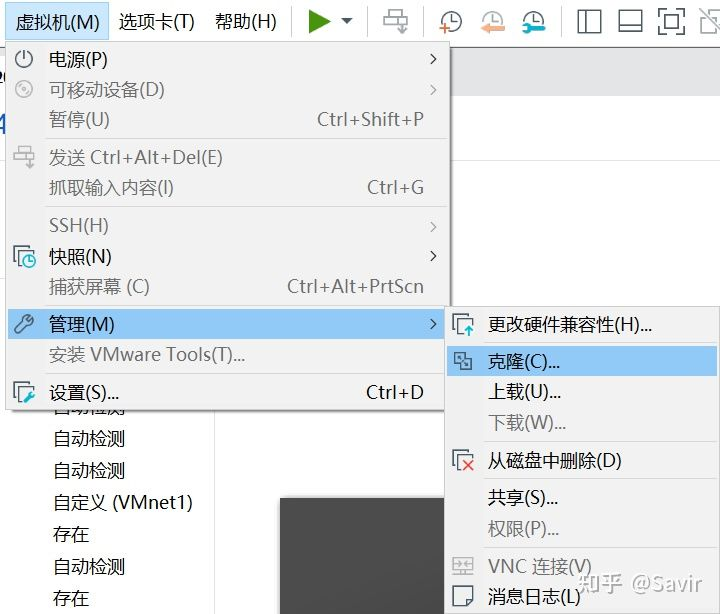

因为我的硬盘还算充裕，所以选的完整克隆：

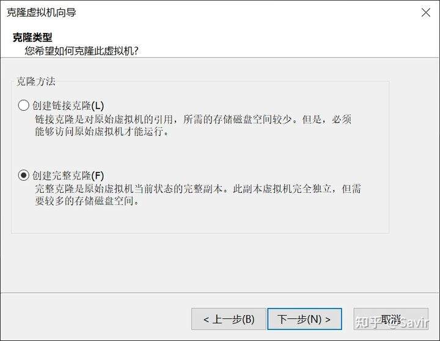

### 配置虚拟机网卡

克隆完毕后，我们就有两台虚拟机了。因为我们最终要使用两台虚拟机作为两个RDMA节点进行试验，所以需要对虚拟机的网卡进行配置，使这两台虚拟机处于同一个网络下。

分别打开两台虚拟机设置中的网络适配器选项，网络连接模式选择自定义：WMnet1（仅主机模式）

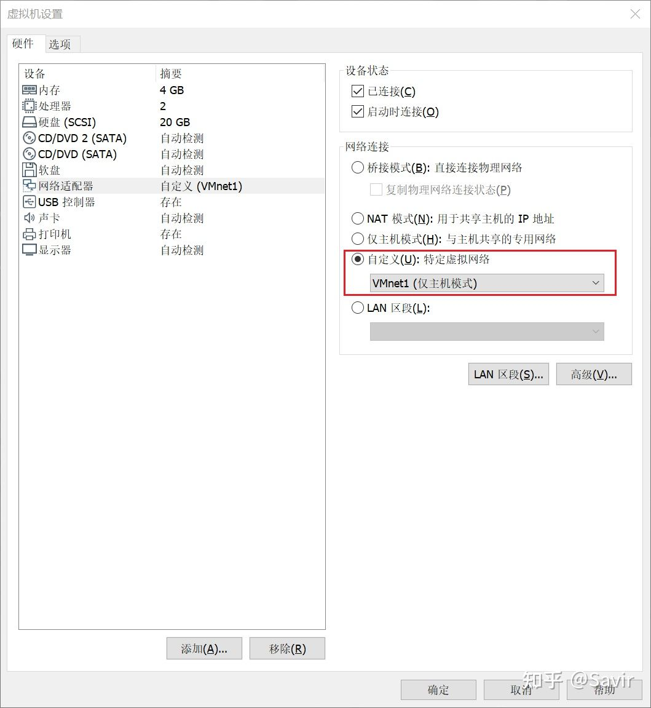

确定之后，呼出终端通过ifconfig查看网口配置，我的两个虚拟机的网卡IP分别是：

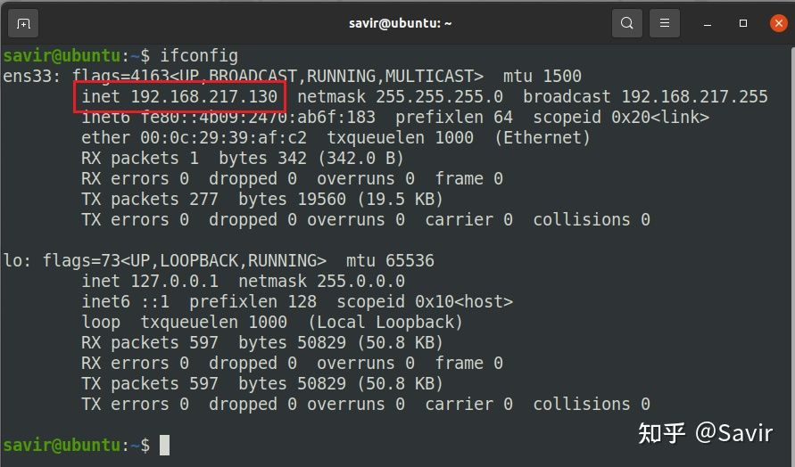

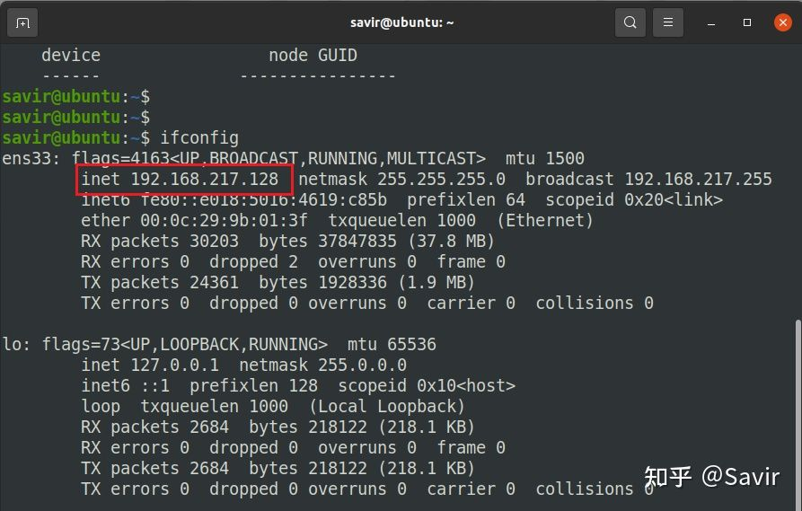

然后查看Windows宿主机的虚拟网卡的IP地址：

```bash
ipconfig /all
```

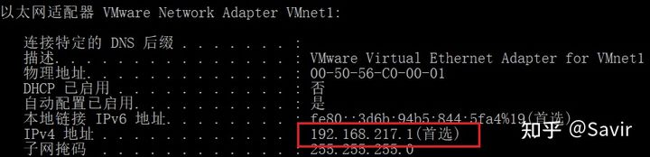

可见这三个网卡都处于192.168.217.x网段。

这时可以用一个虚拟机ping另一个虚拟机测试下网络连通性：

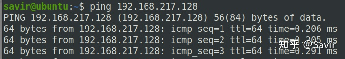

> 有的读者可能会试着用虚拟机ping宿主机的IP，比如对我来说就是192.168.217.1，结果发现ping不通。这是因为Windows的防火墙造成的，实际不影响稍后的抓包实验。关闭防火墙之后是可以双向ping通的，但是不建议大家关闭防火墙。

### 配置RXE网卡

首先我们需要加载内核驱动，modprobe会自动加载依赖的其他驱动。

```bash
modprobe rdma_rxe
```

然后进行用户态配置：

```bash
sudo rdma link add rxe_0 type rxe netdev ens33
```

其中rxe_0是你希望的RDMA的设备名，可任意取名。ens33为Soft-RoCE设备所绑定的网络设备名，也就是我们刚才ifconfig看到的网卡名，每个虚拟机可能都不一样。

接着我们用rdma工具查看是否添加成功：

```text
rdma link
```

效果如下：

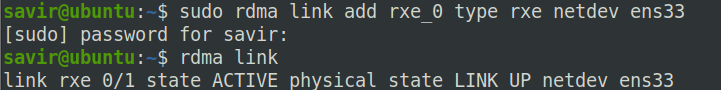

也可以跑下我们前文提到的ibv_devices程序了，可以看到已经在设备列表里了：

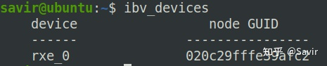

也可以看下这个虚拟RDMA设备的信息：

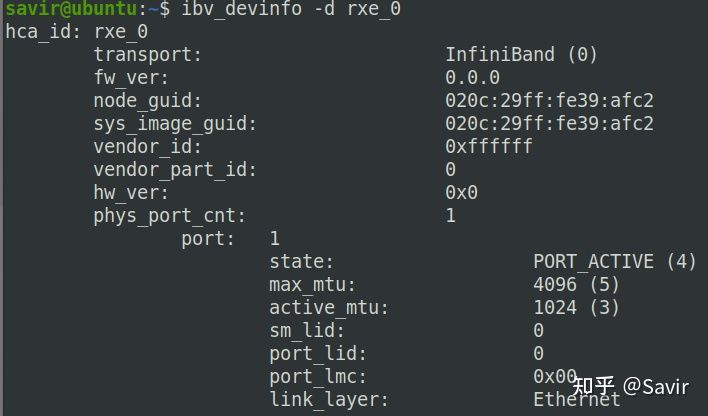

里面的参数读者现在不需要了解，感兴趣的话可以先自己研究下。

**注意：网上一些写的比较早的教程说用rxe_cfg配置Soft-RoCE，该工具已经在2020年1月末被rdma工具取代。**

### 执行perftest测试

我们在两端分别执行：

```bash
ib_send_bw -d rxe_0
```

以及：

```bash
ib_send_bw -d rxe_0 <server_ip>
```

ib_send_bw是用来测试SEND操作的带宽的程序（infiniband_send*bandwidth），其中*<server_ip>表示对端的IP，对于我的环境来说，本端是192.168.217.130，那么对端就是192.168.217.128。

两端的结果如下，Server端：

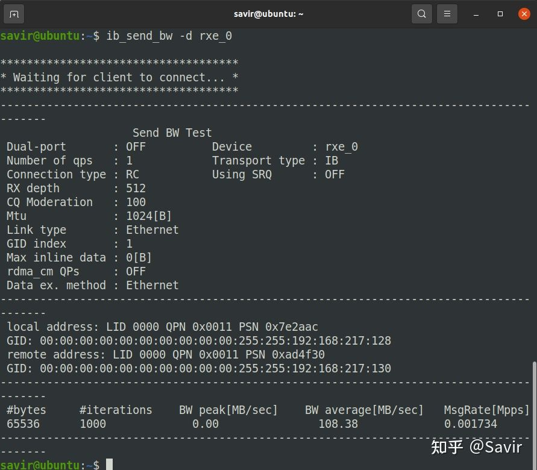

Client端：

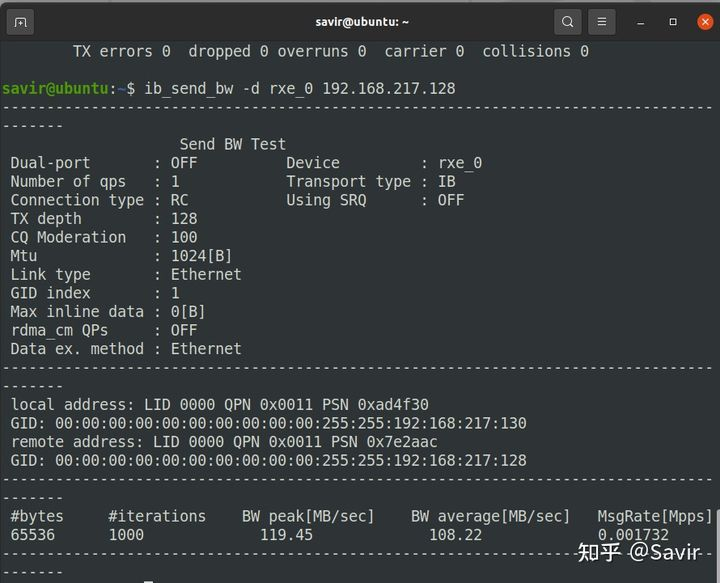

可以看到两端都打印出了一些测试信息以及最后的测试结果，也就是带宽信息。读者当前不必关心具体发生了什么，以及这些打印都是什么意思，只需要知道client端向server端发起了Send操作就可以了。以后我会展开讲perftest。

### 通过Wireshark抓包

Wireshark是一个开源的抓包软件，我们以后会使用它来分析RoCE的报文。我已经附了下载链接，安装没什么注意事项，完成之后可能需要重启。

好了，万事具备，我们打开Wireshark，选择宿主机和两台虚拟机处于同一个子网的虚拟网卡VMnet1：

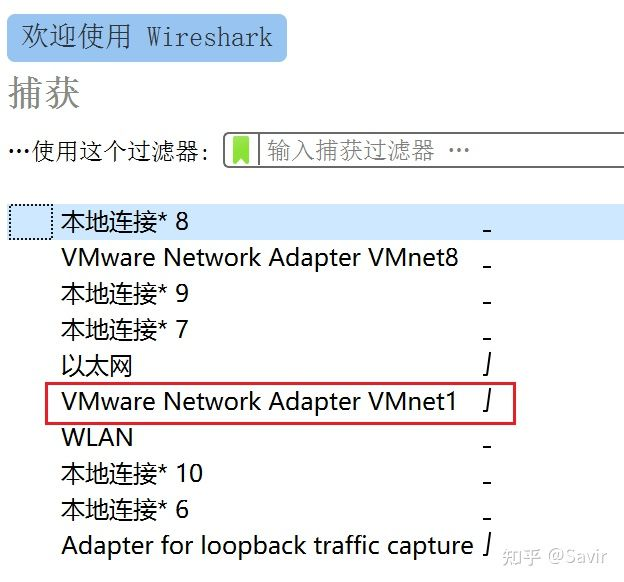

然后就自动开始抓包了，我们可以看到一些DNS和ARP报文：

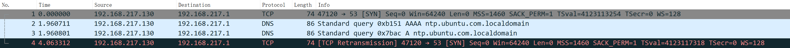

如果此时我用一台虚拟机去ping另一台虚拟机，那么我们可以看到ICMP的报文：

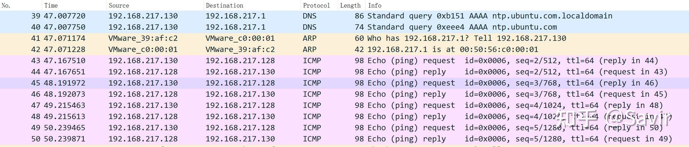

我们此时分别在两端再次上面的执行perftest示例，就可以在Wireshark中看到RoCE报文了：

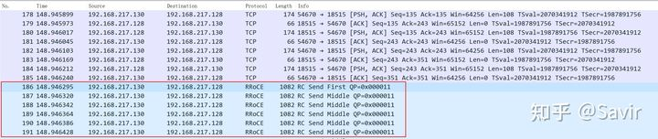

其中RRoCE是Routable RoCE的意思，即可以被路由的RoCE，即RoCE v2。我们随便选中一个条目，下面的窗口中我们就可以看到每一层报文的内容了，非常清晰：

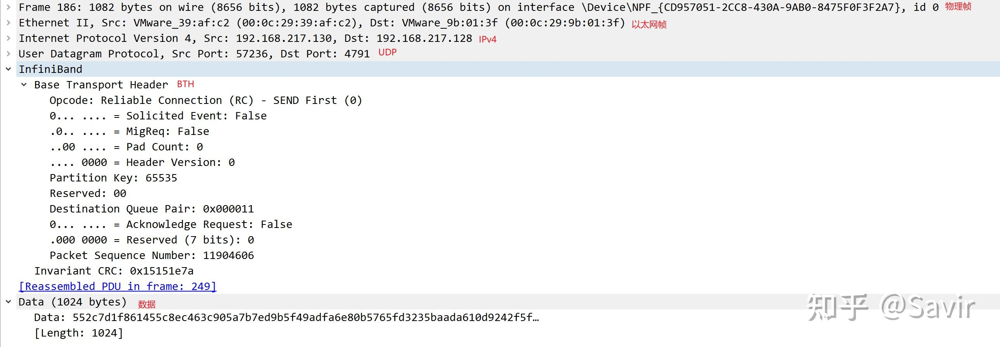

上图从上到下分别是：物理层-->以太网链路层-->IPv4网络层-->UDP传输层-->IB传输层（BTH头和iCRC校验）-->数据。

Wireshark非常强大，还可以解析CM建链的报文，我们会在后面的文章中进一步讲解和分析CM。

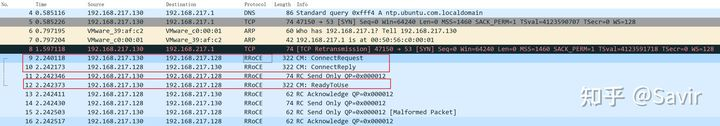


好了，本文就写到这，感谢阅读。读者如有疑问，欢迎在评论区讨论。

下期预告：CM协议的理论部分，目前还没完全理清楚，会需要比较长的时间完成，敬请期待。

## 参考资料

[1] IBTA对于Soft-RoCE的官方介绍文档. [https://www.roceinitiative.org/wp-content/uploads/2016/11/SoftRoCE_Paper_FINAL.pdf](https://link.zhihu.com/?target=https%3A//www.roceinitiative.org/wp-content/uploads/2016/11/SoftRoCE_Paper_FINAL.pdf)

[2] OFA组织2017年年会时对于Soft-RoCE实现的介绍视频. [https://www.youtube.com/watch?v=NumH5YeVjHU](https://link.zhihu.com/?target=https%3A//www.youtube.com/watch%3Fv%3DNumH5YeVjHU)

[3] OFA组织2017年年会时对于Soft-RoCE实现的介绍材料. [https://www.openfabrics.org/images/eventpresos/2017presentations/205_SoftRoCE_LLiss.pdf](https://link.zhihu.com/?target=https%3A//www.openfabrics.org/images/eventpresos/2017presentations/205_SoftRoCE_LLiss.pdf)

[4] rdma-core软件仓对于如何使用Soft-RoCE的说明. [https://github.com/linux-rdma/r](https://link.zhihu.com/?target=https%3A//github.com/linux-rdma/rdma-core/blob/master/Documentation/rxe.md)