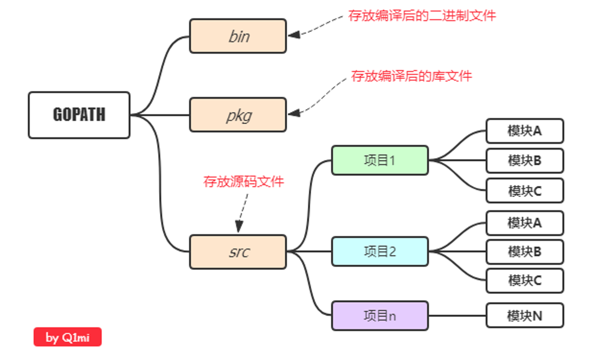
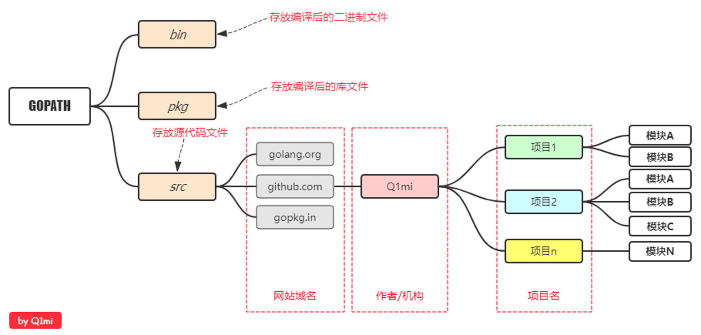
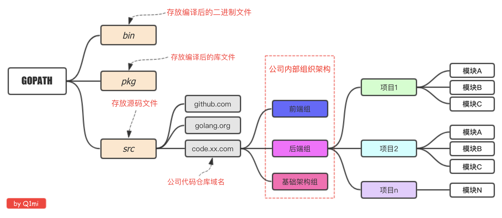

## 目录结构推荐

### 项目目录

在进行Go语言开发的时候，我们的代码总是会保存在`$GOPATH/src`目录下。
	
在工程经过`go build`、`go install`或`go get`等指令后，会将下载的第三方包源代码文件放在`$GOPATH/src`目录下， 产生的二进制可执行文件放在 `$GOPATH/bin`目录下，生成的中间缓存文件会被保存在 `$GOPATH/pkg` 下。
	
如果我们使用版本管理工具（Version Control System，VCS。常用如Git）来管理我们的项目代码时，我们只需要添加$GOPATH/src目录的源代码即可。bin 和 pkg 目录的内容无需版本控制。

### 结构推荐

**个人开发**

 **流行结构**

**企业开发**

## 

