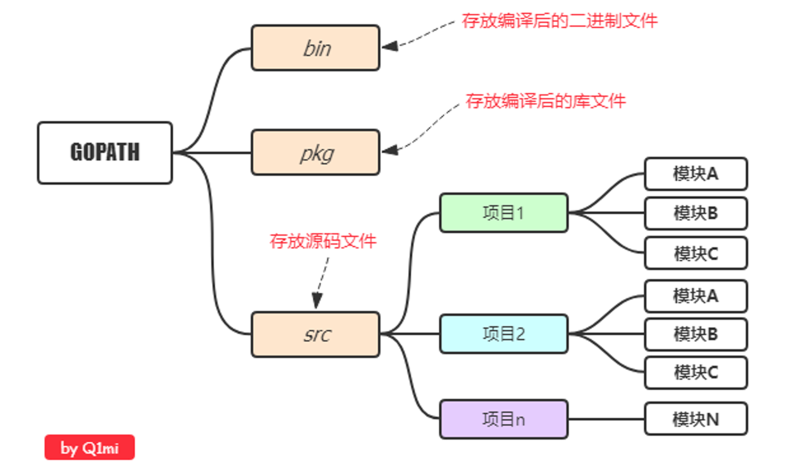
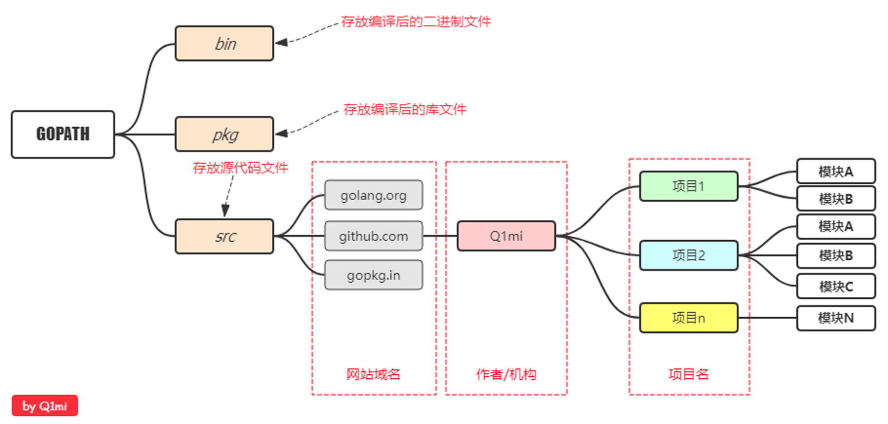
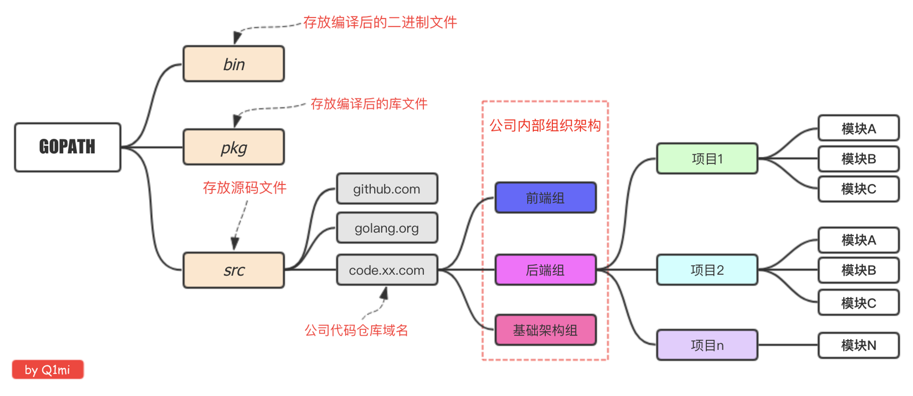

# 环境搭建

## 下载安装

### 下载地址	

安装包下载地址为： https://golang.org/dl/
如果打不开可以使用这个地址： https://golang.google.cn/dl/

### 下载安装

**`LINUX `**

	1. 下载二进制包：go1.4.linux-amd64.tar.gz。

2. 将下载的二进制包解压至 `/usr/local`目录。

    ```sh
    tar -C /usr/local -xzf go1.4.linux-amd64.tar.gz
    ```

3. 将 `/usr/local/go/bin` 目录添加至PATH环境变量

    ```sh
    export PATH=$PATH:/usr/local/go/bin
    ```

**`MAC`**
MAC 系统下你可以使用 .pkg 结尾的安装包直接双击来完成安装，安装目录在 `/usr/local/go/` 下

### 设置 GOPATH 目录

* GOPATH 是一个环境变量，用来表明你写的 go 项目的存放路径（工作目录）。
* GOPATH 路径最好只设置一个，所有的项目代码都放到 GOPATH的 src目录下。

> 补充说明：`Go1.11`版本之后，开启 `go mod` 模式之后就不再强制需要配置GOPATH了


**`创建目录`**

```sh
mkdir ~/gopath
mkdir ~/gopath/bin    # 存放编译后的二进制文件
mkdir ~/gopath/pkg    # 存放中间文件
mkdir ~/gopath/src    # 存放源码
```

编辑如下文件 $HOME/.profile（mac下为：~/.zshrc），添加如下行：

```sh
export GOPATH=~/gopath
```

**`go env`**

```sh
$ go env
GO111MODULE="on"
GOARCH="amd64"
GOBIN=""
GOCACHE="/Volumes/MacData/Users/ziyht/Library/Caches/go-build"
GOENV="/Volumes/MacData/Users/ziyht/Library/Application Support/go/env"
GOEXE=""
GOFLAGS=""
GOHOSTARCH="amd64"
GOHOSTOS="darwin"
GOINSECURE=""
GONOPROXY=""
GONOSUMDB=""
GOOS="darwin"
GOPATH="/Volumes/MacData/Users/ziyht/gopath"
GOPRIVATE=""
GOPROXY="https://goproxy.cn,direct"
GOROOT="/usr/local/go"
GOSUMDB="sum.golang.org"
...
```

### 安装go 工具

```sh
go get -u golang.org/x/tools/cmd/goimports
go get -u golang.org/x/tools/cmd/gorename
go get -u github.com/sqs/goreturns
go get -u github.com/mdempsky/gocode
go get -u github.com/alecthomas/gometalinter
go get -u github.com/mgechev/revive
go get -u github.com/golangci/golangci-lint/cmd/golangci-lint
go get -u github.com/zmb3/gogetdoc
go get -u github.com/zmb3/goaddimport
go get -u github.com/rogpeppe/godef
go get -u golang.org/x/tools/cmd/guru
go get -u github.com/fatih/gomodifytags
go get -u github.com/tpng/gopkgs
go get -u github.com/ramya-rao-a/go-outline
```

## 项目目录

在进行Go语言开发的时候，我们的代码总是会保存在`$GOPATH/src`目录下。
	
在工程经过`go build`、`go install`或`go get`等指令后，会将下载的第三方包源代码文件放在`$GOPATH/src`目录下， 产生的二进制可执行文件放在 `$GOPATH/bin`目录下，生成的中间缓存文件会被保存在 `$GOPATH/pkg` 下。
	
如果我们使用版本管理工具（Version Control System，VCS。常用如Git）来管理我们的项目代码时，我们只需要添加$GOPATH/src目录的源代码即可。bin 和 pkg 目录的内容无需版本控制。

### 结构推荐

**个人开发**



 **流行结构**



**企业开发**



## 编辑器

### VSCode

#### 解决国内 go get 无法下载的问题

使用国内七牛云的 go module 镜像。

参考 https://github.com/goproxy/goproxy.cn。

golang 1.13 可以直接执行：

```go
go env -w GO111MODULE=on
go env -w GOPROXY=https://goproxy.cn,direct
```

```sh
go get -u github.com/gin-gonic/gin
```

#### 远程调试

```json
{
    "name": "Attach",
    "type": "go",
    "request": "launch",
    "mode": "remote",
    "remotePath": "${workspaceRoot}",
    "port": 2345,
    "host": "127.0.0.1",
    "program": "${workspaceRoot}",
    "env": {},
    "args": [],
    "showLog": true
}
```

1. go build && run
2. get pid && dlv attach $pid  --headless=true --api-version=2--listen=:2345 --log
3. in VSCode, Click begin debug button

* 注意go build要带上这个标记 -gcflags='-N -l'，目的是关闭Go内部做的一些优化，聚合变量和函数内联等优化。

* 或者直接这样运行`dlv --listen=:2345 --headless=true --api-version=2 exec ./demo`

