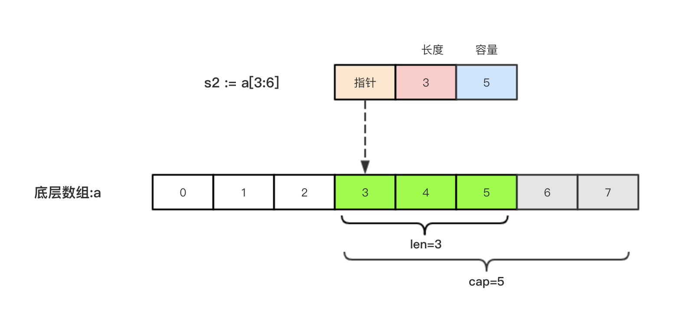

# 基础

## `编译`

### 1. go build

创建一个最简单的项目，`${GOPATH}/src/github.com/ziyht/helloworld/`

创建文件 `main.go`

```go
package main

// 导入语句
import "fmt"

// 程序的入口函数
func main() {
	fmt.Println("Hello world!")
}
```

进入目录编译：
```sh
$ go build
```

或在其他目录编译，输入相对于src的路径即可
```sh
$ go build github.com/ziyht/helloworld
```

生成的可执行文件位于当前目录下

### 2. 交叉编译

默认我们`go build`的可执行文件都是当前操作系统可执行的文件，如果我想在windows下编译一个linux下可执行文件，那需要怎么做呢？

只需要指定目标操作系统的平台和处理器架构即可，`在编译前设置环境变量`：

```bash
SET CGO_ENABLED=0  // 禁用CGO
SET GOOS=linux     // 目标平台可以是linux/windows/darwin
SET GOARCH=amd64   // 目标处理器架构是amd64
```

> **`注意：使用了cgo的代码是不支持跨平台编译的`**

然后再执行`go build`命令，得到的就是能够在Linux平台运行的可执行文件了。

**Mac 下编译 Linux 和 Windows平台 64位 可执行程序**：

```bash
CGO_ENABLED=0 GOOS=linux GOARCH=amd64 go build
CGO_ENABLED=0 GOOS=windows GOARCH=amd64 go build
```

**Linux 下编译 Mac 和 Windows 平台64位可执行程序：**

```bash
CGO_ENABLED=0 GOOS=darwin GOARCH=amd64 go build
CGO_ENABLED=0 GOOS=windows GOARCH=amd64 go build
```

**Windows下编译Mac平台64位可执行程序：**

```bash
SET CGO_ENABLED=0
SET GOOS=darwin
SET GOARCH=amd64
go build
```


## `标识符与关键字`

**标识符**

在编程语言中标识符就是程序员定义的具有特殊意义的词，比如变量名、常量名、函数名等等。 Go语言中标识符由字母数字和`_`(下划线）组成，并且只能以字母和`_`开头。 举几个例子：`abc`, `_`, `_123`, `a123`。

**关键字**

关键字是指编程语言中预先定义好的具有特殊含义的标识符。 `关键字和保留字都不建议用作变量名`。

Go语言中有25个关键字：

```go
    break        default      func         interface    select
    case         defer        go           map          struct
    chan         else         goto         package      switch
    const        fallthrough  if           range        type
    continue     for          import       return       var
```

此外，Go语言中还有37个保留字。

```go
    Constants:    true  false  iota  nil

        Types:    int  int8  int16  int32  int64  
                  uint  uint8  uint16  uint32  uint64  uintptr
                  float32  float64  complex128  complex64
                  bool  byte  rune  string  error

    Functions:   make  len  cap  new  append  copy  close  delete
                 complex  real  imag
                 panic  recover
```

## `变量`

* 变量必须先声明才能使用
* 变量类型确定后无法再表示其它类型
* 全局变量声明后可以不使用
* 局部变量声明后必须使用
*  `:=` 只能声明局部变量

### 1. 变量的来历

程序运行过程中的数据都是保存在内存中，我们想要在代码中操作某个数据时就需要去内存上找到这个变量，但是如果我们直接在代码中通过内存地址去操作变量的话，代码的可读性会非常差而且还容易出错，所以我们就利用变量将这个数据的内存地址保存起来，以后直接通过这个变量就能找到内存上对应的数据了。

### 2. 变量类型

变量（Variable）的功能是存储数据。不同的变量保存的数据类型可能会不一样。经过半个多世纪的发展，编程语言已经基本形成了一套固定的类型，常见变量的数据类型有：整型、浮点型、布尔型等。

Go语言中的每一个变量都有自己的类型，并且变量必须经过声明才能开始使用。

### 3. 变量声明

Go语言中的变量需要声明后才能使用，同一作用域内不支持重复声明。 并且Go语言的变量声明后必须使用。

Go语言的变量声明格式为：

```go
var 变量名 变量类型
```

变量声明以关键字`var`开头，变量类型放在变量的后面，行尾无需分号。 举个例子：

```go
// 声明变量
var name string
var age  int
var isOk bool

// 批量声明
var (
    a string   	// = ""
    b int  			// = 0
    c bool			// = false
    d float32		// = 0.0
)
```

### 4.变量的初始化

Go语言在声明变量的时候，会自动对变量对应的内存区域进行初始化操作。每个变量会被初始化成其类型的默认值，例如： 整型和浮点型变量的默认值为`0`。 字符串变量的默认值为`空字符串`。 布尔型变量默认为`false`。 切片、函数、指针变量的默认为`nil`。

当然我们也可在声明变量的时候为其指定初始值。变量初始化的标准格式如下：

```go
var 变量名 类型 = 表达式
```

举个例子：

```go
var name string = "Q1mi"
var age int = 18
```

#### 类型推导

有时候我们会将变量的类型省略，这个时候编译器会根据等号右边的值来推导变量的类型完成初始化。

```go
var name = "Q1mi"
var age = 18

var name, age = "Q1mi", 20
```

#### 简短声明

在函数内部，可以使用更简略的 `:=` 方式声明并初始化变量。`只能在函数中使用`

```go
package main

import (
	"fmt"
)
// 全局变量m
var m = 100

func main() {
	n := 10
	m := 200 // 此处声明局部变量m
	fmt.Println(m, n)
}
```

### 5.匿名变量(忽略返回值)

在使用多重赋值时，如果想要忽略某个值，可以使用`匿名变量（anonymous variable）`。 匿名变量用一个下划线`_`表示，例如：

```go
func foo() (int, string) {
	return 10, "Q1mi"
}
func main() {
	x, _ := foo()
	_, y := foo()
	fmt.Println("x=", x)
	fmt.Println("y=", y)
}
```

匿名变量不占用命名空间，不会分配内存，所以匿名变量之间不存在重复声明。 (在`Lua`等编程语言里，匿名变量也被叫做哑元变量。)

注意事项：

1. 函数外的每个语句都必须以关键字开始（var、const、func等）
2. `:=`不能使用在函数外。
3. `_`多用于占位，表示忽略值。


## `常量`

相对于变量，常量是恒定不变的值，多用于定义程序运行期间不会改变的那些值。 常量的声明和变量声明非常类似，只是把`var`换成了`const`，常量在定义的时候必须赋值。

```go
const pi = 3.1415
const e = 2.7182
```

声明了`pi`和`e`这两个常量之后，在整个程序运行期间它们的值都不能再发生变化了。

多个常量也可以一起声明：

```go
const (
    pi = 3.1415
    e = 2.7182
)
```

const同时声明多个常量时，如果省略了值则表示和上面一行的值相同。 例如：

```go
const (
    n1 = 100
    n2
    n3
)
```

上面示例中，常量`n1`、`n2`、`n3`的值都是100。

### iota

`iota`是go语言的常量计数器，只能在常量的表达式中使用。

`iota`在const关键字出现时将被重置为0。const中每新增一行常量声明将使`iota`计数一次(iota可理解为const语句块中的行索引)。 使用iota能简化定义，在定义枚举时很有用。

举个例子：

```go
const (
		n1 = iota //0
		n2        //1
		n3        //2
		n4        //3
	)
```

#### 示例

使用`_`跳过某些值

```go
const (
		n1 = iota //0
		n2        //1
		_
		n4        //3
	)
```

`iota`声明中间插队

```go
const (
		n1 = iota //0
		n2 = 100  //100
		n3 = iota //2
		n4        //3
	)
	const n5 = iota //0
```

定义数量级 （这里的`<<`表示左移操作，`1<<10`表示将1的二进制表示向左移10位，也就是由`1`变成了`10000000000`，也就是十进制的1024。同理`2<<2`表示将2的二进制表示向左移2位，也就是由`10`变成了`1000`，也就是十进制的8。）

```go
const (
		_  = iota
		KB = 1 << (10 * iota)
		MB = 1 << (10 * iota)
		GB = 1 << (10 * iota)
		TB = 1 << (10 * iota)
		PB = 1 << (10 * iota)
	)
```

多个`iota`定义在一行

```go
const (
		a, b = iota + 1, iota + 2 //1,2
		c, d                      //2,3
		e, f                      //3,4
	)
```

## `基础数据类型`

### 1.整型

整型分为以下两个大类： 按长度分为：int8、int16、int32、int64 对应的无符号整型：uint8、uint16、uint32、uint64

其中，`uint8`就是我们熟知的`byte`型，`int16`对应C语言中的`short`型，`int64`对应C语言中的`long`型。

|  类型  |                             描述                             |
| :----: | :----------------------------------------------------------: |
| uint8  |                  无符号 8位整型 (0 到 255)                   |
| uint16 |                 无符号 16位整型 (0 到 65535)                 |
| uint32 |              无符号 32位整型 (0 到 4294967295)               |
| uint64 |         无符号 64位整型 (0 到 18446744073709551615)          |
|  int8  |                 有符号 8位整型 (-128 到 127)                 |
| int16  |              有符号 16位整型 (-32768 到 32767)               |
| int32  |         有符号 32位整型 (-2147483648 到 2147483647)          |
| int64  | 有符号 64位整型 (-9223372036854775808 到 9223372036854775807) |

**特殊整型**

|  类型   |                          描述                          |
| :-----: | :----------------------------------------------------: |
|  uint   | 32位操作系统上就是`uint32`，64位操作系统上就是`uint64` |
|   int   |  32位操作系统上就是`int32`，64位操作系统上就是`int64`  |
| uintptr |              无符号整型，用于存放一个指针              |

**注意：** 在使用`int`和 `uint`类型时，不能假定它是32位或64位的整型，而是考虑`int`和`uint`可能在不同平台上的差异。

**注意事项** 获取对象的长度的内建`len()`函数返回的长度可以根据不同平台的字节长度进行变化。实际使用中，切片或 map 的元素数量等都可以用`int`来表示。在涉及到二进制传输、读写文件的结构描述时，为了保持文件的结构不会受到不同编译目标平台字节长度的影响，不要使用`int`和 `uint`。

#### 数字字面量语法（Number literals syntax）

Go1.13版本之后引入了数字字面量语法，这样便于开发者以二进制、八进制或十六进制浮点数的格式定义数字，例如：

|    --    | --              | --                                    |
| :------: | --------------- | ------------------------------------- |
|  二进制  | v := 0b00101101 | 代表二进制的 101101                   |
|  八进制  | v := 0o377      | 代表八进制的 377，相当于十进制的 255  |
| 十六进制 | v := 0x1p-2     | 代表十六进制的 1 除以 2²，也就是 0.25 |
| 分割数字 | v := 123_456    | 等于 123456                           |

我们可以借助fmt函数来将一个整数以不同进制形式展示。

```go
package main
 
import "fmt"
 
func main(){
	// 十进制
	var a int = 10
	fmt.Printf("%d \n", a)  // 10
	fmt.Printf("%b \n", a)  // 1010  占位符%b表示二进制
 
	// 八进制  以0开头
	var b int = 077
	fmt.Printf("%o \n", b)  // 77
 
	// 十六进制  以0x开头
	var c int = 0xff
	fmt.Printf("%x \n", c)  // ff
	fmt.Printf("%X \n", c)  // FF
}
```

### 2. 浮点型

Go语言支持两种浮点型数：`float32`和`float64`。这两种浮点型数据格式遵循`IEEE 754`标准： `float32` 的浮点数的最大范围约为 `3.4e38`，可以使用常量定义：`math.MaxFloat32`。 `float64` 的浮点数的最大范围约为 `1.8e308`，可以使用一个常量定义：`math.MaxFloat64`。

打印浮点数时，可以使用`fmt`包配合动词`%f`，代码如下：

```go
package main
import (
		"fmt"
    "math"
)
func main() {
    fmt.Printf("%f\n", math.Pi)
    fmt.Printf("%.2f\n", math.Pi)
  
    f1 := 1.123		// float64
}
```

### 3.复数

complex64和complex128

```go
var c1 complex64
c1 = 1 + 2i
var c2 complex128
c2 = 2 + 3i
fmt.Println(c1)
fmt.Println(c2)
```

复数有实部和虚部，complex64的实部和虚部为32位，complex128的实部和虚部为64位。

### 4.布尔值

Go语言中以`bool`类型进行声明布尔型数据，布尔型数据只有`true（真）`和`false（假）`两个值。

**注意：**

1. 布尔类型变量的默认值为`false`。
2. Go 语言中不允许将整型强制转换为布尔型.
3. 布尔型无法参与数值运算，也无法与其他类型进行转换。

### 5.字符串

Go语言中的字符串以原生数据类型出现，使用字符串就像使用其他原生数据类型（int、bool、float32、float64 等）一样。 Go 语言里的字符串的内部实现使用`UTF-8`编码。 字符串的值为`双引号(")`中的内容，可以在Go语言的源码中直接添加非ASCII码字符，例如：

```go
s1 := "hello"
s2 := "你好"
```

#### 字符串转义符

Go 语言的字符串常见转义符包含回车、换行、单双引号、制表符等，如下表所示。

| 转义符 |                含义                |
| :----: | :--------------------------------: |
|  `\r`  |         回车符（返回行首）         |
|  `\n`  | 换行符（直接跳到下一行的同列位置） |
|  `\t`  |               制表符               |
|  `\'`  |               单引号               |
|  `\"`  |               双引号               |
|  `\\`  |               反斜杠               |

举个例子，我们要打印一个Windows平台下的一个文件路径：

```go
package main
import (
    "fmt"
)
func main() {
    fmt.Println("str := \"c:\\Code\\lesson1\\go.exe\"")
}
```

#### 多行字符串

Go语言中要定义一个多行字符串时，就必须使用`反引号`字符：

```go
s1 := `第一行
第二行
第三行
`
fmt.Println(s1)
```

反引号间换行将被作为字符串中的换行，但是所有的转义字符均无效，文本将会原样输出。

#### 字符串的常用操作

| 方法                                     | 介绍           |
| :--------------------------------------- | :------------- |
| `len(`str`)`                             | 求长度         |
| `+`或`fmt.Sprintf`                       | 拼接字符串     |
| `strings.Split`                          | 分割           |
| `strings.contains`                       | 判断是否包含   |
| `strings.HasPrefix`,`strings.HasSuffix`  | 前缀/后缀判断  |
| `strings.Index()`,``strings.LastIndex()` | 子串出现的位置 |
| `strings.Join(a[]string, sep string)`    | join操作       |

#### byte和rune类型

组成每个字符串的元素叫做“字符”，可以通过遍历或者单个获取字符串元素获得字符。 字符用单引号（’）包裹起来，如：

```go
var a := '中'
var b := 'x'
```

Go 语言的字符有以下两种：

1. `uint8`类型，或者叫 byte 型，代表了`ASCII码`的一个字符。
2. `rune`类型，代表一个 `UTF-8字符`。

当需要处理中文、日文或者其他复合字符时，则需要用到`rune`类型。`rune`类型实际是一个`int32`。

Go 使用了特殊的 rune 类型来处理 Unicode，让基于 Unicode 的文本处理更为方便，也可以使用 byte 型进行默认字符串处理，性能和扩展性都有照顾。

```go
// 遍历字符串
func traversalString() {
	s := "hello沙河"
	for i := 0; i < len(s); i++ { //byte
		fmt.Printf("%v(%c) ", s[i], s[i])
	}
	fmt.Println()
  
	for _, r := range s { //rune
		fmt.Printf("%v(%c) ", r, r)
	}
	fmt.Println()
}
```

输出：

```bash
104(h) 101(e) 108(l) 108(l) 111(o) 230(æ) 178(²) 153() 230(æ) 178(²) 179(³) 
104(h) 101(e) 108(l) 108(l) 111(o) 27801(沙) 27827(河) 
```

因为UTF8编码下一个中文汉字由3~4个字节组成，所以我们不能简单的按照字节去遍历一个包含中文的字符串，否则就会出现上面输出中第一行的结果。

* 字符串底层是一个byte数组，所以可以和`[]byte`类型相互转换
* `字符串是不能修改的`
* 字符串是由byte字节组成，所以字符串的长度是byte字节的长度
* rune类型用来表示utf8字符，一个rune字符由一个或多个byte组成

#### 修改字符串

要修改字符串，需要先将其转换成`[]rune`或`[]byte`，完成后再转换为`string`。无论哪种转换，都会重新分配内存，并复制字节数组。

```go
func changeString() {
	s1 := "big"
	// 强制类型转换
	byteS1 := []byte(s1)
	byteS1[0] = 'p'
	fmt.Println(string(byteS1))

	s2 := "白萝卜"
	runeS2 := []rune(s2)
	runeS2[0] = '红'
	fmt.Println(string(runeS2))
}
```

### 6.类型转换

Go语言中只有强制类型转换，没有隐式类型转换。该语法只能在两个类型之间支持相互转换的时候使用。

强制类型转换的基本语法如下：

```bash
T(表达式)
```

其中，T表示要转换的类型。表达式包括变量、复杂算子和函数返回值等.

比如计算直角三角形的斜边长时使用math包的Sqrt()函数，该函数接收的是float64类型的参数，而变量a和b都是int类型的，这个时候就需要将a和b强制类型转换为float64类型。

```go
func sqrtDemo() {
	var a, b = 3, 4
	var c int
	// math.Sqrt()接收的参数是float64类型，需要强制转换
	c = int(math.Sqrt(float64(a*a + b*b)))
	fmt.Println(c)
}
```

### 7.格式化

| Fmt  | 接受类型                                           | 示例         |
| ---- | -------------------------------------------------- | ------------ |
| %d   | 整形，输出10进制数                                 | 1            |
| %b   | 整形，输出二进制数                                 | 1100         |
| %o   | 整形，输出八进制数                                 | 14           |
| %x   | 整形，输出十六进制数，小写                         | ab           |
| %X   | 整形，输出十六进制数，大写                         | AB           |
|      |                                                    |              |
| %f   | 浮点，保留6位小数                                  | 1.123456     |
| %.2f | 浮点，保留两位小数                                 | 1.12         |
| %.*f | 浮点，保留指定位数的小数，如传入("%.*f", 2, 1.123) | 1.12         |
| %e   | 浮点，以科学计数法表示，保留6位小数                | 1.200000e+00 |
|      |                                                    |              |
| %c   | byte, rune(宽字符)                                 | 我           |
| %s   | 字串                                               | hello        |
|      |                                                    |              |
| %T   | 所有类型，输出数据类型                             | int64        |
| %v   | 所有类型，根据数据类型输出值                       | hello        |
| %#v  | 所有类型，根据数据类型输出值，对于字符串，会加上"" | "hello"      |

更多请查看[fmt](../02.包/fmt.md)

## `运算符`

### 1.算数运算符

| 运算符 | 描述 |
| :----: | :--: |
|   +    | 相加 |
|   -    | 相减 |
|   *    | 相乘 |
|   /    | 相除 |
|   %    | 求余 |

**注意：** `++`（自增）和`--`（自减）在Go语言中是单独的语句，并不是运算符。

### 2.关系运算符

| 运算符 | 描述                                                         |
| :----: | :----------------------------------------------------------- |
|   ==   | 检查两个值是否相等，如果相等返回 True 否则返回 False。       |
|   !=   | 检查两个值是否不相等，如果不相等返回 True 否则返回 False。   |
|   >    | 检查左边值是否大于右边值，如果是返回 True 否则返回 False。   |
|   >=   | 检查左边值是否大于等于右边值，如果是返回 True 否则返回 False。 |
|   <    | 检查左边值是否小于右边值，如果是返回 True 否则返回 False。   |
|   <=   | 检查左边值是否小于等于右边值，如果是返回 True 否则返回 False。 |

### 3.逻辑运算符

| 运算符 | 描述                                                         |
| :----: | :----------------------------------------------------------- |
|   &&   | 逻辑 AND 运算符。 如果两边的操作数都是 True，则为 True，否则为 False。 |
|  \|\|  | 逻辑 OR 运算符。 如果两边的操作数有一个 True，则为 True，否则为 False。 |
|   !    | 逻辑 NOT 运算符。 如果条件为 True，则为 False，否则为 True。 |

### 4.位运算符

位运算符对整数在内存中的二进制位进行操作。

| 运算符 | 描述                                                         |
| :----: | :----------------------------------------------------------- |
|   &    | 参与运算的两数各对应的二进位相与。 （两位均为1才为1）        |
|   \|   | 参与运算的两数各对应的二进位相或。 （两位有一个为1就为1）    |
|   ^    | 参与运算的两数各对应的二进位相异或，当两对应的二进位相异时，结果为1。 （两位不一样则为1） |
|   <<   | 左移n位就是乘以2的n次方。 “a<<b”是把a的各二进位全部左移b位，高位丢弃，低位补0。 |
|   >>   | 右移n位就是除以2的n次方。 “a>>b”是把a的各二进位全部右移b位。 |

### 5.赋值运算符

| 运算符 | 描述                                           |
| :----: | :--------------------------------------------- |
|   =    | 简单的赋值运算符，将一个表达式的值赋给一个左值 |
|   +=   | 相加后再赋值                                   |
|   -=   | 相减后再赋值                                   |
|   *=   | 相乘后再赋值                                   |
|   /=   | 相除后再赋值                                   |
|   %=   | 求余后再赋值                                   |
|  <<=   | 左移后赋值                                     |
|  >>=   | 右移后赋值                                     |
|   &=   | 按位与后赋值                                   |
|  \|=   | 按位或后赋值                                   |
|   ^=   | 按位异或后赋值                                 |

## `流程控制`

流程控制是每种编程语言控制逻辑走向和执行次序的重要部分，流程控制可以说是一门语言的“经脉”。

Go语言中最常用的流程控制有`if`和`for`，而`switch`和`goto`主要是为了简化代码、降低重复代码而生的结构，属于扩展类的流程控制。

### 1. if else

#### if条件判断基本写法

Go语言中`if`条件判断的格式如下：

```go
if 表达式1 {
    分支1
} else if 表达式2 {
    分支2
} else{
    分支3
}
```

当表达式1的结果为`true`时，执行分支1，否则判断表达式2，如果满足则执行分支2，都不满足时，则执行分支3。 if判断中的`else if`和`else`都是可选的，可以根据实际需要进行选择。

Go语言规定与`if`匹配的左括号`{`必须与`if和表达式`放在同一行，`{`放在其他位置会触发编译错误。 同理，与`else`匹配的`{`也必须与`else`写在同一行，`else`也必须与上一个`if`或`else if`右边的大括号在同一行。

举个例子：

```go
func ifDemo1() {
	score := 65
	if score >= 90 {
		fmt.Println("A")
	} else if score > 75 {
		fmt.Println("B")
	} else {
		fmt.Println("C")
	}
}
```

#### if条件判断特殊写法

if条件判断还有一种特殊的写法，可以在 if 表达式之前添加一个执行语句，再根据变量值进行判断，举个例子：

```go
func ifDemo2() {
	if score := 65; score >= 90 {
		fmt.Println("A")
	} else if score > 75 {
		fmt.Println("B")
	} else {
		fmt.Println("C")
	}
}
```

**思考题：** 上下两种写法的区别在哪里？

### 2.for

Go 语言中的所有循环类型均可以使用`for`关键字来完成。

for循环的基本格式如下：

```bash
for 初始语句;条件表达式;结束语句{
    循环体语句
}
```

条件表达式返回`true`时循环体不停地进行循环，直到条件表达式返回`false`时自动退出循环。

```go
func forDemo() {
	for i := 0; i < 10; i++ {
		fmt.Println(i)
	}
}
```

for循环的初始语句可以被忽略，但是初始语句后的分号必须要写，例如：

```go
func forDemo2() {
	i := 0
	for ; i < 10; i++ {
		fmt.Println(i)
	}
}
```

for循环的初始语句和结束语句都可以省略，例如：

```go
func forDemo3() {
	i := 0
	for i < 10 {
		fmt.Println(i)
		i++
	}
}
```

这种写法类似于其他编程语言中的`while`，在`while`后添加一个条件表达式，满足条件表达式时持续循环，否则结束循环。

#### 无限循环

```go
for {
    循环体语句
}
```

for循环可以通过`break`、`goto`、`return`、`panic`语句强制退出循环。

#### for range(键值循环)

Go语言中可以使用`for range`遍历数组、切片、字符串、map 及通道（channel）。 通过`for range`遍历的返回值有以下规律：

1. 数组、切片、字符串返回索引和值。
2. map返回键和值。
3. 通道（channel）只返回通道内的值。

### 3.switch case

使用`switch`语句可方便地对大量的值进行条件判断。

```go
func switchDemo1() {
	finger := 3
	switch finger {
	case 1:
		fmt.Println("大拇指")
	case 2:
		fmt.Println("食指")
	case 3:
		fmt.Println("中指")
	case 4:
		fmt.Println("无名指")
	case 5:
		fmt.Println("小拇指")
	default:
		fmt.Println("无效的输入！")
	}
}
```

Go语言规定每个`switch`只能有一个`default`分支。

#### 多值

一个分支可以有多个值，多个case值中间使用英文逗号分隔。

```go
func testSwitch3() {
	switch n := 7; n {
	case 1, 3, 5, 7, 9:
		fmt.Println("奇数")
	case 2, 4, 6, 8:
		fmt.Println("偶数")
	default:
		fmt.Println(n)
	}
}
```

#### 多条件

分支还可以使用表达式，这时候switch语句后面不需要再跟判断变量。例如：

```go
func switchDemo4() {
	age := 30
	switch {
	case age < 25:
		fmt.Println("好好学习吧")
	case age > 25 && age < 35:
		fmt.Println("好好工作吧")
	case age > 60:
		fmt.Println("好好享受吧")
	default:
		fmt.Println("活着真好")
	}
}
```

#### fallthrough

`fallthrough`语法可以执行满足条件的case的下一个case，是为了兼容C语言中的case设计的。

```go
func switchDemo5() {
	s := "a"
	switch {
	case s == "a":
		fmt.Println("a")
		fallthrough
	case s == "b":
		fmt.Println("b")
	case s == "c":
		fmt.Println("c")
	default:
		fmt.Println("...")
	}
}
```

输出：

```bash
a
b
```

### 4.goto(跳转到指定标签)

`goto`语句通过标签进行代码间的无条件跳转。`goto`语句可以在快速跳出循环、避免重复退出上有一定的帮助。Go语言中使用`goto`语句能简化一些代码的实现过程。 例如双层嵌套的for循环要退出时：

```go
func gotoDemo1() {
	var breakFlag bool
	for i := 0; i < 10; i++ {
		for j := 0; j < 10; j++ {
			if j == 2 {
				// 设置退出标签
				breakFlag = true
				break
			}
			fmt.Printf("%v-%v\n", i, j)
		}
		// 外层for循环判断
		if breakFlag {
			break
		}
	}
}
```

使用`goto`语句能简化代码：

```go
func gotoDemo2() {
	for i := 0; i < 10; i++ {
		for j := 0; j < 10; j++ {
			if j == 2 {
				// 设置退出标签
				goto breakTag
			}
			fmt.Printf("%v-%v\n", i, j)
		}
	}
	return
  
	// 标签
breakTag:
	fmt.Println("结束for循环")
}
```

### 5.break(跳出循环)

`break`语句可以结束`for`、`switch`和`select`的代码块。

`break`语句还可以在语句后面添加标签，表示退出某个标签对应的代码块，标签要求必须定义在对应的`for`、`switch`和 `select`的代码块上。 举个例子：

```go
func breakDemo1() {
BREAKDEMO1:
	for i := 0; i < 10; i++ {
		for j := 0; j < 10; j++ {
			if j == 2 {
				break BREAKDEMO1
			}
			fmt.Printf("%v-%v\n", i, j)
		}
	}
	fmt.Println("...")
}
```

### 6.continue(继续下次循环)

`continue`语句可以结束当前循环，开始下一次的循环迭代过程，仅限在`for`循环内使用。

在 `continue`语句后添加标签时，表示开始标签对应的循环。例如：

```go
func continueDemo() {
forloop1:
	for i := 0; i < 5; i++ {
		// forloop2:
		for j := 0; j < 5; j++ {
			if i == 2 && j == 2 {
				continue forloop1
			}
			fmt.Printf("%v-%v\n", i, j)
		}
	}
}
```

## `数组`

数组是同一种数据类型元素的集合。 在Go语言中，数组从声明时就确定，使用时可以修改数组成员，但是数组大小不可变化。 基本语法：

```go
// 定义一个长度为3元素类型为int的数组a
var a [3]int
```

### 1.定义

```bash
var 数组变量名 [元素数量]T
```

比如：`var a [5]int`， 数组的长度必须是常量，并且长度是数组类型的一部分。一旦定义，长度不能变。`[5]int`和`[10]int`是不同的类型。

```go
var a [3]int
var b [4]int
a = b //不可以这样做，因为此时a和b是不同的类型
```

数组可以通过下标进行访问，下标是从`0`开始，最后一个元素下标是：`len-1`，访问越界（下标在合法范围之外），则触发访问越界，会panic。

### 2.初始化

数组的初始化也有很多方式。

#### 顺序初始化

初始化数组时可以使用初始化列表来设置数组元素的值。

```go
func main() {
	var testArray [3]int                        //数组会初始化为int类型的零值
	var numArray = [3]int{1, 2}                 //使用指定的初始值完成初始化
	var cityArray = [3]string{"北京", "上海", "深圳"} //使用指定的初始值完成初始化
	fmt.Println(testArray)                      //[0 0 0]
	fmt.Println(numArray)                       //[1 2 0]
	fmt.Println(cityArray)                      //[北京 上海 深圳]
}
```

#### 自动推导长度

按照上面的方法每次都要确保提供的初始值和数组长度一致，一般情况下我们可以让编译器根据初始值的个数自行推断数组的长度，例如：

```go
func main() {
	var testArray [3]int
	var numArray = [...]int{1, 2}
	var cityArray = [...]string{"北京", "上海", "深圳"}
	fmt.Println(testArray)                          //[0 0 0]
	fmt.Println(numArray)                           //[1 2]
	fmt.Printf("type of numArray:%T\n", numArray)   //type of numArray:[2]int
	fmt.Println(cityArray)                          //[北京 上海 深圳]
	fmt.Printf("type of cityArray:%T\n", cityArray) //type of cityArray:[3]string
}
```

#### 指定索引初始化

我们还可以使用指定索引值的方式来初始化数组，例如:

```go
func main() {
	a := [...]int{1: 1, 3: 5}
	fmt.Println(a)                  // [0 1 0 5]
	fmt.Printf("type of a:%T\n", a) //type of a:[4]int
}
```

### 3.遍历

遍历数组a有以下两种方法：

```go
func main() {
	var a = [...]string{"北京", "上海", "深圳"}
	// 方法1：for循环遍历
	for i := 0; i < len(a); i++ {
		fmt.Println(a[i])
	}

	// 方法2：for range遍历
	for index, value := range a {
		fmt.Println(index, value)
	}
}
```

### 4.多维数组

Go语言是支持多维数组的，我们这里以二维数组为例（数组中又嵌套数组）。

#### 二维数组的定义

```go
func main() {
	a := [3][2]string{
		{"北京", "上海"},
		{"广州", "深圳"},
		{"成都", "重庆"},
	}
	fmt.Println(a) //[[北京 上海] [广州 深圳] [成都 重庆]]
	fmt.Println(a[2][1]) //支持索引取值:重庆
}
```

#### 二维数组的遍历

```go
func main() {
	a := [3][2]string{
		{"北京", "上海"},
		{"广州", "深圳"},
		{"成都", "重庆"},
	}
	for _, v1 := range a {
		for _, v2 := range v1 {
			fmt.Printf("%s\t", v2)
		}
		fmt.Println()
	}
}
```

输出：

```bash
北京	上海	
广州	深圳	
成都	重庆	
```

#### 自动推导长度

**注意：** 多维数组**只有第一层**可以使用`...`来让编译器推导数组长度。例如：

```go
//支持的写法
a := [...][2]string{
	{"北京", "上海"},
	{"广州", "深圳"},
	{"成都", "重庆"},
}
//不支持多维数组的内层使用...
b := [3][...]string{
	{"北京", "上海"},
	{"广州", "深圳"},
	{"成都", "重庆"},
}
```

### 5.数组是值类型

数组是值类型，赋值和传参会复制整个数组。因此改变副本的值，不会改变本身的值。

```go
func modifyArray(x [3]int) {
	x[0] = 100
}

func modifyArray2(x [3][2]int) {
	x[2][0] = 100
}
func main() {
	a := [3]int{10, 20, 30}
	modifyArray(a) //在modify中修改的是a的副本x
	fmt.Println(a) //[10 20 30]
	b := [3][2]int{
		{1, 1},
		{1, 1},
		{1, 1},
	}
	modifyArray2(b) //在modify中修改的是b的副本x
	fmt.Println(b)  //[[1 1] [1 1] [1 1]]
}
```

**注意：**

1. 数组支持 “==“、”!=” 操作符，因为内存总是被初始化过的。
2. `[n]*T`表示指针数组，`*[n]T`表示数组指针 。

## `切片`

切片（Slice）是一个拥有相同类型元素的可变长度的序列。它是基于数组类型做的一层封装。它非常灵活，支持自动扩容。

切片是一个引用类型，它的内部结构包含`地址`、`长度`和`容量`。切片一般用于快速地操作一块数据集合。

### 1.定义

声明切片类型的基本语法如下：

```go
var name []T
```

相对于数组的定义，区别就是切片的 定义没有指定长度

其中：

- name:表示变量名
- T:表示切片中的元素类型

举个例子：

```go
func main() {
	// 声明切片类型
	var a []string              //声明一个字符串切片
	var b = []int{}             //声明一个整型切片并初始化
	var c = []bool{false, true} //声明一个布尔切片并初始化
	var d = []bool{false, true} //声明一个布尔切片并初始化
	fmt.Println(a)              //[]
	fmt.Println(b)              //[]
	fmt.Println(c)              //[false true]
	fmt.Println(a == nil)       //true
	fmt.Println(b == nil)       //false
	fmt.Println(c == nil)       //false
	// fmt.Println(c == d)   //切片是引用类型，不支持直接比较，只能和nil比较
}
```

**长度和容量**

切片拥有自己的长度和容量，我们可以通过使用内置的len()函数求长度，使用内置的cap()函数求切片的容量。

#### 基于数组定义切片

由于切片的底层就是一个数组，所以我们可以基于数组定义切片。

```go
func main() {
	// 基于数组定义切片
	a := [5]int{55, 56, 57, 58, 59}
	b := a[1:4]                     //基于数组a创建切片，包括元素a[1],a[2],a[3]
	fmt.Println(b)                  //[56 57 58]
	fmt.Printf("type of b:%T\n", b) //type of b:[]int
}
```

还支持如下方式：

```go
c := a[1:] //[56 57 58 59]
d := a[:4] //[55 56 57 58]
e := a[:]  //[55 56 57 58 59]
```

#### 切片再切片

除了基于数组得到切片，我们还可以通过切片来得到切片。

```go
func main() {
	//切片再切片
	a := [...]string{"北京", "上海", "广州", "深圳", "成都", "重庆"}
	fmt.Printf("a:%v type:%T len:%d  cap:%d\n", a, a, len(a), cap(a))
	b := a[1:3]
	fmt.Printf("b:%v type:%T len:%d  cap:%d\n", b, b, len(b), cap(b))
	c := b[1:5]
	fmt.Printf("c:%v type:%T len:%d  cap:%d\n", c, c, len(c), cap(c))
}
```

输出：

```bash
a:[北京 上海 广州 深圳 成都 重庆] type:[6]string len:6  cap:6
b:[上海 广州] type:[]string len:2  cap:5
c:[广州 深圳 成都 重庆] type:[]string len:4  cap:4
```

**注意：** 对切片进行再切片时，索引不能超过原数组的长度，否则会出现索引越界的错误。

#### 使用make()函数构造切片

我们上面都是基于数组来创建的切片，如果需要动态的创建一个切片，我们就需要使用内置的`make()`函数，格式如下：

```bash
make([]T, size, cap)
```

其中：

- T:切片的元素类型
- size:切片中元素的数量
- cap:切片的容量

举个例子：

```go
func main() {
	a := make([]int, 2, 10)
	fmt.Println(a)      //[0 0]
	fmt.Println(len(a)) //2
	fmt.Println(cap(a)) //10
}
```

上面代码中`a`的内部存储空间已经分配了10个，但实际上只用了2个。 容量并不会影响当前元素的个数，所以`len(a)`返回2，`cap(a)`则返回该切片的容量。

### 2.切片的本质

切片的本质就是对底层数组的封装，它包含了三个信息：底层数组的指针、切片的长度（len）和切片的容量（cap）。

举个例子，现在有一个数组`a := [8]int{0, 1, 2, 3, 4, 5, 6, 7}`，切片`s1 := a[:5]`，相应示意图如下：


切片`s2 := a[3:6]`，相应示意图如下：



### 3.切片不能直接比较

切片之间是不能比较的，我们不能使用`==`操作符来判断两个切片是否含有全部相等元素。 切片唯一合法的比较操作是和`nil`比较。 一个`nil`值的切片并没有底层数组，一个`nil`值的切片的长度和容量都是0。但是我们不能说一个长度和容量都是0的切片一定是`nil`，例如下面的示例：

```go
var s1 []int         //len(s1)=0;cap(s1)=0;s1==nil
s2 := []int{}        //len(s2)=0;cap(s2)=0;s2!=nil
s3 := make([]int, 0) //len(s3)=0;cap(s3)=0;s3!=nil
```

所以要判断一个切片是否是空的，要是用`len(s) == 0`来判断，不应该使用`s == nil`来判断。

### 4.切片的赋值拷贝

下面的代码中演示了拷贝前后两个变量共享底层数组，对一个切片的修改会影响另一个切片的内容，这点需要特别注意。

```go
func main() {
	s1 := make([]int, 3) //[0 0 0]
	s2 := s1             //将s1直接赋值给s2，s1和s2共用一个底层数组
	s2[0] = 100
	fmt.Println(s1) //[100 0 0]
	fmt.Println(s2) //[100 0 0]
}
```

### 5.切片遍历

切片的遍历方式和数组是一致的，支持索引遍历和`for range`遍历。

```go
func main() {
	s := []int{1, 3, 5}

	for i := 0; i < len(s); i++ {
		fmt.Println(i, s[i])
	}

	for index, value := range s {
		fmt.Println(index, value)
	}
}
```

### 6.append()方法为切片添加元素

Go语言的内建函数`append()`可以为切片动态添加元素，每个切片会指向一个底层数组，这个数组的容量够用就添加新增元素。当底层数组不能容纳新增的元素时，切片就会自动按照一定的策略进行“扩容”，此时该切片指向的底层数组就会更换。“扩容”操作往往发生在`append()`函数调用时，`所以我们通常都需要用原变量接收append函数的返回值`。

举个例子：

```go
func main() {
	//append()添加元素和切片扩容
	var numSlice []int
	for i := 0; i < 10; i++ {
		numSlice = append(numSlice, i)
		fmt.Printf("%v  len:%d  cap:%d  ptr:%p\n", numSlice, len(numSlice), cap(numSlice), numSlice)
	}
}
```

输出：

```bash
[0]  len:1  cap:1  ptr:0xc0000a8000
[0 1]  len:2  cap:2  ptr:0xc0000a8040
[0 1 2]  len:3  cap:4  ptr:0xc0000b2020
[0 1 2 3]  len:4  cap:4  ptr:0xc0000b2020
[0 1 2 3 4]  len:5  cap:8  ptr:0xc0000b6000
[0 1 2 3 4 5]  len:6  cap:8  ptr:0xc0000b6000
[0 1 2 3 4 5 6]  len:7  cap:8  ptr:0xc0000b6000
[0 1 2 3 4 5 6 7]  len:8  cap:8  ptr:0xc0000b6000
[0 1 2 3 4 5 6 7 8]  len:9  cap:16  ptr:0xc0000b8000
[0 1 2 3 4 5 6 7 8 9]  len:10  cap:16  ptr:0xc0000b8000
```

从上面的结果可以看出：

1. `append()`函数将元素追加到切片的最后并返回该切片。
2. 切片numSlice的容量按照1，2，4，8，16这样的规则自动进行扩容，每次扩容后都是扩容前的2倍。

append()函数还支持一次性追加多个元素。 例如：

```go
var citySlice []string
// 追加一个元素
citySlice = append(citySlice, "北京")
// 追加多个元素
citySlice = append(citySlice, "上海", "广州", "深圳")
// 追加切片
a := []string{"成都", "重庆"}
citySlice = append(citySlice, a...)
fmt.Println(citySlice) //[北京 上海 广州 深圳 成都 重庆]
```

### 7.切片的扩容策略

可以通过查看`$GOROOT/src/runtime/slice.go`源码，其中扩容相关代码如下：

```go
newcap := old.cap
doublecap := newcap + newcap
if cap > doublecap {
	newcap = cap
} else {
	if old.len < 1024 {
		newcap = doublecap
	} else {
		// Check 0 < newcap to detect overflow
		// and prevent an infinite loop.
		for 0 < newcap && newcap < cap {
			newcap += newcap / 4
		}
		// Set newcap to the requested cap when
		// the newcap calculation overflowed.
		if newcap <= 0 {
			newcap = cap
		}
	}
}
```

从上面的代码可以看出以下内容：

- 首先判断，如果新申请容量（cap）大于2倍的旧容量（old.cap），最终容量（newcap）就是新申请的容量（cap）。
- 否则判断，如果旧切片的长度小于1024，则最终容量(newcap)就是旧容量(old.cap)的两倍，即（newcap=doublecap），
- 否则判断，如果旧切片长度大于等于1024，则最终容量（newcap）从旧容量（old.cap）开始循环增加原来的1/4，即（newcap=old.cap,for {newcap += newcap/4}）直到最终容量（newcap）大于等于新申请的容量(cap)，即（newcap >= cap）
- 如果最终容量（cap）计算值溢出，则最终容量（cap）就是新申请容量（cap）。

需要注意的是，切片扩容还会根据切片中元素的类型不同而做不同的处理，比如`int`和`string`类型的处理方式就不一样。

### 8.使用copy()函数复制切片

首先我们来看一个问题：

```go
func main() {
	a := []int{1, 2, 3, 4, 5}
	b := a
	fmt.Println(a) //[1 2 3 4 5]
	fmt.Println(b) //[1 2 3 4 5]
	b[0] = 1000
	fmt.Println(a) //[1000 2 3 4 5]
	fmt.Println(b) //[1000 2 3 4 5]
}
```

由于切片是引用类型，所以a和b其实都指向了同一块内存地址。修改b的同时a的值也会发生变化。

Go语言内建的`copy()`函数可以迅速地将一个切片的数据复制到另外一个切片空间中，`copy()`函数的使用格式如下：

```bash
copy(destSlice, srcSlice []T)
```

其中：

- srcSlice: 数据来源切片
- destSlice: 目标切片

举个例子：

```go
func main() {
	// copy()复制切片
	a := []int{1, 2, 3, 4, 5}
	c := make([]int, 5, 5)
	copy(c, a)     //使用copy()函数将切片a中的元素复制到切片c
	fmt.Println(a) //[1 2 3 4 5]
	fmt.Println(c) //[1 2 3 4 5]
	c[0] = 1000
	fmt.Println(a) //[1 2 3 4 5]
	fmt.Println(c) //[1000 2 3 4 5]
}
```

### 9.从切片中删除元素

Go语言中并没有删除切片元素的专用方法，我们可以使用切片本身的特性来删除元素。 代码如下：

```go
func main() {
	// 从切片中删除元素
	a := []int{30, 31, 32, 33, 34, 35, 36, 37}
	// 要删除索引为2的元素
	a = append(a[:2], a[3:]...)
	fmt.Println(a) //[30 31 33 34 35 36 37]
}
```

总结一下就是：要从切片a中删除索引为`index`的元素，操作方法是`a = append(a[:index], a[index+1:]...)`

## `map`

Go语言中提供的映射关系容器为`map`，其内部使用`散列表（hash）`实现。

map是一种无序的基于`key-value`的数据结构，Go语言中的map是引用类型，必须初始化才能使用。

### 1.定义

Go语言中 `map`的定义语法如下：

```go
map[KeyType]ValueType
```

其中，

- KeyType:表示键的类型。
- ValueType:表示键对应的值的类型。

map类型的变量默认初始值为nil，需要使用make()函数来分配内存。语法为：

```go
make(map[KeyType]ValueType, [cap])
```

其中cap表示map的容量，该参数虽然不是必须的，但是我们应该在初始化map的时候就为其指定一个合适的容量。

### 2.基本使用

map中的数据都是成对出现的，map的基本使用示例代码如下：

```go
func main() {
	scoreMap := make(map[string]int, 8)
	scoreMap["张三"] = 90
	scoreMap["小明"] = 100
	fmt.Println(scoreMap)
	fmt.Println(scoreMap["小明"])
	fmt.Printf("type of a:%T\n", scoreMap)
}
```

输出：

```bash
map[小明:100 张三:90]
100
type of a:map[string]int
```

map也支持在声明的时候填充元素，例如：

```go
func main() {
	userInfo := map[string]string{
		"username": "沙河小王子",
		"password": "123456",
	}
	fmt.Println(userInfo) //
}
```

#### 元素为map类型的切片

```go
func main() {
	var mapSlice = make([]map[string]string, 3)
	for index, value := range mapSlice {
		fmt.Printf("index:%d value:%v\n", index, value)
	}
	fmt.Println("after init")
	// 对切片中的map元素进行初始化
	mapSlice[0] = make(map[string]string, 10)
	mapSlice[0]["name"] = "小王子"
	mapSlice[0]["password"] = "123456"
	mapSlice[0]["address"] = "沙河"
	for index, value := range mapSlice {
		fmt.Printf("index:%d value:%v\n", index, value)
	}
}
```

#### 值为切片类型的map

```go
func main() {
	var sliceMap = make(map[string][]string, 3)
	fmt.Println(sliceMap)
	fmt.Println("after init")
	key := "中国"
	value, ok := sliceMap[key]
	if !ok {
		value = make([]string, 0, 2)
	}
	value = append(value, "北京", "上海")
	sliceMap[key] = value
	fmt.Println(sliceMap)
}
```

### 3.判断某个键是否存在

Go语言中有个判断map中键是否存在的特殊写法，格式如下:

```go
if value, ok := map[key]; ok {
  //存在
}
```

举个例子：

```go
func main() {
	scoreMap := make(map[string]int)
	scoreMap["张三"] = 90
	scoreMap["小明"] = 100
  
	// 如果key存在ok为true,v为对应的值；不存在ok为false,v为值类型的零值
	v, ok := scoreMap["张三"]
	if ok {
		fmt.Println(v)
	} else {
		fmt.Println("查无此人")
	}
}
```

### 4.map的遍历

Go语言中使用`for range`遍历map。

```go
func main() {
	scoreMap := make(map[string]int)
	scoreMap["张三"] = 90
	scoreMap["小明"] = 100
	scoreMap["娜扎"] = 60
	for k, v := range scoreMap {
		fmt.Println(k, v)
	}
}
```

但我们只想遍历key的时候，可以按下面的写法：

```go
func main() {
	scoreMap := make(map[string]int)
	scoreMap["张三"] = 90
	scoreMap["小明"] = 100
	scoreMap["娜扎"] = 60
	for k := range scoreMap {
		fmt.Println(k)
	}
}
```

**注意：** 遍历map时的元素顺序与添加键值对的顺序无关。

#### 按照指定顺序遍历map

```go
func main() {
	rand.Seed(time.Now().UnixNano()) //初始化随机数种子

	var scoreMap = make(map[string]int, 200)

	for i := 0; i < 100; i++ {
		key := fmt.Sprintf("stu%02d", i) //生成stu开头的字符串
		value := rand.Intn(100)          //生成0~99的随机整数
		scoreMap[key] = value
	}
	//取出map中的所有key存入切片keys
	var keys = make([]string, 0, 200)
	for key := range scoreMap {
		keys = append(keys, key)
	}
	//对切片进行排序
	sort.Strings(keys)
	//按照排序后的key遍历map
	for _, key := range keys {
		fmt.Println(key, scoreMap[key])
	}
}
```

1. 获取所有key，生成切片
2. 排序切片
3. 根据切片元素依次获取值

### 5.删除键值对

使用`delete()`内建函数从map中删除一组键值对，`delete()`函数的格式如下：

```go
delete(map, key)
```

其中，

- map:表示要删除键值对的map
- key:表示要删除的键值对的键

示例代码如下：

```go
func main(){
	scoreMap := make(map[string]int)
	scoreMap["张三"] = 90
	scoreMap["小明"] = 100
	scoreMap["娜扎"] = 60
	delete(scoreMap, "小明")//将小明:100从map中删除
	for k,v := range scoreMap{
		fmt.Println(k, v)
	}
}
```

## `指针`

区别于C/C++中的指针，Go语言中的指针不能进行偏移和运算，是安全指针。

要搞明白Go语言中的指针需要先知道3个概念：指针地址、指针类型和指针取值。

任何程序数据载入内存后，在内存都有他们的地址，这就是指针。而为了保存一个数据在内存中的地址，我们就需要指针变量。

比如，“永远不要高估自己”这句话是我的座右铭，我想把它写入程序中，程序一启动这句话是要加载到内存（假设内存地址0x123456），我在程序中把这段话赋值给变量`A`，把内存地址赋值给变量`B`。这时候变量`B`就是一个指针变量。通过变量`A`和变量`B`都能找到我的座右铭。

Go语言中的指针不能进行偏移和运算，因此Go语言中的指针操作非常简单，我们只需要记住两个符号：`&`（取地址）和`*`（根据地址取值）。

### 指针地址和指针类型

每个变量在运行时都拥有一个地址，这个地址代表变量在内存中的位置。Go语言中使用`&`字符放在变量前面对变量进行“取地址”操作。 Go语言中的值类型（int、float、bool、string、array、struct）都有对应的指针类型，如：`*int`、`*int64`、`*string`等。

取变量指针的语法如下：

```go
ptr := &v    // v的类型为T
```

其中：

- v:代表被取地址的变量，类型为`T`
- ptr:用于接收地址的变量，ptr的类型就为`*T`，称做T的指针类型。*代表指针。

举个例子：

```go
func main() {
	a := 10
	b := &a
	fmt.Printf("a:%d ptr:%p\n", a, &a) // a:10 ptr:0xc00001a078
	fmt.Printf("b:%p type:%T\n", b, b) // b:0xc00001a078 type:*int
	fmt.Println(&b)                    // 0xc00000e018
}
```

我们来看一下`b := &a`的图示：


### 指针取值

在对普通变量使用&操作符取地址后会获得这个变量的指针，然后可以对指针使用*操作，也就是指针取值，代码如下。

```go
func main() {
	//指针取值
	a := 10
	b := &a // 取变量a的地址，将指针保存到b中
	fmt.Printf("type of b:%T\n", b)
	c := *b // 指针取值（根据指针去内存取值）
	fmt.Printf("type of c:%T\n", c)
	fmt.Printf("value of c:%v\n", c)
}
```

输出如下：

```go
type of b:*int
type of c:int
value of c:10
```

**总结：** 取地址操作符`&`和取值操作符`*`是一对互补操作符，`&`取出地址，`*`根据地址取出地址指向的值。

变量、指针地址、指针变量、取地址、取值的相互关系和特性如下：

- 对变量进行取地址（&）操作，可以获得这个变量的指针变量。
- 指针变量的值是指针地址。
- 对指针变量进行取值（*）操作，可以获得指针变量指向的原变量的值。

**指针传值示例：**

```go
func modify1(x int) {
	x = 100
}

func modify2(x *int) {
	*x = 100
}

func main() {
	a := 10
	modify1(a)
	fmt.Println(a) // 10
	modify2(&a)
	fmt.Println(a) // 100
}
```

### new和make

我们先来看一个例子：

```go
func main() {
	var a *int
	*a = 100
	fmt.Println(*a)

	var b map[string]int
	b["沙河娜扎"] = 100
	fmt.Println(b)
}
```

执行上面的代码会引发panic，为什么呢？ 在Go语言中对于引用类型的变量，我们在使用的时候不仅要声明它，还要为它分配内存空间，否则我们的值就没办法存储。而对于值类型的声明不需要分配内存空间，是因为它们在声明的时候已经默认分配好了内存空间。要分配内存，就引出来今天的new和make。 Go语言中new和make是内建的两个函数，主要用来分配内存。

#### new

new是一个内置的函数，它的函数签名如下：

```go
func new(Type) *Type
```

其中，

- Type表示类型，new函数只接受一个参数，这个参数是一个类型
- *Type表示类型指针，new函数返回一个指向该类型内存地址的指针。

new函数不太常用，使用new函数得到的是一个类型的指针，并且该指针对应的值为该类型的零值。举个例子：

```go
func main() {
	a := new(int)
	b := new(bool)
	fmt.Printf("%T\n", a) // *int
	fmt.Printf("%T\n", b) // *bool
	fmt.Println(*a)       // 0
	fmt.Println(*b)       // false
}	
```

本节开始的示例代码中`var a *int`只是声明了一个指针变量a但是没有初始化，指针作为引用类型需要初始化后才会拥有内存空间，才可以给它赋值。应该按照如下方式使用内置的new函数对a进行初始化之后就可以正常对其赋值了：

```go
func main() {
	var a *int
	a = new(int)
	*a = 10
	fmt.Println(*a)
}
```

#### make

make也是用于内存分配的，区别于new，它只用于slice、map以及chan的内存创建，而且它返回的类型就是这三个类型本身，而不是他们的指针类型，因为这三种类型就是引用类型，所以就没有必要返回他们的指针了。make函数的函数签名如下：

```go
func make(t Type, size ...IntegerType) Type
```

make函数是无可替代的，我们在使用slice、map以及channel的时候，都需要使用make进行初始化，然后才可以对它们进行操作。这个我们在上一章中都有说明，关于channel我们会在后续的章节详细说明。

本节开始的示例中`var b map[string]int`只是声明变量b是一个map类型的变量，需要像下面的示例代码一样使用make函数进行初始化操作之后，才能对其进行键值对赋值：

```go
func main() {
	var b map[string]int
	b = make(map[string]int, 10)
	b["沙河娜扎"] = 100
	fmt.Println(b)
}
```

#### new与make的区别

1. 二者都是用来做内存分配的。
2. make只用于slice、map以及channel的初始化，返回的还是这三个引用类型本身；
3. 而new用于类型的内存分配，并且内存对应的值为类型零值，返回的是指向类型的指针。

## `函数`

Go语言中支持函数、匿名函数和闭包，并且函数在Go语言中属于“一等公民”。

### 1.定义

Go语言中定义函数使用`func`关键字，具体格式如下：

```go
func 函数名(参数)(返回值){
    函数体
}
```

其中：

- 函数名：由字母、数字、下划线组成。但函数名的第一个字母不能是数字。在同一个包内，函数名也称不能重名（包的概念详见后文）。
- 参数：参数由参数变量和参数变量的类型组成，多个参数之间使用`,`分隔。
- 返回值：返回值由返回值变量和其变量类型组成，也可以只写返回值的类型，多个返回值必须用`()`包裹，并用`,`分隔。
- 函数体：实现指定功能的代码块。

我们先来定义一个求两个数之和的函数：

```go
func intSum(x int, y int) int {
	return x + y
}
```

函数的参数和返回值都是可选的，例如我们可以实现一个既不需要参数也没有返回值的函数：

```go
func sayHello() {
	fmt.Println("Hello 沙河")
}
```

### 2.调用

定义了函数之后，我们可以通过`函数名()`的方式调用函数。 例如我们调用上面定义的两个函数，代码如下：

```go
func main() {
	sayHello()
	ret := intSum(10, 20)
	fmt.Println(ret)
}
```

注意，调用有返回值的函数时，可以不接收其返回值。

### 3.参数

#### 类型简写

函数的参数中如果相邻变量的类型相同，则可以省略类型，例如：

```go
func intSum(x, y int) int {
	return x + y
}
```

上面的代码中，`intSum`函数有两个参数，这两个参数的类型均为`int`，因此可以省略`x`的类型，因为`y`后面有类型说明，`x`参数也是该类型。

#### 可变参数

可变参数是指函数的参数数量不固定。Go语言中的可变参数通过在参数名后加`...`来标识。

注意：可变参数通常要作为函数的最后一个参数。

举个例子：

```go
func intSum2(x ...int) int {
	fmt.Println(x) //x是一个切片
	sum := 0
	for _, v := range x {
		sum = sum + v
	}
	return sum
}
```

调用上面的函数：

```go
ret1 := intSum2()
ret2 := intSum2(10)
ret3 := intSum2(10, 20)
ret4 := intSum2(10, 20, 30)
fmt.Println(ret1, ret2, ret3, ret4) //0 10 30 60
```

固定参数搭配可变参数使用时，可变参数要放在固定参数的后面，示例代码如下：

```go
func intSum3(x int, y ...int) int {
	fmt.Println(x, y)
	sum := x
	for _, v := range y {
		sum = sum + v
	}
	return sum
}
```

调用上述函数：

```go
ret5 := intSum3(100)
ret6 := intSum3(100, 10)
ret7 := intSum3(100, 10, 20)
ret8 := intSum3(100, 10, 20, 30)
fmt.Println(ret5, ret6, ret7, ret8) //100 110 130 160
```

本质上，函数的可变参数是通过切片来实现的。

### 4.返回值

Go语言中通过`return`关键字向外输出返回值。

#### 多返回值

Go语言中函数支持多返回值，函数如果有多个返回值那么在定义时必须用`()`将所有返回值类型包裹起来。

举个例子：

```go
func calc(x, y int) (int, int) {
	sum := x + y
	sub := x - y
	return sum, sub
}
```

#### 返回值命名

函数定义时可以给返回值命名，并在函数体中直接使用这些变量，最后通过`return`关键字返回，返回的结果即为相关变量的最终值。

例如：

```go
func calc(x, y int) (sum, sub int) {
	sum = x + y
	sub = x - y
	return
  return sub, sum  // 也可使用变量返回，这里相当于交换了 sum 和 sub
}
```

### 5.变量作用域

#### 全局变量

全局变量是定义在函数外部的变量，它在程序整个运行周期内都有效。 在函数中可以访问到全局变量。

```go
package main

import "fmt"

//定义全局变量num
var num int64 = 10

func testGlobalVar() {
	fmt.Printf("num=%d\n", num) //函数中可以访问全局变量num
}
func main() {
	testGlobalVar() //num=10
}
```

#### 局部变量

局部变量又分为两种： 函数内定义的变量无法在该函数外使用，例如下面的示例代码main函数中无法使用testLocalVar函数中定义的变量x：

```go
func testLocalVar() {
	//定义一个函数局部变量x,仅在该函数内生效
	var x int64 = 100
	fmt.Printf("x=%d\n", x)
}

func main() {
	testLocalVar()
	fmt.Println(x) // 此时无法使用变量x
}
```

如果局部变量和全局变量重名，优先访问局部变量。

```go
package main

import "fmt"

//定义全局变量num
var num int64 = 10

func testNum() {
	num := 100
	fmt.Printf("num=%d\n", num) // 函数中优先使用局部变量
}
func main() {
	testNum() // num=100
}
```

接下来我们来看一下语句块定义的变量，通常我们会在if条件判断、for循环、switch语句上使用这种定义变量的方式。

```go
func testLocalVar2(x, y int) {
	fmt.Println(x, y) //函数的参数也是只在本函数中生效
	if x > 0 {
		z := 100 //变量z只在if语句块生效
		fmt.Println(z)
	}
	//fmt.Println(z)//此处无法使用变量z
}
```

还有我们之前讲过的for循环语句中定义的变量，也是只在for语句块中生效：

```go
func testLocalVar3() {
	for i := 0; i < 10; i++ {
		fmt.Println(i) //变量i只在当前for语句块中生效
	}
	//fmt.Println(i) //此处无法使用变量i
}
```

### 6.函数类型与函数类型变量

#### 定义函数类型

我们可以使用`type`关键字来定义一个函数类型，具体格式如下：

```go
type calculation func(int, int) int
```

上面语句定义了一个`calculation`类型，它是一种函数类型，这种函数接收两个int类型的参数并且返回一个int类型的返回值。

简单来说，凡是满足这个条件的函数都是calculation类型的函数，例如下面的add和sub是calculation类型。

```go
func add(x, y int) int {
	return x + y
}

func sub(x, y int) int {
	return x - y
}
```

add和sub都能赋值给calculation类型的变量。

```go
var c calculation
c = add
```

#### 函数类型变量

我们可以声明函数类型的变量并且为该变量赋值：

```go
func main() {
	var c calculation               // 声明一个calculation类型的变量c
	c = add                         // 把add赋值给c
	fmt.Printf("type of c:%T\n", c) // type of c:main.calculation
	fmt.Println(c(1, 2))            // 像调用add一样调用c

	f := add                        // 将函数add赋值给变量f1
	fmt.Printf("type of f:%T\n", f) // type of f:func(int, int) int
	fmt.Println(f(10, 20))          // 像调用add一样调用f
}
```

#### 函数作为参数

```go
func add(x, y int) int {
	return x + y
}
func calc(x, y int, op func(int, int) int) int {
	return op(x, y)
}
func main() {
	ret2 := calc(10, 20, add)
	fmt.Println(ret2) //30
}
```

#### 函数作为返回值

```go
func do(s string) (func(int, int) int, error) {
	switch s {
	case "+":
		return add, nil
	case "-":
		return sub, nil
	default:
		err := errors.New("无法识别的操作符")
		return nil, err
	}
}
```

### 7.匿名函数

函数可以作为返回值，但是在Go语言中函数内部不能再像之前那样定义函数了，只能定义匿名函数。匿名函数就是没有函数名的函数，匿名函数的定义格式如下：

```go
func(参数)(返回值){
    函数体
}
```

匿名函数因为没有函数名，所以没办法像普通函数那样调用，所以匿名函数需要保存到某个变量或者作为立即执行函数:

```go
func main() {
	// 将匿名函数保存到变量
	add := func(x, y int) {
		fmt.Println(x + y)
	}
	add(10, 20) // 通过变量调用匿名函数

	//自执行函数：匿名函数定义完加()直接执行
	func(x, y int) {
		fmt.Println(x + y)
	}(10, 20)
}
```

匿名函数多用于实现回调函数和闭包。

### 8.闭包

闭包指的是一个函数和与其相关的引用环境组合而成的实体。简单来说，`闭包=函数+引用环境`。 首先我们来看一个例子：

```go
func adder() func(int) int {
	var x int
	return func(y int) int {
		x += y
		return x
	}
}
func main() {
	var f = adder()
	fmt.Println(f(10)) //10
	fmt.Println(f(20)) //30
	fmt.Println(f(30)) //60

	f1 := adder()
	fmt.Println(f1(40)) //40
	fmt.Println(f1(50)) //90
}
```

变量`f`是一个函数并且它引用了其外部作用域中的`x`变量，此时`f`就是一个闭包。 在`f`的生命周期内，变量`x`也一直有效。

 闭包进阶示例1：

```go
func adder2(x int) func(int) int {
  // 返回一个 函数闭包，包括下面的函数 和 相关环境
  // 环境中包含 x 变量，在外部无法访问
  // 每次调用，都会产生一个全新的函数闭包
  return func(y int) int {  
		x += y
		return x
	}
}
func main() {
	var f = adder2(10)
	fmt.Println(f(10)) //20
	fmt.Println(f(20)) //40
	fmt.Println(f(30)) //70

	f1 := adder2(20)
	fmt.Println(f1(40)) //60
	fmt.Println(f1(50)) //110
}
```

闭包进阶示例2：

```go
func makeSuffixFunc(suffix string) func(string) string {
	return func(name string) string {
		if !strings.HasSuffix(name, suffix) {
			return name + suffix
		}
		return name
	}
}

func main() {
	jpgFunc := makeSuffixFunc(".jpg")
	txtFunc := makeSuffixFunc(".txt")
	fmt.Println(jpgFunc("test")) //test.jpg
	fmt.Println(txtFunc("test")) //test.txt
}
```

闭包进阶示例3：

```go
func calc(base int) (func(int) int, func(int) int) {
	add := func(i int) int {
		base += i
		return base
	}

	sub := func(i int) int {
		base -= i
		return base
	}
	return add, sub
}

func main() {
	f1, f2 := calc(10)
	fmt.Println(f1(1), f2(2)) //11 9
	fmt.Println(f1(3), f2(4)) //12 8
	fmt.Println(f1(5), f2(6)) //13 7
}
```

闭包其实并不复杂，只要牢记`闭包=函数+引用环境`。

### 9.defer

Go语言中的`defer`语句会将其后面跟随的语句进行延迟处理。在`defer`归属的函数即将返回时，将延迟处理的语句按`defer`定义的逆序进行执行，也就是说，先被`defer`的语句最后被执行，最后被`defer`的语句，最先被执行。

举个例子：

```go
func main() {
	fmt.Println("start")
	defer fmt.Println(1)
	defer fmt.Println(2)
	defer fmt.Println(3)
	fmt.Println("end")
}
```

输出结果：

```go
start
end
3
2
1
```

由于`defer`语句延迟调用的特性，所以`defer`语句能非常方便的处理资源释放问题。比如：资源清理、文件关闭、解锁及记录时间等。

#### 执行时机

在Go语言的函数中`return`语句在底层并不是原子操作，它分为给返回值赋值和RET指令两步。而`defer`语句执行的时机就在返回值赋值操作后，RET指令执行前。具体如下图所示：

#### defer经典案例

阅读下面的代码，写出最后的打印结果。

```go
func f1() int {
	x := 5
	defer func() {
		x++
	}()
	return x
}
func f2() (x int) {
	defer func() {
		x++
	}()
	return 5
}
func f3() (y int) {
	x := 5
	defer func() {
		x++
	}()
	return x
}
func f4() (x int) {
	defer func(x int) {
		x++
	}(x)
	return 5
}

func main() {
	fmt.Println(f1())
	fmt.Println(f2())
	fmt.Println(f3())
	fmt.Println(f4())
}
```

输出：

```
5
6
5
5
```

#### defer面试题

```go
func calc(index string, a, b int) int {
	ret := a + b
	fmt.Println(index, a, b, ret)
	return ret
}

func main() {
	x := 1
	y := 2
	defer calc("AA", x, calc("A", x, y))
	x = 10
	defer calc("BB", x, calc("B", x, y))
	y = 20
}
```

问，上面代码的输出结果是？（提示：defer注册要延迟执行的函数时该函数所有的参数都需要确定其值）

输出：

```
A 1 2 3
B 10 2 12
BB 10 12 22
AA 1 3 4
```

### 10.内置函数介绍

|    内置函数    |                             介绍                             |
| :------------: | :----------------------------------------------------------: |
|     close      |                     主要用来关闭channel                      |
|      len       |      用来求长度，比如string、array、slice、map、channel      |
|      new       | 用来分配内存，主要用来分配值类型，比如int、struct。返回的是指针 |
|      make      |   用来分配内存，主要用来分配引用类型，比如chan、map、slice   |
|     append     |                 用来追加元素到数组、slice中                  |
| panic和recover |                        用来做错误处理                        |

#### panic/recover

Go语言中目前（Go1.12）是没有异常机制，但是使用`panic/recover`模式来处理错误。 `panic`可以在任何地方引发，但`recover`只有在`defer`调用的函数中有效。 首先来看一个例子：

```go
func funcA() {
	fmt.Println("func A")
}

func funcB() {
	panic("panic in B")
}

func funcC() {
	fmt.Println("func C")
}
func main() {
	funcA()
	funcB()
	funcC()
}
```

输出：

```bash
func A
panic: panic in B

goroutine 1 [running]:
main.funcB(...)
        .../code/func/main.go:12
main.main()
        .../code/func/main.go:20 +0x98
```

程序运行期间`funcB`中引发了`panic`导致程序崩溃，异常退出了。这个时候我们就可以通过`recover`将程序恢复回来，继续往后执行。

```go
func funcA() {
	fmt.Println("func A")
}

func funcB() {
	defer func() {
		err := recover()
		//如果程序出出现了panic错误,可以通过recover恢复过来
		if err != nil {
			fmt.Println("recover in B")
		}
	}()
	panic("panic in B")
}

func funcC() {
	fmt.Println("func C")
}
func main() {
	funcA()
	funcB()
	funcC()
}
```

输出：

```
func A
recover in B
func C
```

注意：**

1. `recover()`必须搭配`defer`使用。
2. `defer`一定要在可能引发`panic`的语句之前定义。


## `结构体`

Go语言中没有“类”的概念，也不支持“类”的继承等面向对象的概念。Go语言中通过结构体的内嵌再配合接口比面向对象具有更高的扩展性和灵活性。

### 1.类型别名和自定义类型

#### 自定义类型

在Go语言中有一些基本的数据类型，如`string`、`整型`、`浮点型`、`布尔`等数据类型， Go语言中可以使用`type`关键字来定义自定义类型。

自定义类型是定义了一个全新的类型。我们可以基于内置的基本类型定义，也可以通过struct定义。例如：

```go
//将MyInt定义为int类型
type MyInt int
```

通过`type`关键字的定义，`MyInt`就是一种新的类型，它具有`int`的特性。

#### 类型别名

类型别名是`Go1.9`版本添加的新功能。

类型别名规定：TypeAlias只是Type的别名，本质上TypeAlias与Type是同一个类型。就像一个孩子小时候有小名、乳名，上学后用学名，英语老师又会给他起英文名，但这些名字都指的是他本人。

```go
type TypeAlias = Type
```

我们之前见过的`rune`和`byte`就是类型别名，他们的定义如下：

```go
type byte = uint8
type rune = int32
```

#### 区别

类型别名与类型定义表面上看只有一个等号的差异，我们通过下面的这段代码来理解它们之间的区别。

```go
//类型定义
type NewInt int

//类型别名
type MyInt = int

func main() {
	var a NewInt
	var b MyInt
	
	fmt.Printf("type of a:%T\n", a) //type of a:main.NewInt
	fmt.Printf("type of b:%T\n", b) //type of b:int
}
```

结果显示a的类型是`main.NewInt`，表示main包下定义的`NewInt`类型。b的类型是`int`。`MyInt`类型只会在代码中存在，编译完成时并不会有`MyInt`类型。

### 2.定义

Go语言中的基础数据类型可以表示一些事物的基本属性，但是当我们想表达一个事物的全部或部分属性时，这时候再用单一的基本数据类型明显就无法满足需求了，Go语言提供了一种自定义数据类型，可以封装多个基本数据类型，这种数据类型叫结构体，英文名称`struct`。 也就是我们可以通过`struct`来定义自己的类型了。

Go语言中通过`struct`来实现面向对象。

使用`type`和`struct`关键字来定义结构体，具体代码格式如下：

```go
type 类型名 struct {
    字段名 字段类型
    字段名 字段类型
    …
}
```

其中：

- 类型名：标识自定义结构体的名称，在同一个包内不能重复。
- 字段名：表示结构体字段名。结构体中的字段名必须唯一。
- 字段类型：表示结构体字段的具体类型。

举个例子，我们定义一个`Person`（人）结构体，代码如下：

```go
type person struct {
	name string
	city string
	age  int8
}
```

同样类型的字段也可以写在一行，

```go
type person1 struct {
	name, city string
	age        int8
}
```

这样我们就拥有了一个`person`的自定义类型，它有`name`、`city`、`age`三个字段，分别表示姓名、城市和年龄。这样我们使用这个`person`结构体就能够很方便的在程序中表示和存储人信息了。

语言内置的基础数据类型是用来描述一个值的，而结构体是用来描述一组值的。比如一个人有名字、年龄和居住城市等，本质上是一种聚合型的数据类型

### 3.实例化

只有当结构体实例化时，才会真正地分配内存。也就是必须实例化后才能使用结构体的字段。

结构体本身也是一种类型，我们可以像声明内置类型一样使用`var`关键字声明结构体类型。

```go
var 结构体实例 结构体类型
```

#### 基本实例化

举个例子：

```go
type person struct {
	name string
	city string
	age  int8
}

func main() {
	var p1 person
	p1.name = "沙河娜扎"
	p1.city = "北京"
	p1.age = 18
	fmt.Printf("p1=%v\n", p1)  //p1={沙河娜扎 北京 18}
	fmt.Printf("p1=%#v\n", p1) //p1=main.person{name:"沙河娜扎", city:"北京", age:18}
}
```

我们通过`.`来访问结构体的字段（成员变量）,例如`p1.name`和`p1.age`等。

#### 匿名结构体

在定义一些临时数据结构等场景下还可以使用匿名结构体。

```go
package main
     
import (
    "fmt"
)
     
func main() {
    var user struct{Name string; Age int}
    user.Name = "小王子"
    user.Age = 18
    fmt.Printf("%#v\n", user)
}
```

#### 创建指针类型结构体

我们还可以通过使用`new`关键字对结构体进行实例化，得到的是结构体的地址。 格式如下：

```go
var p2 = new(person)
fmt.Printf("%T\n", p2)     //*main.person
fmt.Printf("p2=%#v\n", p2) //p2=&main.person{name:"", city:"", age:0}
```

从打印的结果中我们可以看出`p2`是一个结构体指针。

需要注意的是在Go语言中支持对结构体指针直接使用`.`来访问结构体的成员。

```go
var p2 = new(person)
p2.name = "小王子"
p2.age = 28
p2.city = "上海"
fmt.Printf("p2=%#v\n", p2) //p2=&main.person{name:"小王子", city:"上海", age:28}
```

#### 取结构体的地址实例化

使用`&`对结构体进行取地址操作相当于对该结构体类型进行了一次`new`实例化操作。

```go
p3 := &person{}
fmt.Printf("%T\n", p3)     //*main.person
fmt.Printf("p3=%#v\n", p3) //p3=&main.person{name:"", city:"", age:0}
p3.name = "七米"
p3.age = 30
p3.city = "成都"
fmt.Printf("p3=%#v\n", p3) //p3=&main.person{name:"七米", city:"成都", age:30}
```

`p3.name = "七米"`其实在底层是`(*p3).name = "七米"`，这是Go语言帮我们实现的语法糖。

### 4.初始化

没有初始化的结构体，其成员变量都是对应其类型的零值。

```go
type person struct {
	name string
	city string
	age  int8
}

func main() {
	var p4 person
	fmt.Printf("p4=%#v\n", p4) //p4=main.person{name:"", city:"", age:0}
}
```

#### 使用键值对初始化

使用键值对对结构体进行初始化时，键对应结构体的字段，值对应该字段的初始值。

```go
p5 := person{
	name: "小王子",
	city: "北京",
	age:  18,
}
fmt.Printf("p5=%#v\n", p5) //p5=main.person{name:"小王子", city:"北京", age:18}
```

也可以对结构体指针进行键值对初始化，例如：

```go
p6 := &person{
	name: "小王子",
	city: "北京",
	age:  18,
}
fmt.Printf("p6=%#v\n", p6) //p6=&main.person{name:"小王子", city:"北京", age:18}
```

当某些字段没有初始值的时候，该字段可以不写。此时，没有指定初始值的字段的值就是该字段类型的零值。

```go
p7 := &person{
	city: "北京",
}
fmt.Printf("p7=%#v\n", p7) //p7=&main.person{name:"", city:"北京", age:0}
```

#### 使用值的列表初始化

初始化结构体的时候可以简写，也就是初始化的时候不写键，直接写值：

```go
p8 := &person{
	"沙河娜扎",
	"北京",
	28,
}
fmt.Printf("p8=%#v\n", p8) //p8=&main.person{name:"沙河娜扎", city:"北京", age:28}
```

使用这种格式初始化时，需要注意：

1. 必须初始化结构体的所有字段。
2. 初始值的填充顺序必须与字段在结构体中的声明顺序一致。
3. 该方式不能和键值初始化方式混用。

### 5.结构体内存布局

结构体占用一块连续的内存。

```go
type test struct {
	a int8
	b int8
	c int8
	d int8
}
n := test{
	1, 2, 3, 4,
}
fmt.Printf("n.a %p\n", &n.a)
fmt.Printf("n.b %p\n", &n.b)
fmt.Printf("n.c %p\n", &n.c)
fmt.Printf("n.d %p\n", &n.d)
```

输出：

```bash
n.a 0xc0000a0060
n.b 0xc0000a0061
n.c 0xc0000a0062
n.d 0xc0000a0063
```

【进阶知识点】关于Go语言中的内存对齐推荐阅读:[在 Go 中恰到好处的内存对齐](https://segmentfault.com/a/1190000017527311?utm_campaign=studygolang.com&utm_medium=studygolang.com&utm_source=studygolang.com)

**面试题**

请问下面代码的执行结果是什么？

```go
type student struct {
	name string
	age  int
}

func main() {
	m := make(map[string]*student)
	stus := []student{
		{name: "小王子", age: 18},
		{name: "娜扎", age: 23},
		{name: "大王八", age: 9000},
	}

	for _, stu := range stus {
		m[stu.name] = &stu
	}
	for k, v := range m {
		fmt.Println(k, "=>", v.name)
	}
}
```

### 6.构造函数

Go语言的结构体没有构造函数，我们可以自己实现。 例如，下方的代码就实现了一个`person`的构造函数。 因为`struct`是值类型，如果结构体比较复杂的话，值拷贝性能开销会比较大，所以该构造函数返回的是结构体指针类型。

```go
func newPerson(name, city string, age int8) *person {
	return &person{
		name: name,
		city: city,
		age:  age,
	}
}
```

调用构造函数

```go
p9 := newPerson("张三", "沙河", 90)
fmt.Printf("%#v\n", p9) //&main.person{name:"张三", city:"沙河", age:90}
```

### 7.方法和接收者

Go语言中的`方法（Method）`是一种作用于特定类型变量的函数。这种特定类型变量叫做`接收者（Receiver）`。接收者的概念就类似于其他语言中的`this`或者 `self`。

方法的定义格式如下：

```go
func (接收者变量 接收者类型) 方法名(参数列表) (返回参数) {
    函数体
}
```

其中，

- 接收者变量：接收者中的参数变量名在命名时，官方建议使用接收者类型名称首字母的小写，而不是`self`、`this`之类的命名。例如，`Person`类型的接收者变量应该命名为 `p`，`Connector`类型的接收者变量应该命名为`c`等。
- 接收者类型：接收者类型和参数类似，可以是指针类型和非指针类型。
- 方法名、参数列表、返回参数：具体格式与函数定义相同。

举个例子：

```go
//Person 结构体
type Person struct {
	name string
	age  int8
}

//NewPerson 构造函数
func NewPerson(name string, age int8) *Person {
	return &Person{
		name: name,
		age:  age,
	}
}

//Dream Person做梦的方法
func (p Person) Dream() {
	fmt.Printf("%s的梦想是学好Go语言！\n", p.name)
}

func main() {
	p1 := NewPerson("小王子", 25)
	p1.Dream()
}
```

方法与函数的区别是，函数不属于任何类型，方法属于特定的类型。

#### 指针类型的接收者

指针类型的接收者由一个结构体的指针组成，由于指针的特性，调用方法时修改接收者指针的任意成员变量，在方法结束后，修改都是有效的。这种方式就十分接近于其他语言中面向对象中的`this`或者`self`。 例如我们为`Person`添加一个`SetAge`方法，来修改实例变量的年龄。

```go
// SetAge 设置p的年龄
// 使用指针接收者
func (p *Person) SetAge(newAge int8) {
	p.age = newAge
}
```

调用该方法：

```go
func main() {
	p1 := NewPerson("小王子", 25)
	fmt.Println(p1.age) // 25
	p1.SetAge(30)
	fmt.Println(p1.age) // 30
}
```

#### 值类型的接收者

当方法作用于值类型接收者时，Go语言会在代码运行时将接收者的值复制一份。在值类型接收者的方法中可以获取接收者的成员值，但修改操作只是针对副本，无法修改接收者变量本身。

```go
// SetAge2 设置p的年龄
// 使用值接收者
func (p Person) SetAge2(newAge int8) {
	p.age = newAge
}

func main() {
	p1 := NewPerson("小王子", 25)
	p1.Dream()
	fmt.Println(p1.age) // 25
	p1.SetAge2(30) // (*p1).SetAge2(30)
	fmt.Println(p1.age) // 25
}
```

#### 什么时候应该使用指针类型接收者

1. 需要修改接收者中的值
2. 接收者是拷贝代价比较大的大对象
3. 保证一致性，如果有某个方法使用了指针接收者，那么其他的方法也应该使用指针接收者。

### 8.任意类型添加方法

在Go语言中，接收者的类型可以是任何类型，不仅仅是结构体，任何类型都可以拥有方法。 举个例子，我们基于内置的`int`类型使用type关键字可以定义新的自定义类型，然后为我们的自定义类型添加方法。

```go
//MyInt 将int定义为自定义MyInt类型
type MyInt int

//SayHello 为MyInt添加一个SayHello的方法
func (m MyInt) SayHello() {
	fmt.Println("Hello, 我是一个int。")
}
func main() {
	var m1 MyInt
	m1.SayHello() //Hello, 我是一个int。
	m1 = 100
	fmt.Printf("%#v  %T\n", m1, m1) //100  main.MyInt
}
```

**注意事项：** 非本地类型不能定义方法，也就是说我们不能给别的包的类型定义方法。

### 9.结构体的匿名字段

结构体允许其成员字段在声明时没有字段名而只有类型，这种没有名字的字段就称为匿名字段。

```go
//Person 结构体Person类型
type Person struct {
	string
	int
}

func main() {
	p1 := Person{
		"小王子",
		18,
	}
	fmt.Printf("%#v\n", p1)        //main.Person{string:"北京", int:18}
	fmt.Println(p1.string, p1.int) //北京 18
}
```

匿名字段默认采用类型名作为字段名，结构体要求字段名称必须唯一，因此`一个结构体中同种类型的匿名字段只能有一个`。

### 10.嵌套结构体

一个结构体中可以嵌套包含另一个结构体或结构体指针。

```go
//Address 地址结构体
type Address struct {
	Province string
	City     string
}

//User 用户结构体
type User struct {
	Name    string
	Gender  string
	Address Address
}

func main() {
	user1 := User{
		Name:   "小王子",
		Gender: "男",
		Address: Address{
			Province: "山东",
			City:     "威海",
		},
	}
	fmt.Printf("user1=%#v\n", user1)//user1=main.User{Name:"小王子", Gender:"男", Address:main.Address{Province:"山东", City:"威海"}}
}
```

#### 嵌套匿名结构体

```go
//Address 地址结构体
type Address struct {
	Province string
	City     string
}

//User 用户结构体
type User struct {
	Name    string
	Gender  string
	Address //匿名结构体
}

func main() {
	var user2 User
	user2.Name = "小王子"
	user2.Gender = "男"
	user2.Address.Province = "山东"    //通过匿名结构体.字段名访问
	user2.City = "威海"                //直接访问匿名结构体的字段名
	fmt.Printf("user2=%#v\n", user2) //user2=main.User{Name:"小王子", Gender:"男", Address:main.Address{Province:"山东", City:"威海"}}
}
```

当访问结构体成员时会先在结构体中查找该字段，找不到再去匿名结构体中查找。

#### 嵌套结构体的字段名冲突

嵌套结构体内部可能存在相同的字段名。这个时候为了避免歧义需要指定具体的内嵌结构体的字段。

```go
//Address 地址结构体
type Address struct {
	Province   string
	City       string
	CreateTime string  // <-
}

//Email 邮箱结构体
type Email struct {
	Account    string
	CreateTime string  // <-
}

//User 用户结构体
type User struct {
	Name   string
	Gender string
	Address
	Email
}

func main() {
	var user3 User
	user3.Name = "沙河娜扎"
	user3.Gender = "男"
	// user3.CreateTime = "2019" //ambiguous selector user3.CreateTime
	user3.Address.CreateTime = "2000" //指定Address结构体中的CreateTime
	user3.Email.CreateTime = "2000"   //指定Email结构体中的CreateTime
}
```

### 11.结构体的“继承”

Go语言中使用结构体也可以实现其他编程语言中面向对象的继承。

```go
//Animal 动物
type Animal struct {
	name string
}

func (a *Animal) move() {
	fmt.Printf("%s会动！\n", a.name)
}

//Dog 狗
type Dog struct {
	Feet    int8
	*Animal 					// <- 通过嵌套匿名结构体实现继承
}

func (d *Dog) wang() {
	fmt.Printf("%s会汪汪汪~\n", d.name)
}

func main() {
	d1 := &Dog{
		Feet: 4,
		Animal: &Animal{ //注意嵌套的是结构体指针
			name: "乐乐",
		},
	}
	d1.wang() //乐乐会汪汪汪~
	d1.move() //乐乐会动！
}
```

### 12.结构体字段的可见性

结构体中字段大写开头表示可公开访问，小写表示私有（仅在定义当前结构体的包中可访问）。

### 13.结构体与JSON序列化

JSON(JavaScript Object Notation) 是一种轻量级的数据交换格式。易于人阅读和编写。同时也易于机器解析和生成。JSON键值对是用来保存JS对象的一种方式，键/值对组合中的键名写在前面并用双引号`""`包裹，使用冒号`:`分隔，然后紧接着值；多个键值之间使用英文`,`分隔。

```go
//Student 学生
type Student struct {
	ID     int
	Gender string
	Name   string
}

//Class 班级
type Class struct {
	Title    string
	Students []*Student
}

func main() {
	c := &Class{
		Title:    "101",
		Students: make([]*Student, 0, 200),
	}
	for i := 0; i < 10; i++ {
		stu := &Student{
			Name:   fmt.Sprintf("stu%02d", i),
			Gender: "男",
			ID:     i,
		}
		c.Students = append(c.Students, stu)
	}
	//JSON序列化：结构体-->JSON格式的字符串
	data, err := json.Marshal(c)
	if err != nil {
		fmt.Println("json marshal failed")
		return
	}
	fmt.Printf("json:%s\n", data)
	//JSON反序列化：JSON格式的字符串-->结构体
	str := `{"Title":"101","Students":[{"ID":0,"Gender":"男","Name":"stu00"},{"ID":1,"Gender":"男","Name":"stu01"},{"ID":2,"Gender":"男","Name":"stu02"},{"ID":3,"Gender":"男","Name":"stu03"},{"ID":4,"Gender":"男","Name":"stu04"},{"ID":5,"Gender":"男","Name":"stu05"},{"ID":6,"Gender":"男","Name":"stu06"},{"ID":7,"Gender":"男","Name":"stu07"},{"ID":8,"Gender":"男","Name":"stu08"},{"ID":9,"Gender":"男","Name":"stu09"}]}`
	c1 := &Class{}
	err = json.Unmarshal([]byte(str), c1)
	if err != nil {
		fmt.Println("json unmarshal failed!")
		return
	}
	fmt.Printf("%#v\n", c1)
}
```

### 14.结构体标签（Tag）

`Tag`是结构体的元信息，可以在运行的时候通过反射的机制读取出来。 `Tag`在结构体字段的后方定义，由一对反引号包裹起来，具体的格式如下：

```bash
`key1:"value1" key2:"value2"`
```

结构体标签由一个或多个键值对组成。键与值使用冒号分隔，值用双引号括起来。键值对之间使用一个空格分隔。 **注意事项：** 为结构体编写`Tag`时，必须严格遵守键值对的规则。结构体标签的解析代码的容错能力很差，一旦格式写错，编译和运行时都不会提示任何错误，通过反射也无法正确取值。例如不要在key和value之间添加空格。

例如我们为`Student`结构体的每个字段定义json序列化时使用的Tag：

```go
//Student 学生
type Student struct {
	ID     int    `json:"id"` //通过指定tag实现json序列化该字段时的key
	Gender string //json序列化是默认使用字段名作为key
	name   string //私有不能被json包访问
}

func main() {
	s1 := Student{
		ID:     1,
		Gender: "男",
		name:   "沙河娜扎",
	}
	data, err := json.Marshal(s1)
	if err != nil {
		fmt.Println("json marshal failed!")
		return
	}
	fmt.Printf("json str:%s\n", data) //json str:{"id":1,"Gender":"男"}
}
```

## `包（package）`

在工程化的Go语言开发项目中，Go语言的源码复用是建立在包（package）基础之上的。本文介绍了Go语言中如何定义包、如何导出包的内容及如何导入其他包。

`包（package）`是多个Go源码的集合，是一种高级的代码复用方案，Go语言为我们提供了很多内置包，如`fmt`、`os`、`io`等。

### 1.定义

我们还可以根据自己的需要创建自己的包。一个包可以简单理解为一个存放`.go`文件的文件夹。 该文件夹下面的所有go文件都要在代码的第一行添加如下代码，声明该文件归属的包。

```go
package 包名
```

注意事项：

- 一个文件夹下面直接包含的文件只能归属一个`package`，同样一个`package`的文件不能在多个文件夹下。
- 包名可以不和文件夹的名字一样，包名不能包含 `-` 符号。
- 包名为`main`的包为应用程序的入口包，这种包编译后会得到一个可执行文件，而编译不包含`main`包的源代码则不会得到可执行文件。

### 2.可见性

如果想在一个包中引用另外一个包里的标识符（如变量、常量、类型、函数等）时，该标识符必须是对外可见的（public）。在Go语言中只需要将标识符的首字母大写就可以让标识符对外可见了。

举个例子， 我们定义一个包名为`pkg2`的包，代码如下：

```go
package pkg2

import "fmt"

// 包变量可见性

var a = 100 // 首字母小写，外部包不可见，只能在当前包内使用

// 首字母大写外部包可见，可在其他包中使用
const Mode = 1

type person struct { // 首字母小写，外部包不可见，只能在当前包内使用
	name string
}

// 首字母大写，外部包可见，可在其他包中使用
func Add(x, y int) int {
	return x + y
}

func age() { // 首字母小写，外部包不可见，只能在当前包内使用
	var Age = 18 // 函数局部变量，外部包不可见，只能在当前函数内使用
	fmt.Println(Age)
}
```

结构体中的字段名和接口中的方法名如果首字母都是大写，外部包可以访问这些字段和方法。例如：

```go
type Student struct {
	Name  string //可在包外访问的方法
	class string //仅限包内访问的字段
}

type Payer interface {
	init() //仅限包内访问的方法
	Pay()  //可在包外访问的方法
}
```

### 3.包的导入

要在代码中引用其他包的内容，需要使用`import`关键字导入使用的包。具体语法如下:

```go
import "包的路径"
```

注意事项：

- import导入语句通常放在文件开头包声明语句的下面。
- 导入的包名需要使用双引号包裹起来。
- 包名是从`$GOPATH/src/`后开始计算的，使用`/`进行路径分隔。
- Go语言中禁止循环导入包。

**单行导入**

```go
import "包1"
import "包2"
```

**多行导入**

```go
import (
    "包1"
    "包2"
)
```

#### 自定义包名

在导入包名的时候，我们还可以为导入的包设置别名。通常用于导入的包名太长或者导入的包名冲突的情况。具体语法格式如下：

```go
import 别名 "包的路径"
```

单行导入方式定义别名：

```go
import "fmt"
import m "github.com/Q1mi/studygo/pkg_test"

func main() {
	fmt.Println(m.Add(100, 200))
	fmt.Println(m.Mode)
}
```

多行导入方式定义别名：

```go
import (
    "fmt"
    m "github.com/Q1mi/studygo/pkg_test"
 )

func main() {
	fmt.Println(m.Add(100, 200))
	fmt.Println(m.Mode)
}
```

#### 匿名导入包

如果只希望导入包，而不使用包内部的数据时，可以使用匿名导入包。具体的格式如下：

```go
import _ "包的路径"
```

匿名导入的包与其他方式导入的包一样都会被编译到可执行文件中。

### 4.init()初始化函数

#### 介绍

在Go语言程序执行时导入包语句会自动触发包内部`init()`函数的调用。需要注意的是： `init()`函数没有参数也没有返回值。 `init()`函数在程序运行时自动被调用执行，不能在代码中主动调用它。

包初始化执行的顺序如下图所示：

#### 执行顺序

Go语言包会从`main`包开始检查其导入的所有包，每个包中又可能导入了其他的包。Go编译器由此构建出一个树状的包引用关系，再根据引用顺序决定编译顺序，依次编译这些包的代码。

在运行时，被最后导入的包会最先初始化并调用其`init()`函数， 如下图示：

## `接口`

接口（interface）定义了一个对象的行为规范，只定义规范不实现，由具体的对象来实现规范的细节。

### 1.接口类型

在Go语言中接口（interface）是一种类型，一种抽象的类型。

`interface`是一组`method`的集合，是`duck-type programming`的一种体现。接口做的事情就像是定义一个协议（规则），只要一台机器有洗衣服和甩干的功能，我就称它为洗衣机。不关心属性（数据），只关心行为（方法）。

为了保护你的Go语言职业生涯，请牢记接口（interface）是一种类型。

### 2.为什么要使用接口

```go
type Cat struct{}

func (c Cat) Say() string { return "喵喵喵" }

type Dog struct{}

func (d Dog) Say() string { return "汪汪汪" }

func main() {
	c := Cat{}
	fmt.Println("猫:", c.Say())
	d := Dog{}
	fmt.Println("狗:", d.Say())
}
```

上面的代码中定义了猫和狗，然后它们都会叫，你会发现main函数中明显有重复的代码，如果我们后续再加上猪、青蛙等动物的话，我们的代码还会一直重复下去。那我们能不能把它们当成“能叫的动物”来处理呢？

像类似的例子在我们编程过程中会经常遇到：

比如一个网上商城可能使用支付宝、微信、银联等方式去在线支付，我们能不能把它们当成“支付方式”来处理呢？

比如三角形，四边形，圆形都能计算周长和面积，我们能不能把它们当成“图形”来处理呢？

比如销售、行政、程序员都能计算月薪，我们能不能把他们当成“员工”来处理呢？

Go语言中为了解决类似上面的问题，就设计了接口这个概念。接口区别于我们之前所有的具体类型，接口是一种抽象的类型。当你看到一个接口类型的值时，你不知道它是什么，唯一知道的是通过它的方法能做什么。

### 3.定义

Go语言提倡面向接口编程。

每个接口由数个方法组成，接口的定义格式如下：

```go
type 接口类型名 interface{
    方法名1( 参数列表1 ) 返回值列表1
    方法名2( 参数列表2 ) 返回值列表2
    …
}
```

其中：

- 接口名：使用`type`将接口定义为自定义的类型名。Go语言的接口在命名时，一般会在单词后面添加`er`，如有写操作的接口叫`Writer`，有字符串功能的接口叫`Stringer`等。接口名最好要能突出该接口的类型含义。
- 方法名：当方法名首字母是大写且这个接口类型名首字母也是大写时，这个方法可以被接口所在的包（package）之外的代码访问。
- 参数列表、返回值列表：参数列表和返回值列表中的参数变量名可以省略。

举个例子：

```go
type writer interface{
    Write([]byte) error
}
```

当你看到这个接口类型的值时，你不知道它是什么，唯一知道的就是可以通过它的Write方法来做一些事情。

### 4.实现接口的条件

一个对象只要全部实现了接口中的方法，那么就实现了这个接口。换句话说，接口就是一个**需要实现的方法列表**。

我们来定义一个`Sayer`接口：

```go
// Sayer 接口
type Sayer interface {
	say()
}
```

定义`dog`和`cat`两个结构体：

```go
type dog struct {}

type cat struct {}
```

因为`Sayer`接口里只有一个`say`方法，所以我们只需要给`dog`和`cat `分别实现`say`方法就可以实现`Sayer`接口了。

```go
// dog实现了Sayer接口
func (d dog) say() {
	fmt.Println("汪汪汪")
}

// cat实现了Sayer接口
func (c cat) say() {
	fmt.Println("喵喵喵")
}
```

接口的实现就是这么简单，只要实现了接口中的所有方法，就实现了这个接口。

### 5.接口类型变量

那实现了接口有什么用呢？

接口类型变量能够存储所有实现了该接口的实例。 例如上面的示例中，`Sayer`类型的变量能够存储`dog`和`cat`类型的变量。

```go
func main() {
	var x Sayer // 声明一个Sayer类型的变量x
	a := cat{}  // 实例化一个cat
	b := dog{}  // 实例化一个dog
	x = a       // 可以把cat实例直接赋值给x
	x.say()     // 喵喵喵
	x = b       // 可以把dog实例直接赋值给x
	x.say()     // 汪汪汪
}
```

### 6.值接收者和指针接收者实现接口的区别

使用值接收者实现接口和使用指针接收者实现接口有什么区别呢？接下来我们通过一个例子看一下其中的区别。

我们有一个`Mover`接口和一个`dog`结构体。

```go
type Mover interface {
	move()
}

type dog struct {}
```

#### 值接收者实现接口

```go
func (d dog) move() {
	fmt.Println("狗会动")
}
```

此时实现接口的是`dog`类型：

```go
func main() {
	var x Mover
	var wangcai = dog{} // 旺财是dog类型
	x = wangcai         // x可以接收dog类型
	var fugui = &dog{}  // 富贵是*dog类型
	x = fugui           // x可以接收*dog类型
	x.move()
}
```

从上面的代码中我们可以发现，使用值接收者实现接口之后，不管是dog结构体还是结构体指针*dog类型的变量都可以赋值给该接口变量。因为Go语言中有对指针类型变量求值的语法糖，dog指针`fugui`内部会自动求值`*fugui`。

#### 指针接收者实现接口

同样的代码我们再来测试一下使用指针接收者有什么区别：

```go
func (d *dog) move() {
	fmt.Println("狗会动")
}
func main() {
	var x Mover
	var wangcai = dog{} // 旺财是dog类型
	x = wangcai         // x不可以接收dog类型
	var fugui = &dog{}  // 富贵是*dog类型
	x = fugui           // x可以接收*dog类型
}
```

此时实现`Mover`接口的是`*dog`类型，所以不能给`x`传入`dog`类型的wangcai，此时x只能存储`*dog`类型的值。

#### 面试题

**注意：**这是一道你需要回答“能”或者“不能”的题！

首先请观察下面的这段代码，然后请回答这段代码能不能通过编译？

```go
type People interface {
	Speak(string) string
}

type Student struct{}

func (stu *Student) Speak(think string) (talk string) {
	if think == "sb" {
		talk = "你是个大帅比"
	} else {
		talk = "您好"
	}
	return
}

func main() {
	var peo People = Student{}
	think := "bitch"
	fmt.Println(peo.Speak(think))
}
```

### 7.类型与接口的关系

#### 一个类型实现多个接口

一个类型可以同时实现多个接口，而接口间彼此独立，不知道对方的实现。 例如，狗可以叫，也可以动。我们就分别定义Sayer接口和Mover接口，如下： `Mover`接口。

```go
// Sayer 接口
type Sayer interface {
	say()
}

// Mover 接口
type Mover interface {
	move()
}
```

dog既可以实现Sayer接口，也可以实现Mover接口。

```go
type dog struct {
	name string
}

// 实现Sayer接口
func (d dog) say() {
	fmt.Printf("%s会叫汪汪汪\n", d.name)
}

// 实现Mover接口
func (d dog) move() {
	fmt.Printf("%s会动\n", d.name)
}

func main() {
	var x Sayer
	var y Mover

	var a = dog{name: "旺财"}
	x = a
	y = a
	x.say()
	y.move()
}
```

#### 多个类型实现同一接口

Go语言中不同的类型还可以实现同一接口 首先我们定义一个`Mover`接口，它要求必须由一个`move`方法。

```go
// Mover 接口
type Mover interface {
	move()
}
```

例如狗可以动，汽车也可以动，可以使用如下代码实现这个关系：

```go
type dog struct {
	name string
}

type car struct {
	brand string
}

// dog类型实现Mover接口
func (d dog) move() {
	fmt.Printf("%s会跑\n", d.name)
}

// car类型实现Mover接口
func (c car) move() {
	fmt.Printf("%s速度70迈\n", c.brand)
}
```

这个时候我们在代码中就可以把狗和汽车当成一个会动的物体来处理了，不再需要关注它们具体是什么，只需要调用它们的`move`方法就可以了。

```go
func main() {
	var x Mover
	var a = dog{name: "旺财"}
	var b = car{brand: "保时捷"}
	x = a
	x.move()
	x = b
	x.move()
}
```

上面的代码执行结果如下：

```go
旺财会跑
保时捷速度70迈
```

#### 嵌套实现接口

一个接口的方法，不一定需要由一个类型完全实现，接口的方法可以通过在类型中嵌入其他类型或者结构体来实现。

```go
// WashingMachine 洗衣机
type WashingMachine interface {
	wash()
	dry()
}

// 甩干器
type dryer struct{}

// 实现WashingMachine接口的dry()方法
func (d dryer) dry() {
	fmt.Println("甩一甩")
}

// 海尔洗衣机
type haier struct {
	dryer //嵌入甩干器
}

// 实现WashingMachine接口的wash()方法
func (h haier) wash() {
	fmt.Println("洗刷刷")
}
```

### 8.接口嵌套

接口与接口间可以通过嵌套创造出新的接口。

```go
// Sayer 接口
type Sayer interface {
	say()
}

// Mover 接口
type Mover interface {
	move()
}

// 接口嵌套
type animal interface {
	Sayer
	Mover
}
```

嵌套得到的接口的使用与普通接口一样，这里我们让cat实现animal接口：

```go
type cat struct {
	name string
}

func (c cat) say() {
	fmt.Println("喵喵喵")
}

func (c cat) move() {
	fmt.Println("猫会动")
}

func main() {
	var x animal
	x = cat{name: "花花"}
	x.move()
	x.say()
}
```

### 9.空接口

#### 定义

空接口是指没有定义任何方法的接口。因此任何类型都实现了空接口。

空接口类型的变量可以存储任意类型的变量。

```go
func main() {
	// 定义一个空接口x
	var x interface{}
	s := "Hello 沙河"
	x = s
	fmt.Printf("type:%T value:%v\n", x, x)
	i := 100
	x = i
	fmt.Printf("type:%T value:%v\n", x, x)
	b := true
	x = b
	fmt.Printf("type:%T value:%v\n", x, x)
}
```

#### 空接口作为函数的参数

使用空接口实现可以接收任意类型的函数参数。

```go
// 空接口作为函数参数
func show(a interface{}) {
	fmt.Printf("type:%T value:%v\n", a, a)
}
```

#### 空接口作为map的值

使用空接口实现可以保存任意值的字典。

```go
// 空接口作为map值
	var studentInfo = make(map[string]interface{})
	studentInfo["name"] = "沙河娜扎"
	studentInfo["age"] = 18
	studentInfo["married"] = false
	fmt.Println(studentInfo)
```

### 10.类型断言

空接口可以存储任意类型的值，那我们如何获取其存储的具体数据呢？

#### 接口值

一个接口的值（简称接口值）是由`一个具体类型`和`具体类型的值`两部分组成的。这两部分分别称为接口的`动态类型`和`动态值`。

我们来看一个具体的例子：

```go
var w io.Writer
w = os.Stdout
w = new(bytes.Buffer)
w = nil
```

请看下图分解：

想要判断空接口中的值这个时候就可以使用类型断言，其语法格式：

```go
x.(T)
```

其中：

- x：表示类型为`interface{}`的变量
- T：表示断言`x`可能是的类型。

该语法返回两个参数，第一个参数是`x`转化为`T`类型后的变量，第二个值是一个布尔值，若为`true`则表示断言成功，为`false`则表示断言失败。

举个例子：

```go
func main() {
	var x interface{}
	x = "Hello 沙河"
	v, ok := x.(string)
	if ok {
		fmt.Println(v)
	} else {
		fmt.Println("类型断言失败")
	}
}
```

上面的示例中如果要断言多次就需要写多个`if`判断，这个时候我们可以使用`switch`语句来实现：

```go
func justifyType(x interface{}) {
	switch v := x.(type) {
	case string:
		fmt.Printf("x is a string，value is %v\n", v)
	case int:
		fmt.Printf("x is a int is %v\n", v)
	case bool:
		fmt.Printf("x is a bool is %v\n", v)
	default:
		fmt.Println("unsupport type！")
	}
}
```

因为空接口可以存储任意类型值的特点，所以空接口在Go语言中的使用十分广泛。

关于接口需要注意的是，只有当有两个或两个以上的具体类型必须以相同的方式进行处理时才需要定义接口。不要为了接口而写接口，那样只会增加不必要的抽象，导致不必要的运行时损耗。

## `反射`

**变量的内在机制**

Go语言中的变量是分为两部分的:

- 类型信息：预先定义好的元信息。
- 值信息：程序运行过程中可动态变化的。

### 1.介绍

反射是指在程序运行期对程序本身进行访问和修改的能力。程序在编译时，变量被转换为内存地址，变量名不会被编译器写入到可执行部分。在运行程序时，程序无法获取自身的信息。

支持反射的语言可以在程序编译期将变量的反射信息，如字段名称、类型信息、结构体信息等整合到可执行文件中，并给程序提供接口访问反射信息，这样就可以在程序运行期获取类型的反射信息，并且有能力修改它们。

Go程序在运行期使用reflect包访问程序的反射信息。

在上一篇博客中我们介绍了空接口。 空接口可以存储任意类型的变量，那我们如何知道这个空接口保存的数据是什么呢？ 反射就是在运行时动态的获取一个变量的类型信息和值信息。

### 2.reflect包

在Go语言的反射机制中，任何接口值都由是`一个具体类型`和`具体类型的值`两部分组成的(我们在上一篇接口的博客中有介绍相关概念)。 在Go语言中反射的相关功能由内置的reflect包提供，任意接口值在反射中都可以理解为由`reflect.Type`和`reflect.Value`两部分组成，并且reflect包提供了`reflect.TypeOf`和`reflect.ValueOf`两个函数来获取任意对象的Value和Type。

#### TypeOf

在Go语言中，使用`reflect.TypeOf()`函数可以获得任意值的类型对象（reflect.Type），程序通过类型对象可以访问任意值的类型信息。

```go
package main

import (
	"fmt"
	"reflect"
)

func reflectType(x interface{}) {
	v := reflect.TypeOf(x)
	fmt.Printf("type:%v\n", v)
}
func main() {
	var a float32 = 3.14
	reflectType(a) // type:float32
	var b int64 = 100
	reflectType(b) // type:int64
}
```

##### type name和type kind

在反射中关于类型还划分为两种：`类型（Type）`和`种类（Kind）`。因为在Go语言中我们可以使用type关键字构造很多自定义类型，而`种类（Kind）`就是指底层的类型，但在反射中，当需要区分指针、结构体等大品种的类型时，就会用到`种类（Kind）`。 举个例子，我们定义了两个指针类型和两个结构体类型，通过反射查看它们的类型和种类。

```go
package main

import (
	"fmt"
	"reflect"
)

type myInt int64

func reflectType(x interface{}) {
	t := reflect.TypeOf(x)
	fmt.Printf("type:%v kind:%v\n", t.Name(), t.Kind())
}

func main() {
	var a *float32 // 指针
	var b myInt    // 自定义类型
	var c rune     // 类型别名
	reflectType(a) // type: kind:ptr
	reflectType(b) // type:myInt kind:int64
	reflectType(c) // type:int32 kind:int32

	type person struct {
		name string
		age  int
	}
	type book struct{ title string }
	var d = person{
		name: "沙河小王子",
		age:  18,
	}
	var e = book{title: "《跟小王子学Go语言》"}
	reflectType(d) // type:person kind:struct
	reflectType(e) // type:book kind:struct
}
```

Go语言的反射中像数组、切片、Map、指针等类型的变量，它们的`.Name()`都是返回`空`。

在`reflect`包中定义的Kind类型如下：

```go
type Kind uint
const (
    Invalid Kind = iota  // 非法类型
    Bool                 // 布尔型
    Int                  // 有符号整型
    Int8                 // 有符号8位整型
    Int16                // 有符号16位整型
    Int32                // 有符号32位整型
    Int64                // 有符号64位整型
    Uint                 // 无符号整型
    Uint8                // 无符号8位整型
    Uint16               // 无符号16位整型
    Uint32               // 无符号32位整型
    Uint64               // 无符号64位整型
    Uintptr              // 指针
    Float32              // 单精度浮点数
    Float64              // 双精度浮点数
    Complex64            // 64位复数类型
    Complex128           // 128位复数类型
    Array                // 数组
    Chan                 // 通道
    Func                 // 函数
    Interface            // 接口
    Map                  // 映射
    Ptr                  // 指针
    Slice                // 切片
    String               // 字符串
    Struct               // 结构体
    UnsafePointer        // 底层指针
)
```

#### ValueOf

`reflect.ValueOf()`返回的是`reflect.Value`类型，其中包含了原始值的值信息。`reflect.Value`与原始值之间可以互相转换。

`reflect.Value`类型提供的获取原始值的方法如下：

|           方法           |                             说明                             |
| :----------------------: | :----------------------------------------------------------: |
| Interface() interface {} | 将值以 interface{} 类型返回，可以通过类型断言转换为指定类型  |
|       Int() int64        |     将值以 int 类型返回，所有有符号整型均可以此方式返回      |
|      Uint() uint64       |     将值以 uint 类型返回，所有无符号整型均可以此方式返回     |
|     Float() float64      | 将值以双精度（float64）类型返回，所有浮点数（float32、float64）均可以此方式返回 |
|       Bool() bool        |                     将值以 bool 类型返回                     |
|     Bytes() []bytes      |               将值以字节数组 []bytes 类型返回                |
|     String() string      |                     将值以字符串类型返回                     |

##### 通过反射获取值

```go
func reflectValue(x interface{}) {
	v := reflect.ValueOf(x)
	k := v.Kind()
	switch k {
	case reflect.Int64:
		// v.Int()从反射中获取整型的原始值，然后通过int64()强制类型转换
		fmt.Printf("type is int64, value is %d\n", int64(v.Int()))
	case reflect.Float32:
		// v.Float()从反射中获取浮点型的原始值，然后通过float32()强制类型转换
		fmt.Printf("type is float32, value is %f\n", float32(v.Float()))
	case reflect.Float64:
		// v.Float()从反射中获取浮点型的原始值，然后通过float64()强制类型转换
		fmt.Printf("type is float64, value is %f\n", float64(v.Float()))
	}
}
func main() {
	var a float32 = 3.14
	var b int64 = 100
	reflectValue(a) // type is float32, value is 3.140000
	reflectValue(b) // type is int64, value is 100
	// 将int类型的原始值转换为reflect.Value类型
	c := reflect.ValueOf(10)
	fmt.Printf("type c :%T\n", c) // type c :reflect.Value
}
```

##### 通过反射设置变量的值

想要在函数中通过反射修改变量的值，需要注意函数参数传递的是值拷贝，必须传递变量地址才能修改变量值。而反射中使用专有的`Elem()`方法来获取指针对应的值。

```go
package main

import (
	"fmt"
	"reflect"
)

func reflectSetValue1(x interface{}) {
	v := reflect.ValueOf(x)
	if v.Kind() == reflect.Int64 {
		v.SetInt(200) //修改的是副本，reflect包会引发panic
	}
}
func reflectSetValue2(x interface{}) {
	v := reflect.ValueOf(x)
	// 反射中使用 Elem()方法获取指针对应的值
	if v.Elem().Kind() == reflect.Int64 {
		v.Elem().SetInt(200)
	}
}
func main() {
	var a int64 = 100
	// reflectSetValue1(a) //panic: reflect: reflect.Value.SetInt using unaddressable value
	reflectSetValue2(&a)
	fmt.Println(a)
}
```

### 3.isNil()和isValid()

#### isNil()

```go
func (v Value) IsNil() bool
```

`IsNil()`报告v持有的值是否为nil。v持有的值的分类必须是通道、函数、接口、映射、指针、切片之一；否则IsNil函数会导致panic。

#### isValid()

```go
func (v Value) IsValid() bool
```

`IsValid()`返回v是否持有一个值。如果v是Value零值会返回假，此时v除了IsValid、String、Kind之外的方法都会导致panic。

#### 举个例子

`IsNil()`常被用于判断指针是否为空；`IsValid()`常被用于判定返回值是否有效。

```go
func main() {
	// *int类型空指针
	var a *int
	fmt.Println("var a *int IsNil:", reflect.ValueOf(a).IsNil())
	// nil值
	fmt.Println("nil IsValid:", reflect.ValueOf(nil).IsValid())
	// 实例化一个匿名结构体
	b := struct{}{}
	// 尝试从结构体中查找"abc"字段
	fmt.Println("不存在的结构体成员:", reflect.ValueOf(b).FieldByName("abc").IsValid())
	// 尝试从结构体中查找"abc"方法
	fmt.Println("不存在的结构体方法:", reflect.ValueOf(b).MethodByName("abc").IsValid())
	// map
	c := map[string]int{}
	// 尝试从map中查找一个不存在的键
	fmt.Println("map中不存在的键：", reflect.ValueOf(c).MapIndex(reflect.ValueOf("娜扎")).IsValid())
}
```

### 4.结构体反射

#### 与结构体相关的方法

任意值通过`reflect.TypeOf()`获得反射对象信息后，如果它的类型是结构体，可以通过反射值对象（`reflect.Type`）的`NumField()`和`Field()`方法获得结构体成员的详细信息。

`reflect.Type`中与获取结构体成员相关的的方法如下表所示。

| 方法                                                        | 说明                                                         |
| :---------------------------------------------------------- | :----------------------------------------------------------- |
| Field(i int) StructField                                    | 根据索引，返回索引对应的结构体字段的信息。                   |
| NumField() int                                              | 返回结构体成员字段数量。                                     |
| FieldByName(name string) (StructField, bool)                | 根据给定字符串返回字符串对应的结构体字段的信息。             |
| FieldByIndex(index []int) StructField                       | 多层成员访问时，根据 []int 提供的每个结构体的字段索引，返回字段的信息。 |
| FieldByNameFunc(match func(string) bool) (StructField,bool) | 根据传入的匹配函数匹配需要的字段。                           |
| NumMethod() int                                             | 返回该类型的方法集中方法的数目                               |
| Method(int) Method                                          | 返回该类型方法集中的第i个方法                                |
| MethodByName(string)(Method, bool)                          | 根据方法名返回该类型方法集中的方法                           |

#### StructField类型

`StructField`类型用来描述结构体中的一个字段的信息。

`StructField`的定义如下：

```go
type StructField struct {
    // Name是字段的名字。PkgPath是非导出字段的包路径，对导出字段该字段为""。
    // 参见http://golang.org/ref/spec#Uniqueness_of_identifiers
    Name    string
    PkgPath string
    Type      Type      // 字段的类型
    Tag       StructTag // 字段的标签
    Offset    uintptr   // 字段在结构体中的字节偏移量
    Index     []int     // 用于Type.FieldByIndex时的索引切片
    Anonymous bool      // 是否匿名字段
}
```

#### 示例

当我们使用反射得到一个结构体数据之后可以通过索引依次获取其字段信息，也可以通过字段名去获取指定的字段信息。

```go
type student struct {
	Name  string `json:"name"`
	Score int    `json:"score"`
}

func main() {
	stu1 := student{
		Name:  "小王子",
		Score: 90,
	}

	t := reflect.TypeOf(stu1)
	fmt.Println(t.Name(), t.Kind()) // student struct
	// 通过for循环遍历结构体的所有字段信息
	for i := 0; i < t.NumField(); i++ {
		field := t.Field(i)
		fmt.Printf("name:%s index:%d type:%v json tag:%v\n", field.Name, field.Index, field.Type, field.Tag.Get("json"))
	}

	// 通过字段名获取指定结构体字段信息
	if scoreField, ok := t.FieldByName("Score"); ok {
		fmt.Printf("name:%s index:%d type:%v json tag:%v\n", scoreField.Name, scoreField.Index, scoreField.Type, scoreField.Tag.Get("json"))
	}
}
```

接下来编写一个函数`printMethod(s interface{})`来遍历打印s包含的方法。

```go
// 给student添加两个方法 Study和Sleep(注意首字母大写)
func (s student) Study() string {
	msg := "好好学习，天天向上。"
	fmt.Println(msg)
	return msg
}

func (s student) Sleep() string {
	msg := "好好睡觉，快快长大。"
	fmt.Println(msg)
	return msg
}

func printMethod(x interface{}) {
	t := reflect.TypeOf(x)
	v := reflect.ValueOf(x)

	fmt.Println(t.NumMethod())
	for i := 0; i < v.NumMethod(); i++ {
		methodType := v.Method(i).Type()
		fmt.Printf("method name:%s\n", t.Method(i).Name)
		fmt.Printf("method:%s\n", methodType)
		// 通过反射调用方法传递的参数必须是 []reflect.Value 类型
		var args = []reflect.Value{}
		v.Method(i).Call(args)
	}
}
```

### 反射是把双刃剑

反射是一个强大并富有表现力的工具，能让我们写出更灵活的代码。但是反射不应该被滥用，原因有以下三个。

1. 基于反射的代码是极其脆弱的，反射中的类型错误会在真正运行的时候才会引发panic，那很可能是在代码写完的很长时间之后。
2. 大量使用反射的代码通常难以理解。
3. 反射的性能低下，基于反射实现的代码通常比正常代码运行速度慢一到两个数量级。

# end