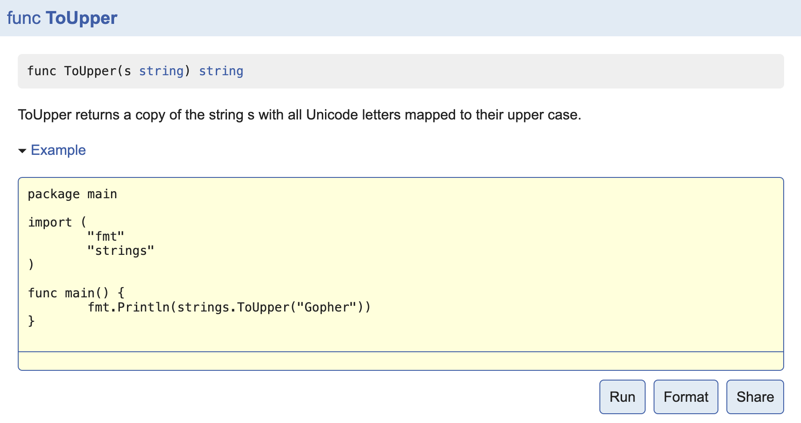

# 并发

**并发与并行**

并发：同一时间段内执行多个任务（你在用微信和两个女朋友聊天）。

并行：同一时刻执行多个任务（你和你朋友都在用微信和女朋友聊天）。

Go语言的并发通过`goroutine`实现。`goroutine`类似于线程，属于用户态的线程，我们可以根据需要创建成千上万个`goroutine`并发工作。`goroutine`是由Go语言的运行时（runtime）调度完成，而线程是由操作系统调度完成。

Go语言还提供`channel`在多个`goroutine`间进行通信。`goroutine`和`channel`是 Go 语言秉承的 CSP（Communicating Sequential Process）并发模式的重要实现基础。

## `goroutine`

在java/c++中我们要实现并发编程的时候，我们通常需要自己维护一个线程池，并且需要自己去包装一个又一个的任务，同时需要自己去调度线程执行任务并维护上下文切换，这一切通常会耗费程序员大量的心智。那么能不能有一种机制，程序员只需要定义很多个任务，让系统去帮助我们把这些任务分配到CPU上实现并发执行呢？

Go语言中的`goroutine`就是这样一种机制，`goroutine`的概念类似于线程，但 `goroutine`是由Go的运行时（runtime）调度和管理的。Go程序会智能地将 goroutine 中的任务合理地分配给每个CPU。Go语言之所以被称为现代化的编程语言，就是因为它在语言层面已经内置了调度和上下文切换的机制。

在Go语言编程中你不需要去自己写进程、线程、协程，你的技能包里只有一个技能–`goroutine`，当你需要让某个任务并发执行的时候，你只需要把这个任务包装成一个函数，开启一个`goroutine`去执行这个函数就可以了，就是这么简单粗暴。

### 1.使用goroutine

Go语言中使用`goroutine`非常简单，只需要在调用函数的时候在前面加上`go`关键字，就可以为一个函数创建一个`goroutine`。

一个`goroutine`必定对应一个函数，可以创建多个`goroutine`去执行相同的函数。

#### 启动单个goroutine

启动goroutine的方式非常简单，只需要在调用的函数（普通函数和匿名函数）前面加上一个`go`关键字。

举个例子如下：

```go
func hello() {
	fmt.Println("Hello Goroutine!")
}
func main() {
	hello()
	fmt.Println("main goroutine done!")
}
```

这个示例中hello函数和下面的语句是串行的，执行的结果是打印完`Hello Goroutine!`后打印`main goroutine done!`。

接下来我们在调用hello函数前面加上关键字`go`，也就是启动一个goroutine去执行hello这个函数。

```go
func main() {
	go hello() // 启动另外一个goroutine去执行hello函数
	fmt.Println("main goroutine done!")
}
```

这一次的执行结果只打印了`main goroutine done!`，并没有打印`Hello Goroutine!`。为什么呢？

在程序启动时，Go程序就会为`main()`函数创建一个默认的`goroutine`。

当main()函数返回的时候该`goroutine`就结束了，所有在`main()`函数中启动的`goroutine`会一同结束，`main`函数所在的`goroutine`就像是权利的游戏中的夜王，其他的`goroutine`都是异鬼，夜王一死它转化的那些异鬼也就全部GG了。

所以我们要想办法让main函数等一等hello函数，最简单粗暴的方式就是`time.Sleep`了。

```go
func main() {
	go hello() // 启动另外一个goroutine去执行hello函数
	fmt.Println("main goroutine done!")
	time.Sleep(time.Second)
}
```

执行上面的代码你会发现，这一次先打印`main goroutine done!`，然后紧接着打印`Hello Goroutine!`。

首先为什么会先打印`main goroutine done!`是因为我们在创建新的goroutine的时候需要花费一些时间，而此时main函数所在的`goroutine`是继续执行的。

#### 启动多个goroutine

在Go语言中实现并发就是这样简单，我们还可以启动多个`goroutine`。让我们再来一个例子： （这里使用了`sync.WaitGroup`来实现goroutine的同步）

```go
var wg sync.WaitGroup

func hello(i int) {
	defer wg.Done() // goroutine结束就登记-1
	fmt.Println("Hello Goroutine!", i)
}
func main() {

	for i := 0; i < 10; i++ {
		wg.Add(1) // 启动一个goroutine就登记+1
		go hello(i)
	}
	wg.Wait() // 等待所有登记的goroutine都结束
}
```

多次执行上面的代码，会发现每次打印的数字的顺序都不一致。这是因为10个`goroutine`是并发执行的，而`goroutine`的调度是随机的。

### 2.可增长的栈

OS线程（操作系统线程）一般都有固定的栈内存（通常为2MB）,一个`goroutine`的栈在其生命周期开始时只有很小的栈（典型情况下2KB），`goroutine`的栈不是固定的，他可以按需增大和缩小，`goroutine`的栈大小限制可以达到1GB，虽然极少会用到这个大。所以在Go语言中一次创建十万左右的`goroutine`也是可以的。

### 3.goroutine调度

`GPM`是Go语言运行时（runtime）层面的实现，是go语言自己实现的一套调度系统。区别于操作系统调度OS线程。

- `G`很好理解，就是个goroutine的，里面除了存放本goroutine信息外 还有与所在P的绑定等信息。
- `P`管理着一组goroutine队列，P里面会存储当前goroutine运行的上下文环境（函数指针，堆栈地址及地址边界），P会对自己管理的goroutine队列做一些调度（比如把占用CPU时间较长的goroutine暂停、运行后续的goroutine等等）当自己的队列消费完了就去全局队列里取，如果全局队列里也消费完了会去其他P的队列里抢任务。
- `M（machine）`是Go运行时（runtime）对操作系统内核线程的虚拟， M与内核线程一般是一一映射的关系， 一个groutine最终是要放到M上执行的；

P与M一般也是一一对应的。他们关系是： P管理着一组G挂载在M上运行。当一个G长久阻塞在一个M上时，runtime会新建一个M，阻塞G所在的P会把其他的G 挂载在新建的M上。当旧的G阻塞完成或者认为其已经死掉时 回收旧的M。

P的个数是通过`runtime.GOMAXPROCS`设定（最大256），Go1.5版本之后默认为物理线程数。 在并发量大的时候会增加一些P和M，但不会太多，切换太频繁的话得不偿失。

单从线程调度讲，Go语言相比起其他语言的优势在于OS线程是由OS内核来调度的，`goroutine`则是由Go运行时（runtime）自己的调度器调度的，这个调度器使用一个称为m:n调度的技术（复用/调度m个goroutine到n个OS线程）。 其一大特点是goroutine的调度是在用户态下完成的， 不涉及内核态与用户态之间的频繁切换，包括内存的分配与释放，都是在用户态维护着一块大的内存池， 不直接调用系统的malloc函数（除非内存池需要改变），成本比调度OS线程低很多。 另一方面充分利用了多核的硬件资源，近似的把若干goroutine均分在物理线程上， 再加上本身goroutine的超轻量，以上种种保证了go调度方面的性能。

[点我了解更多](https://www.cnblogs.com/sunsky303/p/9705727.html)

### 4.GOMAXPROCS

Go运行时的调度器使用`GOMAXPROCS`参数来确定需要使用多少个OS线程来同时执行Go代码。默认值是机器上的CPU核心数。例如在一个8核心的机器上，调度器会把Go代码同时调度到8个OS线程上（GOMAXPROCS是m:n调度中的n）。

Go语言中可以通过`runtime.GOMAXPROCS()`函数设置当前程序并发时占用的CPU逻辑核心数。

Go1.5版本之前，默认使用的是单核心执行。Go1.5版本之后，默认使用全部的CPU逻辑核心数。

我们可以通过将任务分配到不同的CPU逻辑核心上实现并行的效果，这里举个例子：

```go
func a() {
	for i := 1; i < 10; i++ {
		fmt.Println("A:", i)
	}
}

func b() {
	for i := 1; i < 10; i++ {
		fmt.Println("B:", i)
	}
}

func main() {
	runtime.GOMAXPROCS(1)
	go a()
	go b()
	time.Sleep(time.Second)
}
```

两个任务只有一个逻辑核心，此时是做完一个任务再做另一个任务。 将逻辑核心数设为2，此时两个任务并行执行，代码如下。

```go
func a() {
	for i := 1; i < 10; i++ {
		fmt.Println("A:", i)
	}
}

func b() {
	for i := 1; i < 10; i++ {
		fmt.Println("B:", i)
	}
}

func main() {
	runtime.GOMAXPROCS(2)
	go a()
	go b()
	time.Sleep(time.Second)
}
```

Go语言中的操作系统线程和goroutine的关系：

1. 一个操作系统线程对应用户态多个goroutine。
2. go程序可以同时使用多个操作系统线程。
3. goroutine和OS线程是多对多的关系，即m:n。

### 5.worker pool (goroutine池)

在工作中我们通常会使用可以指定启动的goroutine数量–`worker pool`模式，控制`goroutine`的数量，防止`goroutine`泄漏和暴涨。

一个简易的`work pool`示例代码如下：

```go
func worker(id int, jobs <-chan int, results chan<- int) {
	for j := range jobs {
		fmt.Printf("worker:%d start job:%d\n", id, j)
		time.Sleep(time.Second)
		fmt.Printf("worker:%d end job:%d\n", id, j)
		results <- j * 2
	}
}

func main() {
	jobs := make(chan int, 100)
	results := make(chan int, 100)
	// 开启3个goroutine
	for w := 1; w <= 3; w++ {
		go worker(w, jobs, results)
	}
	// 5个任务
	for j := 1; j <= 5; j++ {
		jobs <- j
	}
	close(jobs)
	// 输出结果
	for a := 1; a <= 5; a++ {
		<-results
	}
}
```

## `channel`

单纯地将函数并发执行是没有意义的。函数与函数间需要交换数据才能体现并发执行函数的意义。

虽然可以使用共享内存进行数据交换，但是共享内存在不同的`goroutine`中容易发生竞态问题。为了保证数据交换的正确性，必须使用互斥量对内存进行加锁，这种做法势必造成性能问题。

Go语言的并发模型是`CSP（Communicating Sequential Processes）`，提倡**通过通信共享内存**而不是**通过共享内存而实现通信**。

如果说`goroutine`是Go程序并发的执行体，`channel`就是它们之间的连接。`channel`是可以让一个`goroutine`发送特定值到另一个`goroutine`的通信机制。

Go 语言中的通道（channel）是一种特殊的类型。通道像一个传送带或者队列，总是遵循先入先出（First In First Out）的规则，保证收发数据的顺序。每一个通道都是一个具体类型的导管，也就是声明channel的时候需要为其指定元素类型。

### 1.channel类型

`channel`是一种类型，一种引用类型。声明通道类型的格式如下：

```go
var 变量 chan 元素类型
```

举几个例子：

```go
var ch1 chan int   // 声明一个传递整型的通道
var ch2 chan bool  // 声明一个传递布尔型的通道
var ch3 chan []int // 声明一个传递int切片的通道
```

### 2.创建channel

通道是引用类型，通道类型的空值是`nil`。

```go
var ch chan int
fmt.Println(ch) // <nil>
```

声明的通道后需要使用`make`函数初始化之后才能使用。

创建channel的格式如下：

```go
make(chan 元素类型, [缓冲大小])
```

channel的缓冲大小是可选的。

举几个例子：

```go
ch4 := make(chan int)
ch5 := make(chan bool)
ch6 := make(chan []int)
```

### 3.channel操作

通道有发送（send）、接收(receive）和关闭（close）三种操作。

发送和接收都使用`<-`符号。

现在我们先使用以下语句定义一个通道：

```go
ch := make(chan int)
```

#### 发送

将一个值发送到通道中。

```go
ch <- 10 // 把10发送到ch中
```

#### 接收

从一个通道中接收值。

```go
x := <- ch // 从ch中接收值并赋值给变量x
<-ch       // 从ch中接收值，忽略结果
```

#### 关闭

我们通过调用内置的`close`函数来关闭通道。

```go
close(ch)
```

关于关闭通道需要注意的事情是，只有在通知接收方goroutine所有的数据都发送完毕的时候才需要关闭通道。通道是可以被垃圾回收机制回收的，它和关闭文件是不一样的，在结束操作之后关闭文件是必须要做的，但关闭通道不是必须的。

关闭后的通道有以下特点：

1. 对一个关闭的通道再发送值就会导致panic。
2. 对一个关闭的通道进行接收会一直获取值直到通道为空。
3. 对一个关闭的并且没有值的通道执行接收操作会得到对应类型的零值。
4. 关闭一个已经关闭的通道会导致panic。

### 4.无缓冲的通道

无缓冲的通道又称为阻塞的通道。我们来看一下下面的代码：

```go
func main() {
	ch := make(chan int)
	ch <- 10
	fmt.Println("发送成功")
}
```

上面这段代码能够通过编译，但是执行的时候会出现以下错误：

```bash
fatal error: all goroutines are asleep - deadlock!

goroutine 1 [chan send]:
main.main()
        .../src/github.com/Q1mi/studygo/day06/channel02/main.go:8 +0x54
```

为什么会出现`deadlock`错误呢？

因为我们使用`ch := make(chan int)`创建的是无缓冲的通道，无缓冲的通道只有在有人接收值的时候才能发送值。就像你住的小区没有快递柜和代收点，快递员给你打电话必须要把这个物品送到你的手中，简单来说就是无缓冲的通道必须有接收才能发送。

上面的代码会阻塞在`ch <- 10`这一行代码形成死锁，那如何解决这个问题呢？

一种方法是启用一个`goroutine`去接收值，例如：

```go
func recv(c chan int) {
	ret := <-c
	fmt.Println("接收成功", ret)
}
func main() {
	ch := make(chan int)
	go recv(ch) // 启用goroutine从通道接收值
	ch <- 10
	fmt.Println("发送成功")
}
```

无缓冲通道上的发送操作会阻塞，直到另一个`goroutine`在该通道上执行接收操作，这时值才能发送成功，两个`goroutine`将继续执行。相反，如果接收操作先执行，接收方的goroutine将阻塞，直到另一个`goroutine`在该通道上发送一个值。

使用无缓冲通道进行通信将导致发送和接收的`goroutine`同步化。因此，无缓冲通道也被称为`同步通道`。

### 5.有缓冲的通道

解决上面问题的方法还有一种就是使用有缓冲区的通道。我们可以在使用make函数初始化通道的时候为其指定通道的容量，例如：

```go
func main() {
	ch := make(chan int, 1) // 创建一个容量为1的有缓冲区通道
	ch <- 10
	fmt.Println("发送成功")
}
```

只要通道的容量大于零，那么该通道就是有缓冲的通道，通道的容量表示通道中能存放元素的数量。就像你小区的快递柜只有那么个多格子，格子满了就装不下了，就阻塞了，等到别人取走一个快递员就能往里面放一个。

我们可以使用内置的`len`函数获取通道内元素的数量，使用`cap`函数获取通道的容量，虽然我们很少会这么做。

### 6.for range

当向通道中发送完数据时，我们可以通过`close`函数来关闭通道。

当通道被关闭时，再往该通道发送值会引发`panic`，从该通道取值的操作会先取完通道中的值，再然后取到的值一直都是对应类型的零值。那如何判断一个通道是否被关闭了呢？

我们来看下面这个例子：

```go
// channel 练习
func main() {
	ch1 := make(chan int)
	ch2 := make(chan int)
	// 开启goroutine将0~100的数发送到ch1中
	go func() {
		for i := 0; i < 100; i++ {
			ch1 <- i
		}
		close(ch1)
	}()
	// 开启goroutine从ch1中接收值，并将该值的平方发送到ch2中
	go func() {
		for {
			i, ok := <-ch1 // 通道关闭后再取值ok=false
			if !ok {
				break
			}
			ch2 <- i * i
		}
		close(ch2)
	}()
	// 在主goroutine中从ch2中接收值打印
	for i := range ch2 { // 通道关闭后会退出for range循环
		fmt.Println(i)
	}
}
```

从上面的例子中我们看到有两种方式在接收值的时候判断该通道是否被关闭，不过我们通常使用的是`for range`的方式。使用`for range`遍历通道，当通道被关闭的时候就会退出`for range`。

### 7.单向通道

有的时候我们会将通道作为参数在多个任务函数间传递，很多时候我们在不同的任务函数中使用通道都会对其进行限制，比如限制通道在函数中只能发送或只能接收。

Go语言中提供了**单向通道**来处理这种情况。例如，我们把上面的例子改造如下：

```go
func counter(out chan<- int) {
	for i := 0; i < 100; i++ {
		out <- i
	}
	close(out)
}

func squarer(out chan<- int, in <-chan int) {
	for i := range in {
		out <- i * i
	}
	close(out)
}
func printer(in <-chan int) {
	for i := range in {
		fmt.Println(i)
	}
}

func main() {
	ch1 := make(chan int)
	ch2 := make(chan int)
	go counter(ch1)
	go squarer(ch2, ch1)
	printer(ch2)
}
```

其中，

- `chan<- int`是一个只写单向通道（只能对其写入int类型值），可以对其执行发送操作但是不能执行接收操作；
- `<-chan int`是一个只读单向通道（只能从其读取int类型值），可以对其执行接收操作但是不能执行发送操作。

在函数传参及任何赋值操作中可以将双向通道转换为单向通道，但反过来是不可以的。

### 8.异常情况总结

`channel`常见的异常总结，如下图：

关闭已经关闭的`channel`也会引发`panic`。

### 9.select多路复用

在某些场景下我们需要同时从多个通道接收数据。通道在接收数据时，如果没有数据可以接收将会发生阻塞。你也许会写出如下代码使用遍历的方式来实现：

```go
for{
    // 尝试从ch1接收值
    data, ok := <-ch1
    // 尝试从ch2接收值
    data, ok := <-ch2
    …
}
```

这种方式虽然可以实现从多个通道接收值的需求，但是运行性能会差很多。为了应对这种场景，Go内置了`select`关键字，可以同时响应多个通道的操作。

`select`的使用类似于switch语句，它有一系列case分支和一个默认的分支。每个case会对应一个通道的通信（接收或发送）过程。`select`会一直等待，直到某个`case`的通信操作完成时，就会执行`case`分支对应的语句。具体格式如下：

```go
select{
    case <-ch1:
        ...
    case data := <-ch2:
        ...
    case ch3<-data:
        ...
    default:
        默认操作
}
```

举个小例子来演示下`select`的使用：

```go
func main() {
	ch := make(chan int, 1)
	for i := 0; i < 10; i++ {
		select {
		case x := <-ch:
			fmt.Println(x)
		case ch <- i:
		}
	}
}
```

使用`select`语句能提高代码的可读性。

- 可处理一个或多个channel的发送/接收操作。
- 如果多个`case`同时满足，`select`会随机选择一个。
- 对于没有`case`的`select{}`会一直等待，可用于阻塞main函数。

## `并发安全和锁`

有时候在Go代码中可能会存在多个`goroutine`同时操作一个资源（临界区），这种情况会发生`竞态问题`（数据竞态）。类比现实生活中的例子有十字路口被各个方向的的汽车竞争；还有火车上的卫生间被车厢里的人竞争。

举个例子：

```go
var x int64
var wg sync.WaitGroup

func add() {
	for i := 0; i < 5000; i++ {
		x = x + 1
	}
	wg.Done()
}
func main() {
	wg.Add(2)
	go add()
	go add()
	wg.Wait()
	fmt.Println(x)
}
```

上面的代码中我们开启了两个`goroutine`去累加变量x的值，这两个`goroutine`在访问和修改`x`变量的时候就会存在数据竞争，导致最后的结果与期待的不符。

### 1.互斥锁

互斥锁是一种常用的控制共享资源访问的方法，它能够保证同时只有一个`goroutine`可以访问共享资源。Go语言中使用`sync`包的`Mutex`类型来实现互斥锁。 使用互斥锁来修复上面代码的问题：

```go
var x int64
var wg sync.WaitGroup
var lock sync.Mutex

func add() {
	for i := 0; i < 5000; i++ {
		lock.Lock() // 加锁
		x = x + 1
		lock.Unlock() // 解锁
	}
	wg.Done()
}
func main() {
	wg.Add(2)
	go add()
	go add()
	wg.Wait()
	fmt.Println(x)
}
```

使用互斥锁能够保证同一时间有且只有一个`goroutine`进入临界区，其他的`goroutine`则在等待锁；当互斥锁释放后，等待的`goroutine`才可以获取锁进入临界区，多个`goroutine`同时等待一个锁时，唤醒的策略是随机的。

### 2.读写锁

互斥锁是完全互斥的，但是有很多实际的场景下是读多写少的，当我们并发的去读取一个资源不涉及资源修改的时候是没有必要加锁的，这种场景下使用读写锁是更好的一种选择。读写锁在Go语言中使用`sync`包中的`RWMutex`类型。

读写锁分为两种：读锁和写锁。当一个goroutine获取读锁之后，其他的`goroutine`如果是获取读锁会继续获得锁，如果是获取写锁就会等待；当一个`goroutine`获取写锁之后，其他的`goroutine`无论是获取读锁还是写锁都会等待。

读写锁示例：

```go
var (
	x      int64
	wg     sync.WaitGroup
	lock   sync.Mutex
	rwlock sync.RWMutex
)

func write() {
	// lock.Lock()   // 加互斥锁
	rwlock.Lock() // 加写锁
	x = x + 1
	time.Sleep(10 * time.Millisecond) // 假设读操作耗时10毫秒
	rwlock.Unlock()                   // 解写锁
	// lock.Unlock()                     // 解互斥锁
	wg.Done()
}

func read() {
	// lock.Lock()                  // 加互斥锁
	rwlock.RLock()               // 加读锁
	time.Sleep(time.Millisecond) // 假设读操作耗时1毫秒
	rwlock.RUnlock()             // 解读锁
	// lock.Unlock()                // 解互斥锁
	wg.Done()
}

func main() {
	start := time.Now()
	for i := 0; i < 10; i++ {
		wg.Add(1)
		go write()
	}

	for i := 0; i < 1000; i++ {
		wg.Add(1)
		go read()
	}

	wg.Wait()
	end := time.Now()
	fmt.Println(end.Sub(start))
}
```

需要注意的是读写锁非常适合读多写少的场景，如果读和写的操作差别不大，读写锁的优势就发挥不出来。

### 3.sync.WaitGroup

在代码中生硬的使用`time.Sleep`肯定是不合适的，Go语言中可以使用`sync.WaitGroup`来实现并发任务的同步。`sync.WaitGroup`有以下几个方法：

|             方法名              |        功能         |
| :-----------------------------: | :-----------------: |
| (wg * WaitGroup) Add(delta int) |    计数器+delta     |
|     (wg *WaitGroup) Done()      |      计数器-1       |
|     (wg *WaitGroup) Wait()      | 阻塞直到计数器变为0 |

`sync.WaitGroup`内部维护着一个计数器，计数器的值可以增加和减少。例如当我们启动了N 个并发任务时，就将计数器值增加N。每个任务完成时通过调用Done()方法将计数器减1。通过调用Wait()来等待并发任务执行完，当计数器值为0时，表示所有并发任务已经完成。

我们利用`sync.WaitGroup`将上面的代码优化一下：

```go
var wg sync.WaitGroup

func hello() {
	defer wg.Done()
	fmt.Println("Hello Goroutine!")
}
func main() {
	wg.Add(1)
	go hello() // 启动另外一个goroutine去执行hello函数
	fmt.Println("main goroutine done!")
	wg.Wait()
}
```

需要注意`sync.WaitGroup`是一个结构体，传递的时候要传递指针。

### 4.sync.Once

说在前面的话：这是一个进阶知识点。

在编程的很多场景下我们需要确保某些操作在高并发的场景下只执行一次，例如只加载一次配置文件、只关闭一次通道等。

Go语言中的`sync`包中提供了一个针对只执行一次场景的解决方案–`sync.Once`。

`sync.Once`只有一个`Do`方法，其签名如下：

```go
func (o *Once) Do(f func()) {}
```

*备注：如果要执行的函数`f`需要传递参数就需要搭配闭包来使用。*

#### 加载配置文件示例

延迟一个开销很大的初始化操作到真正用到它的时候再执行是一个很好的实践。因为预先初始化一个变量（比如在init函数中完成初始化）会增加程序的启动耗时，而且有可能实际执行过程中这个变量没有用上，那么这个初始化操作就不是必须要做的。我们来看一个例子：

```go
var icons map[string]image.Image

func loadIcons() {
	icons = map[string]image.Image{
		"left":  loadIcon("left.png"),
		"up":    loadIcon("up.png"),
		"right": loadIcon("right.png"),
		"down":  loadIcon("down.png"),
	}
}

// Icon 被多个goroutine调用时不是并发安全的
func Icon(name string) image.Image {
	if icons == nil {
		loadIcons()
	}
	return icons[name]
}
```

多个`goroutine`并发调用Icon函数时不是并发安全的，现代的编译器和CPU可能会在保证每个`goroutine`都满足串行一致的基础上自由地重排访问内存的顺序。loadIcons函数可能会被重排为以下结果：

```go
func loadIcons() {
	icons = make(map[string]image.Image)
	icons["left"] = loadIcon("left.png")
	icons["up"] = loadIcon("up.png")
	icons["right"] = loadIcon("right.png")
	icons["down"] = loadIcon("down.png")
}
```

在这种情况下就会出现即使判断了`icons`不是nil也不意味着变量初始化完成了。考虑到这种情况，我们能想到的办法就是添加互斥锁，保证初始化`icons`的时候不会被其他的`goroutine`操作，但是这样做又会引发性能问题。

使用`sync.Once`改造的示例代码如下：

```go
var icons map[string]image.Image

var loadIconsOnce sync.Once

func loadIcons() {
	icons = map[string]image.Image{
		"left":  loadIcon("left.png"),
		"up":    loadIcon("up.png"),
		"right": loadIcon("right.png"),
		"down":  loadIcon("down.png"),
	}
}

// Icon 是并发安全的
func Icon(name string) image.Image {
	loadIconsOnce.Do(loadIcons)
	return icons[name]
}
```

#### 并发安全的单例模式

下面是借助`sync.Once`实现的并发安全的单例模式：

```go
package singleton

import (
    "sync"
)

type singleton struct {}

var instance *singleton
var once sync.Once

func GetInstance() *singleton {
    once.Do(func() {
        instance = &singleton{}
    })
    return instance
}
```

`sync.Once`其实内部包含一个互斥锁和一个布尔值，互斥锁保证布尔值和数据的安全，而布尔值用来记录初始化是否完成。这样设计就能保证初始化操作的时候是并发安全的并且初始化操作也不会被执行多次。

### 5.sync.Map

Go语言中内置的map不是并发安全的。请看下面的示例：

```go
var m = make(map[string]int)

func get(key string) int {
	return m[key]
}

func set(key string, value int) {
	m[key] = value
}

func main() {
	wg := sync.WaitGroup{}
	for i := 0; i < 20; i++ {
		wg.Add(1)
		go func(n int) {
			key := strconv.Itoa(n)
			set(key, n)
			fmt.Printf("k=:%v,v:=%v\n", key, get(key))
			wg.Done()
		}(i)
	}
	wg.Wait()
}
```

上面的代码开启少量几个`goroutine`的时候可能没什么问题，当并发多了之后执行上面的代码就会报`fatal error: concurrent map writes`错误。

像这种场景下就需要为map加锁来保证并发的安全性了，Go语言的`sync`包中提供了一个开箱即用的并发安全版map–`sync.Map`。开箱即用表示不用像内置的map一样使用make函数初始化就能直接使用。同时`sync.Map`内置了诸如`Store`、`Load`、`LoadOrStore`、`Delete`、`Range`等操作方法。

```go
var m = sync.Map{}

func main() {
	wg := sync.WaitGroup{}
	for i := 0; i < 20; i++ {
		wg.Add(1)
		go func(n int) {
			key := strconv.Itoa(n)
			m.Store(key, n)
			value, _ := m.Load(key)
			fmt.Printf("k=:%v,v:=%v\n", key, value)
			wg.Done()
		}(i)
	}
	wg.Wait()
}
```

## `原子操作`

代码中的加锁操作因为涉及内核态的上下文切换会比较耗时、代价比较高。针对基本数据类型我们还可以使用原子操作来保证并发安全，因为原子操作是Go语言提供的方法它在用户态就可以完成，因此性能比加锁操作更好。Go语言中原子操作由内置的标准库`sync/atomic`提供。

### atomic包

| 方法                                                         |      解释      |
| :----------------------------------------------------------- | :------------: |
| func LoadInt32(addr *int32) (val int32) <br>func LoadInt64(addr *int64) (val int64) <br/>func LoadUint32(addr *uint32) (val uint32) <br/>func LoadUint64(addr *uint64) (val uint64) <br/>func LoadUintptr(addr *uintptr) (val uintptr) <br/>func LoadPointer(addr *unsafe.Pointer) (val unsafe.Pointer) |    读取操作    |
| func StoreInt32(addr *int32, val int32) <br/>func StoreInt64(addr *int64, val int64) <br/>func StoreUint32(addr *uint32, val uint32) <br/>func StoreUint64(addr *uint64, val uint64) <br/>func StoreUintptr(addr *uintptr, val uintptr) <br/>func StorePointer(addr *unsafe.Pointer, val unsafe.Pointer) |    写入操作    |
| func AddInt32(addr *int32, delta int32) (new int32) <br/>func AddInt64(addr *int64, delta int64) (new int64) <br/>func AddUint32(addr *uint32, delta uint32) (new uint32) <br/>func AddUint64(addr *uint64, delta uint64) (new uint64) <br/>func AddUintptr(addr *uintptr, delta uintptr) (new uintptr) |    修改操作    |
| func SwapInt32(addr *int32, new int32) (old int32) <br/>func SwapInt64(addr *int64, new int64) (old int64) <br/>func SwapUint32(addr *uint32, new uint32) (old uint32) <br/>func SwapUint64(addr *uint64, new uint64) (old uint64) <br/>func SwapUintptr(addr *uintptr, new uintptr) (old uintptr) <br/>func SwapPointer(addr *unsafe.Pointer, new unsafe.Pointer) (old unsafe.Pointer) |    交换操作    |
| func CompareAndSwapInt32(addr *int32, old, new int32) (swapped bool) <br/>func CompareAndSwapInt64(addr *int64, old, new int64) (swapped bool)  <br/>func CompareAndSwapUint32(addr *uint32, old, new uint32) (swapped bool) <br/>func CompareAndSwapUint64(addr *uint64, old, new uint64) (swapped bool) <br/>func CompareAndSwapUintptr(addr *uintptr, old, new uintptr) (swapped bool) <br/>func CompareAndSwapPointer(addr *unsafe.Pointer, old, new unsafe.Pointer) (swapped bool) | 比较并交换操作 |

### 示例

我们填写一个示例来比较下互斥锁和原子操作的性能。

```go
package main

import (
	"fmt"
	"sync"
	"sync/atomic"
	"time"
)

type Counter interface {
	Inc()
	Load() int64
}

// 普通版
type CommonCounter struct {
	counter int64
}

func (c CommonCounter) Inc() {
	c.counter++
}

func (c CommonCounter) Load() int64 {
	return c.counter
}

// 互斥锁版
type MutexCounter struct {
	counter int64
	lock    sync.Mutex
}

func (m *MutexCounter) Inc() {
	m.lock.Lock()
	defer m.lock.Unlock()
	m.counter++
}

func (m *MutexCounter) Load() int64 {
	m.lock.Lock()
	defer m.lock.Unlock()
	return m.counter
}

// 原子操作版
type AtomicCounter struct {
	counter int64
}

func (a *AtomicCounter) Inc() {
	atomic.AddInt64(&a.counter, 1)
}

func (a *AtomicCounter) Load() int64 {
	return atomic.LoadInt64(&a.counter)
}

func test(c Counter) {
	var wg sync.WaitGroup
	start := time.Now()
	for i := 0; i < 1000; i++ {
		wg.Add(1)
		go func() {
			c.Inc()
			wg.Done()
		}()
	}
	wg.Wait()
	end := time.Now()
	fmt.Println(c.Load(), end.Sub(start))
}

func main() {
	c1 := CommonCounter{} // 非并发安全
	test(c1)
	c2 := MutexCounter{} // 使用互斥锁实现并发安全
	test(&c2)
	c3 := AtomicCounter{} // 并发安全且比互斥锁效率更高
	test(&c3)
}
```

`atomic`包提供了底层的原子级内存操作，对于同步算法的实现很有用。这些函数必须谨慎地保证正确使用。除了某些特殊的底层应用，使用通道或者sync包的函数/类型实现同步更好。

# 网络

## 互联网协议介绍

互联网的核心是一系列协议，总称为”互联网协议”（Internet Protocol Suite），正是这一些协议规定了电脑如何连接和组网。我们理解了这些协议，就理解了互联网的原理。由于这些协议太过庞大和复杂，没有办法在这里一概而全，只能介绍一下我们日常开发中接触较多的几个协议。

### 互联网分层模型

互联网的逻辑实现被分为好几层。每一层都有自己的功能，就像建筑物一样，每一层都靠下一层支持。用户接触到的只是最上面的那一层，根本不会感觉到下面的几层。要理解互联网就需要自下而上理解每一层的实现的功能。如上图所示，互联网按照不同的模型划分会有不用的分层，但是不论按照什么模型去划分，越往上的层越靠近用户，越往下的层越靠近硬件。在软件开发中我们使用最多的是上图中将互联网划分为五个分层的模型。

接下来我们一层一层的自底向上介绍一下每一层。

### 物理层

我们的电脑要与外界互联网通信，需要先把电脑连接网络，我们可以用双绞线、光纤、无线电波等方式。这就叫做”实物理层”，它就是把电脑连接起来的物理手段。它主要规定了网络的一些电气特性，作用是负责传送0和1的电信号。

### 数据链路层

单纯的0和1没有任何意义，所以我们使用者会为其赋予一些特定的含义，规定解读电信号的方式：例如：多少个电信号算一组？每个信号位有何意义？这就是”数据链接层”的功能，它在”物理层”的上方，确定了物理层传输的0和1的分组方式及代表的意义。早期的时候，每家公司都有自己的电信号分组方式。逐渐地，一种叫做”以太网”（Ethernet）的协议，占据了主导地位。

以太网规定，一组电信号构成一个数据包，叫做”帧”（Frame）。每一帧分成两个部分：标头（Head）和数据（Data）。其中”标头”包含数据包的一些说明项，比如发送者、接受者、数据类型等等；”数据”则是数据包的具体内容。”标头”的长度，固定为18字节。”数据”的长度，最短为46字节，最长为1500字节。因此，整个”帧”最短为64字节，最长为1518字节。如果数据很长，就必须分割成多个帧进行发送。

那么，发送者和接受者是如何标识呢？以太网规定，连入网络的所有设备都必须具有”网卡”接口。数据包必须是从一块网卡，传送到另一块网卡。网卡的地址，就是数据包的发送地址和接收地址，这叫做MAC地址。每块网卡出厂的时候，都有一个全世界独一无二的MAC地址，长度是48个二进制位，通常用12个十六进制数表示。前6个十六进制数是厂商编号，后6个是该厂商的网卡流水号。有了MAC地址，就可以定位网卡和数据包的路径了。

我们会通过ARP协议来获取接受方的MAC地址，有了MAC地址之后，如何把数据准确的发送给接收方呢？其实这里以太网采用了一种很”原始”的方式，它不是把数据包准确送到接收方，而是向本网络内所有计算机都发送，让每台计算机读取这个包的”标头”，找到接收方的MAC地址，然后与自身的MAC地址相比较，如果两者相同，就接受这个包，做进一步处理，否则就丢弃这个包。这种发送方式就叫做”广播”（broadcasting）。

### 网络层

按照以太网协议的规则我们可以依靠MAC地址来向外发送数据。理论上依靠MAC地址，你电脑的网卡就可以找到身在世界另一个角落的某台电脑的网卡了，但是这种做法有一个重大缺陷就是以太网采用广播方式发送数据包，所有成员人手一”包”，不仅效率低，而且发送的数据只能局限在发送者所在的子网络。也就是说如果两台计算机不在同一个子网络，广播是传不过去的。这种设计是合理且必要的，因为如果互联网上每一台计算机都会收到互联网上收发的所有数据包，那是不现实的。

因此，必须找到一种方法区分哪些MAC地址属于同一个子网络，哪些不是。如果是同一个子网络，就采用广播方式发送，否则就采用”路由”方式发送。这就导致了”网络层”的诞生。它的作用是引进一套新的地址，使得我们能够区分不同的计算机是否属于同一个子网络。这套地址就叫做”网络地址”，简称”网址”。

“网络层”出现以后，每台计算机有了两种地址，一种是MAC地址，另一种是网络地址。两种地址之间没有任何联系，MAC地址是绑定在网卡上的，网络地址则是网络管理员分配的。网络地址帮助我们确定计算机所在的子网络，MAC地址则将数据包送到该子网络中的目标网卡。因此，从逻辑上可以推断，必定是先处理网络地址，然后再处理MAC地址。

规定网络地址的协议，叫做IP协议。它所定义的地址，就被称为IP地址。目前，广泛采用的是IP协议第四版，简称IPv4。IPv4这个版本规定，网络地址由32个二进制位组成，我们通常习惯用分成四段的十进制数表示IP地址，从0.0.0.0一直到255.255.255.255。

根据IP协议发送的数据，就叫做IP数据包。IP数据包也分为”标头”和”数据”两个部分：”标头”部分主要包括版本、长度、IP地址等信息，”数据”部分则是IP数据包的具体内容。IP数据包的”标头”部分的长度为20到60字节，整个数据包的总长度最大为65535字节。

### 传输层

有了MAC地址和IP地址，我们已经可以在互联网上任意两台主机上建立通信。但问题是同一台主机上会有许多程序都需要用网络收发数据，比如QQ和浏览器这两个程序都需要连接互联网并收发数据，我们如何区分某个数据包到底是归哪个程序的呢？也就是说，我们还需要一个参数，表示这个数据包到底供哪个程序（进程）使用。这个参数就叫做”端口”（port），它其实是每一个使用网卡的程序的编号。每个数据包都发到主机的特定端口，所以不同的程序就能取到自己所需要的数据。

“端口”是0到65535之间的一个整数，正好16个二进制位。0到1023的端口被系统占用，用户只能选用大于1023的端口。有了IP和端口我们就能实现唯一确定互联网上一个程序，进而实现网络间的程序通信。

我们必须在数据包中加入端口信息，这就需要新的协议。最简单的实现叫做UDP协议，它的格式几乎就是在数据前面，加上端口号。UDP数据包，也是由”标头”和”数据”两部分组成：”标头”部分主要定义了发出端口和接收端口，”数据”部分就是具体的内容。UDP数据包非常简单，”标头”部分一共只有8个字节，总长度不超过65,535字节，正好放进一个IP数据包。

UDP协议的优点是比较简单，容易实现，但是缺点是可靠性较差，一旦数据包发出，无法知道对方是否收到。为了解决这个问题，提高网络可靠性，TCP协议就诞生了。TCP协议能够确保数据不会遗失。它的缺点是过程复杂、实现困难、消耗较多的资源。TCP数据包没有长度限制，理论上可以无限长，但是为了保证网络的效率，通常TCP数据包的长度不会超过IP数据包的长度，以确保单个TCP数据包不必再分割。

### 应用层

应用程序收到”传输层”的数据，接下来就要对数据进行解包。由于互联网是开放架构，数据来源五花八门，必须事先规定好通信的数据格式，否则接收方根本无法获得真正发送的数据内容。”应用层”的作用就是规定应用程序使用的数据格式，例如我们TCP协议之上常见的Email、HTTP、FTP等协议，这些协议就组成了互联网协议的应用层。

如下图所示，发送方的HTTP数据经过互联网的传输过程中会依次添加各层协议的标头信息，接收方收到数据包之后再依次根据协议解包得到数据。


## `socket编程`

Socket是BSD UNIX的进程通信机制，通常也称作”套接字”，用于描述IP地址和端口，是一个通信链的句柄。Socket可以理解为TCP/IP网络的API，它定义了许多函数或例程，程序员可以用它们来开发TCP/IP网络上的应用程序。电脑上运行的应用程序通常通过”套接字”向网络发出请求或者应答网络请求。

### 1.socket图解

`Socket`是应用层与TCP/IP协议族通信的中间软件抽象层。在设计模式中，`Socket`其实就是一个门面模式，它把复杂的TCP/IP协议族隐藏在`Socket`后面，对用户来说只需要调用Socket规定的相关函数，让`Socket`去组织符合指定的协议数据然后进行通信。


### 2.Go语言实现TCP通信

#### TCP协议

TCP/IP(Transmission Control Protocol/Internet Protocol) 即传输控制协议/网间协议，是一种面向连接（连接导向）的、可靠的、基于字节流的传输层（Transport layer）通信协议，因为是面向连接的协议，数据像水流一样传输，会存在黏包问题。

#### TCP服务端

一个TCP服务端可以同时连接很多个客户端，例如世界各地的用户使用自己电脑上的浏览器访问淘宝网。因为Go语言中创建多个goroutine实现并发非常方便和高效，所以我们可以每建立一次链接就创建一个goroutine去处理。

TCP服务端程序的处理流程：

1. 监听端口
2. 接收客户端请求建立链接
3. 创建goroutine处理链接。

我们使用Go语言的net包实现的TCP服务端代码如下：

```go
// tcp/server/main.go

// TCP server端

// 处理函数
func process(conn net.Conn) {
	defer conn.Close() // 关闭连接
	for {
		reader := bufio.NewReader(conn)
		var buf [128]byte
		n, err := reader.Read(buf[:]) // 读取数据
		if err != nil {
			fmt.Println("read from client failed, err:", err)
			break
		}
		recvStr := string(buf[:n])
		fmt.Println("收到client端发来的数据：", recvStr)
		conn.Write([]byte(recvStr)) // 发送数据
	}
}

func main() {
	listen, err := net.Listen("tcp", "127.0.0.1:20000")
	if err != nil {
		fmt.Println("listen failed, err:", err)
		return
	}
	for {
		conn, err := listen.Accept() // 建立连接
		if err != nil {
			fmt.Println("accept failed, err:", err)
			continue
		}
		go process(conn) // 启动一个goroutine处理连接
	}
}
```

将上面的代码保存之后编译成`server`或`server.exe`可执行文件。

#### TCP客户端

一个TCP客户端进行TCP通信的流程如下：

1. 建立与服务端的链接
2. 进行数据收发
3. 关闭链接

使用Go语言的net包实现的TCP客户端代码如下：

```go
// tcp/client/main.go

// 客户端
func main() {
	conn, err := net.Dial("tcp", "127.0.0.1:20000")
	if err != nil {
		fmt.Println("err :", err)
		return
	}
	defer conn.Close() // 关闭连接
	inputReader := bufio.NewReader(os.Stdin)
	for {
		input, _ := inputReader.ReadString('\n') // 读取用户输入
		inputInfo := strings.Trim(input, "\r\n")
		if strings.ToUpper(inputInfo) == "Q" { // 如果输入q就退出
			return
		}
		_, err = conn.Write([]byte(inputInfo)) // 发送数据
		if err != nil {
			return
		}
		buf := [512]byte{}
		n, err := conn.Read(buf[:])
		if err != nil {
			fmt.Println("recv failed, err:", err)
			return
		}
		fmt.Println(string(buf[:n]))
	}
}
```

将上面的代码编译成`client`或`client.exe`可执行文件，先启动server端再启动client端，在client端输入任意内容回车之后就能够在server端看到client端发送的数据，从而实现TCP通信。

### 3.TCP黏包

#### 黏包示例

服务端代码如下：

```go
// socket_stick/server/main.go

func process(conn net.Conn) {
	defer conn.Close()
	reader := bufio.NewReader(conn)
	var buf [1024]byte
	for {
		n, err := reader.Read(buf[:])
		if err == io.EOF {
			break
		}
		if err != nil {
			fmt.Println("read from client failed, err:", err)
			break
		}
		recvStr := string(buf[:n])
		fmt.Println("收到client发来的数据：", recvStr)
	}
}

func main() {

	listen, err := net.Listen("tcp", "127.0.0.1:30000")
	if err != nil {
		fmt.Println("listen failed, err:", err)
		return
	}
	defer listen.Close()
	for {
		conn, err := listen.Accept()
		if err != nil {
			fmt.Println("accept failed, err:", err)
			continue
		}
		go process(conn)
	}
}
```

客户端代码如下：

```go
// socket_stick/client/main.go

func main() {
	conn, err := net.Dial("tcp", "127.0.0.1:30000")
	if err != nil {
		fmt.Println("dial failed, err", err)
		return
	}
	defer conn.Close()
	for i := 0; i < 20; i++ {
		msg := `Hello, Hello. How are you?`
		conn.Write([]byte(msg))
	}
}
```

将上面的代码保存后，分别编译。先启动服务端再启动客户端，可以看到服务端输出结果如下：

```bash
收到client发来的数据： Hello, Hello. How are you?Hello, Hello. How are you?Hello, Hello. How are you?Hello, Hello. How are you?Hello, Hello. How are you?
收到client发来的数据： Hello, Hello. How are you?Hello, Hello. How are you?Hello, Hello. How are you?Hello, Hello. How are you?Hello, Hello. How are you?Hello, Hello. How are you?Hello, Hello. How are you?Hello, Hello. How are you?
收到client发来的数据： Hello, Hello. How are you?Hello, Hello. How are you?
收到client发来的数据： Hello, Hello. How are you?Hello, Hello. How are you?Hello, Hello. How are you?
收到client发来的数据： Hello, Hello. How are you?Hello, Hello. How are you?
```

客户端分10次发送的数据，在服务端并没有成功的输出10次，而是多条数据“粘”到了一起。

### 为什么会出现粘包

主要原因就是tcp数据传递模式是流模式，在保持长连接的时候可以进行多次的收和发。

“粘包”可发生在发送端也可发生在接收端：

1. 由Nagle算法造成的发送端的粘包：Nagle算法是一种改善网络传输效率的算法。简单来说就是当我们提交一段数据给TCP发送时，TCP并不立刻发送此段数据，而是等待一小段时间看看在等待期间是否还有要发送的数据，若有则会一次把这两段数据发送出去。
2. 接收端接收不及时造成的接收端粘包：TCP会把接收到的数据存在自己的缓冲区中，然后通知应用层取数据。当应用层由于某些原因不能及时的把TCP的数据取出来，就会造成TCP缓冲区中存放了几段数据。

### 解决办法

出现”粘包”的关键在于接收方不确定将要传输的数据包的大小，因此我们可以对数据包进行封包和拆包的操作。

封包：封包就是给一段数据加上包头，这样一来数据包就分为包头和包体两部分内容了(过滤非法包时封包会加入”包尾”内容)。包头部分的长度是固定的，并且它存储了包体的长度，根据包头长度固定以及包头中含有包体长度的变量就能正确的拆分出一个完整的数据包。

我们可以自己定义一个协议，比如数据包的前4个字节为包头，里面存储的是发送的数据的长度。

```go
// socket_stick/proto/proto.go
package proto

import (
	"bufio"
	"bytes"
	"encoding/binary"
)

// Encode 将消息编码
func Encode(message string) ([]byte, error) {
	// 读取消息的长度，转换成int32类型（占4个字节）
	var length = int32(len(message))
	var pkg = new(bytes.Buffer)
	// 写入消息头
	err := binary.Write(pkg, binary.LittleEndian, length)
	if err != nil {
		return nil, err
	}
	// 写入消息实体
	err = binary.Write(pkg, binary.LittleEndian, []byte(message))
	if err != nil {
		return nil, err
	}
	return pkg.Bytes(), nil
}

// Decode 解码消息
func Decode(reader *bufio.Reader) (string, error) {
	// 读取消息的长度
	lengthByte, _ := reader.Peek(4) // 读取前4个字节的数据
	lengthBuff := bytes.NewBuffer(lengthByte)
	var length int32
	err := binary.Read(lengthBuff, binary.LittleEndian, &length)
	if err != nil {
		return "", err
	}
	// Buffered返回缓冲中现有的可读取的字节数。
	if int32(reader.Buffered()) < length+4 {
		return "", err
	}

	// 读取真正的消息数据
	pack := make([]byte, int(4+length))
	_, err = reader.Read(pack)
	if err != nil {
		return "", err
	}
	return string(pack[4:]), nil
}
```

接下来在服务端和客户端分别使用上面定义的`proto`包的`Decode`和`Encode`函数处理数据。

服务端代码如下：

```go
// socket_stick/server2/main.go

func process(conn net.Conn) {
	defer conn.Close()
	reader := bufio.NewReader(conn)
	for {
		msg, err := proto.Decode(reader)
		if err == io.EOF {
			return
		}
		if err != nil {
			fmt.Println("decode msg failed, err:", err)
			return
		}
		fmt.Println("收到client发来的数据：", msg)
	}
}

func main() {

	listen, err := net.Listen("tcp", "127.0.0.1:30000")
	if err != nil {
		fmt.Println("listen failed, err:", err)
		return
	}
	defer listen.Close()
	for {
		conn, err := listen.Accept()
		if err != nil {
			fmt.Println("accept failed, err:", err)
			continue
		}
		go process(conn)
	}
}
```

客户端代码如下：

```go
// socket_stick/client2/main.go

func main() {
	conn, err := net.Dial("tcp", "127.0.0.1:30000")
	if err != nil {
		fmt.Println("dial failed, err", err)
		return
	}
	defer conn.Close()
	for i := 0; i < 20; i++ {
		msg := `Hello, Hello. How are you?`
		data, err := proto.Encode(msg)
		if err != nil {
			fmt.Println("encode msg failed, err:", err)
			return
		}
		conn.Write(data)
	}
}
```

### 4.Go语言实现UDP通信

#### UDP协议

UDP协议（User Datagram Protocol）中文名称是用户数据报协议，是OSI（Open System Interconnection，开放式系统互联）参考模型中一种**无连接**的传输层协议，不需要建立连接就能直接进行数据发送和接收，属于`不可靠`的、`没有时序`的通信，但是UDP协议的实时性比较好，通常用于视频直播相关领域。

#### UDP服务端

使用Go语言的`net`包实现的UDP服务端代码如下：

```go
// UDP/server/main.go

// UDP server端
func main() {
	listen, err := net.ListenUDP("udp", &net.UDPAddr{
		IP:   net.IPv4(0, 0, 0, 0),
		Port: 30000,
	})
	if err != nil {
		fmt.Println("listen failed, err:", err)
		return
	}
	defer listen.Close()
	for {
		var data [1024]byte
		n, addr, err := listen.ReadFromUDP(data[:]) // 接收数据
		if err != nil {
			fmt.Println("read udp failed, err:", err)
			continue
		}
		fmt.Printf("data:%v addr:%v count:%v\n", string(data[:n]), addr, n)
		_, err = listen.WriteToUDP(data[:n], addr) // 发送数据
		if err != nil {
			fmt.Println("write to udp failed, err:", err)
			continue
		}
	}
}
```

#### UDP客户端

使用Go语言的`net`包实现的UDP客户端代码如下：

```go
// UDP 客户端
func main() {
	socket, err := net.DialUDP("udp", nil, &net.UDPAddr{
		IP:   net.IPv4(0, 0, 0, 0),
		Port: 30000,
	})
	if err != nil {
		fmt.Println("连接服务端失败，err:", err)
		return
	}
	defer socket.Close()
	sendData := []byte("Hello server")
	_, err = socket.Write(sendData) // 发送数据
	if err != nil {
		fmt.Println("发送数据失败，err:", err)
		return
	}
	data := make([]byte, 4096)
	n, remoteAddr, err := socket.ReadFromUDP(data) // 接收数据
	if err != nil {
		fmt.Println("接收数据失败，err:", err)
		return
	}
	fmt.Printf("recv:%v addr:%v count:%v\n", string(data[:n]), remoteAddr, n)
}
```

## `net/http`

Go语言内置的`net/http`包十分的优秀，提供了HTTP客户端和服务端的实现。

### 1.HTTP协议

超文本传输协议（HTTP，HyperText Transfer Protocol)是互联网上应用最为广泛的一种网络传输协议，所有的WWW文件都必须遵守这个标准。设计HTTP最初的目的是为了提供一种发布和接收HTML页面的方法。

### 2.客户端

#### 基本的HTTP/HTTPS请求

Get、Head、Post和PostForm函数发出HTTP/HTTPS请求。

```go
resp, err := http.Get("http://example.com/")
...
resp, err := http.Post("http://example.com/upload", "image/jpeg", &buf)
...
resp, err := http.PostForm("http://example.com/form",
	url.Values{"key": {"Value"}, "id": {"123"}})
```

程序在使用完response后必须关闭回复的主体。

```go
resp, err := http.Get("http://example.com/")
if err != nil {
	// handle error
}
defer resp.Body.Close()
body, err := ioutil.ReadAll(resp.Body)
// ...
```

#### GET请求示例

使用`net/http`包编写一个简单的发送HTTP请求的Client端，代码如下：

```go
package main

import (
	"fmt"
	"io/ioutil"
	"net/http"
)

func main() {
	resp, err := http.Get("https://www.liwenzhou.com/")
	if err != nil {
		fmt.Println("get failed, err:", err)
		return
	}
	defer resp.Body.Close()
	body, err := ioutil.ReadAll(resp.Body)
	if err != nil {
		fmt.Println("read from resp.Body failed,err:", err)
		return
	}
	fmt.Print(string(body))
}
```

将上面的代码保存之后编译成可执行文件，执行之后就能在终端打印`liwenzhou.com`网站首页的内容了，我们的浏览器其实就是一个发送和接收HTTP协议数据的客户端，我们平时通过浏览器访问网页其实就是从网站的服务器接收HTTP数据，然后浏览器会按照HTML、CSS等规则将网页渲染展示出来。

#### 带参数的GET请求示例

关于GET请求的参数需要使用Go语言内置的`net/url`这个标准库来处理。

```go
func main() {
	apiUrl := "http://127.0.0.1:9090/get"
	// URL param
	data := url.Values{}
	data.Set("name", "小王子")
	data.Set("age", "18")
	u, err := url.ParseRequestURI(apiUrl)
	if err != nil {
		fmt.Printf("parse url requestUrl failed,err:%v\n", err)
	}
	u.RawQuery = data.Encode() // URL encode
	fmt.Println(u.String())
	resp, err := http.Get(u.String())
	if err != nil {
		fmt.Println("post failed, err:%v\n", err)
		return
	}
	defer resp.Body.Close()
	b, err := ioutil.ReadAll(resp.Body)
	if err != nil {
		fmt.Println("get resp failed,err:%v\n", err)
		return
	}
	fmt.Println(string(b))
}
```

对应的Server端HandlerFunc如下：

```go
func getHandler(w http.ResponseWriter, r *http.Request) {
	defer r.Body.Close()
	data := r.URL.Query()
	fmt.Println(data.Get("name"))
	fmt.Println(data.Get("age"))
	answer := `{"status": "ok"}`
	w.Write([]byte(answer))
}
```

#### Post请求示例

上面演示了使用`net/http`包发送`GET`请求的示例，发送`POST`请求的示例代码如下：

```go
package main

import (
	"fmt"
	"io/ioutil"
	"net/http"
	"strings"
)

// net/http post demo

func main() {
	url := "http://127.0.0.1:9090/post"
	// 表单数据
	//contentType := "application/x-www-form-urlencoded"
	//data := "name=小王子&age=18"
	// json
	contentType := "application/json"
	data := `{"name":"小王子","age":18}`
	resp, err := http.Post(url, contentType, strings.NewReader(data))
	if err != nil {
		fmt.Println("post failed, err:%v\n", err)
		return
	}
	defer resp.Body.Close()
	b, err := ioutil.ReadAll(resp.Body)
	if err != nil {
		fmt.Println("get resp failed,err:%v\n", err)
		return
	}
	fmt.Println(string(b))
}
```

对应的Server端HandlerFunc如下：

```go
func postHandler(w http.ResponseWriter, r *http.Request) {
	defer r.Body.Close()
	// 1. 请求类型是application/x-www-form-urlencoded时解析form数据
	r.ParseForm()
	fmt.Println(r.PostForm) // 打印form数据
	fmt.Println(r.PostForm.Get("name"), r.PostForm.Get("age"))
	// 2. 请求类型是application/json时从r.Body读取数据
	b, err := ioutil.ReadAll(r.Body)
	if err != nil {
		fmt.Println("read request.Body failed, err:%v\n", err)
		return
	}
	fmt.Println(string(b))
	answer := `{"status": "ok"}`
	w.Write([]byte(answer))
}
```

#### 自定义Client

要管理HTTP客户端的头域、重定向策略和其他设置，创建一个Client：

```go
client := &http.Client{
	CheckRedirect: redirectPolicyFunc,
}
resp, err := client.Get("http://example.com")
// ...
req, err := http.NewRequest("GET", "http://example.com", nil)
// ...
req.Header.Add("If-None-Match", `W/"wyzzy"`)
resp, err := client.Do(req)
// ...
```

#### 自定义Transport

要管理代理、TLS配置、keep-alive、压缩和其他设置，创建一个Transport：

```go
tr := &http.Transport{
	TLSClientConfig:    &tls.Config{RootCAs: pool},
	DisableCompression: true,
}
client := &http.Client{Transport: tr}
resp, err := client.Get("https://example.com")
```

Client和Transport类型都可以安全的被多个goroutine同时使用。出于效率考虑，应该一次建立、尽量重用。

### 3.服务端

#### 默认的Server

ListenAndServe使用指定的监听地址和处理器启动一个HTTP服务端。处理器参数通常是nil，这表示采用包变量DefaultServeMux作为处理器。

Handle和HandleFunc函数可以向DefaultServeMux添加处理器。

```go
http.Handle("/foo", fooHandler)
http.HandleFunc("/bar", func(w http.ResponseWriter, r *http.Request) {
	fmt.Fprintf(w, "Hello, %q", html.EscapeString(r.URL.Path))
})
log.Fatal(http.ListenAndServe(":8080", nil))
```

#### 默认的Server示例

使用Go语言中的`net/http`包来编写一个简单的接收HTTP请求的Server端示例，`net/http`包是对net包的进一步封装，专门用来处理HTTP协议的数据。具体的代码如下：

```go
// http server

func sayHello(w http.ResponseWriter, r *http.Request) {
	fmt.Fprintln(w, "Hello 沙河！")
}

func main() {
	http.HandleFunc("/", sayHello)
	err := http.ListenAndServe(":9090", nil)
	if err != nil {
		fmt.Printf("http server failed, err:%v\n", err)
		return
	}
}
```

将上面的代码编译之后执行，打开你电脑上的浏览器在地址栏输入`127.0.0.1:9090`回车，此时就能够看到如下页面了。

#### 自定义Server

要管理服务端的行为，可以创建一个自定义的Server：

```go
s := &http.Server{
	Addr:           ":8080",
	Handler:        myHandler,
	ReadTimeout:    10 * time.Second,
	WriteTimeout:   10 * time.Second,
	MaxHeaderBytes: 1 << 20,
}
log.Fatal(s.ListenAndServe())
```

## `Cookie`

### 1.简介

#### Cookie的由来

HTTP协议是无状态的，这就存在一个问题。

无状态的意思是每次请求都是独立的，它的执行情况和结果与前面的请求和之后的请求都无直接关系，它不会受前面的请求响应情况直接影响，也不会直接影响后面的请求响应情况。

一句有意思的话来描述就是人生只如初见，对服务器来说，每次的请求都是全新的。

状态可以理解为客户端和服务器在某次会话中产生的数据，那无状态的就以为这些数据不会被保留。会话中产生的数据又是我们需要保存的，也就是说要“保持状态”。因此Cookie就是在这样一个场景下诞生。

#### Cookie是什么

在 Internet 中，Cookie 实际上是指小量信息，是由 Web 服务器创建的，将信息存储在用户计算机上（客户端）的数据文件。一般网络用户习惯用其复数形式 Cookies，指某些网站为了辨别用户身份、进行 Session 跟踪而存储在用户本地终端上的数据，而这些数据通常会经过加密处理。

#### Cookie的机制

Cookie是由服务器端生成，发送给User-Agent（一般是浏览器），浏览器会将Cookie的key/value保存到某个目录下的文本文件内，下次请求同一网站时就发送该Cookie给服务器（前提是浏览器设置为启用cookie）。Cookie名称和值可以由服务器端开发自己定义，这样服务器可以知道该用户是否是合法用户以及是否需要重新登录等，服务器可以设置或读取Cookies中包含信息，借此维护用户跟服务器会话中的状态。

总结一下Cookie的特点：

1. 浏览器发送请求的时候，自动把携带该站点之前存储的Cookie信息。
2. 服务端可以设置Cookie数据。
3. Cookie是针对单个域名的，不同域名之间的Cookie是独立的。
4. Cookie数据可以配置过期时间，过期的Cookie数据会被系统清除。

#### 查看Cookie

我们使用Chrome浏览器打开一个网站，打开开发者工具查看该网站保存在我们电脑上的Cookie数据。

### 2.Go操作Cooki

标准库`net/http`中定义了Cookie，它代表一个出现在HTTP响应头中Set-Cookie的值里或者HTTP请求头中Cookie的值的`HTTP cookie`。

```go
type Cookie struct {
    Name       string
    Value      string
    Path       string
    Domain     string
    Expires    time.Time
    RawExpires string
    // MaxAge=0表示未设置Max-Age属性
    // MaxAge<0表示立刻删除该cookie，等价于"Max-Age: 0"
    // MaxAge>0表示存在Max-Age属性，单位是秒
    MaxAge   int
    Secure   bool
    HttpOnly bool
    Raw      string
    Unparsed []string // 未解析的“属性-值”对的原始文本
}
```

#### 设置Cookie

`net/http`中提供了如下`SetCookie`函数，它在w的头域中添加Set-Cookie头，该HTTP头的值为cookie。

```go
func SetCookie(w ResponseWriter, cookie *Cookie)
```

#### 获取Cookie

`Request`对象拥有两个获取Cookie的方法和一个添加Cookie的方法：

获取Cookie的两种方法：

```go
// 解析并返回该请求的Cookie头设置的所有cookie
func (r *Request) Cookies() []*Cookie

// 返回请求中名为name的cookie，如果未找到该cookie会返回nil, ErrNoCookie。
func (r *Request) Cookie(name string) (*Cookie, error)
```

添加Cookie的方法：

```go
// AddCookie向请求中添加一个cookie。
func (r *Request) AddCookie(c *Cookie)
```

### 3.gin框架操作Cookie

```go
import (
    "fmt"

    "github.com/gin-gonic/gin"
)

func main() {
    router := gin.Default()
    router.GET("/cookie", func(c *gin.Context) {
        cookie, err := c.Cookie("gin_cookie") // 获取Cookie
        if err != nil {
            cookie = "NotSet"
            // 设置Cookie
            c.SetCookie("gin_cookie", "test", 3600, "/", "localhost", false, true)
        }
        fmt.Printf("Cookie value: %s \n", cookie)
    })

    router.Run()
}
```

## `Session`

### 1.Session的由来

Cookie虽然在一定程度上解决了“保持状态”的需求，但是由于Cookie本身最大支持4096字节，以及Cookie本身保存在客户端，可能被拦截或窃取，因此就需要有一种新的东西，它能支持更多的字节，并且他保存在服务器，有较高的安全性。这就是`Session`。

问题来了，基于HTTP协议的无状态特征，服务器根本就不知道访问者是“谁”。那么上述的Cookie就起到桥接的作用。

用户登陆成功之后，我们在服务端为每个用户创建一个特定的session和一个唯一的标识，它们一一对应。其中：

- Session是在服务端保存的一个数据结构，用来跟踪用户的状态，这个数据可以保存在集群、数据库、文件中；
- 唯一标识通常称为`Session ID`会写入用户的Cookie中。

这样该用户后续再次访问时，请求会自动携带Cookie数据（其中包含了`Session ID`），服务器通过该`Session ID`就能找到与之对应的Session数据，也就知道来的人是“谁”。

总结而言：Cookie弥补了HTTP无状态的不足，让服务器知道来的人是“谁”；但是Cookie以文本的形式保存在本地，自身安全性较差；所以我们就通过Cookie识别不同的用户，对应的在服务端为每个用户保存一个Session数据，该Session数据中能够保存具体的用户数据信息。

另外，上述所说的Cookie和Session其实是共通性的东西，不限于语言和框架。

# 测试

## `单元测试`

不写测试的开发不是好程序员。我个人非常崇尚TDD（Test Driven Development）的，然而可惜的是国内的程序员都不太关注测试这一部分。 这篇文章主要介绍下在Go语言中如何做单元测试和基准测试。

### 1.go test

Go语言中的测试依赖`go test`命令。编写测试代码和编写普通的Go代码过程是类似的，并不需要学习新的语法、规则或工具。

go test命令是一个按照一定约定和组织的测试代码的驱动程序。在包目录内，所有以`_test.go`为后缀名的源代码文件都是`go test`测试的一部分，不会被`go build`编译到最终的可执行文件中。

在`*_test.go`文件中有三种类型的函数，单元测试函数、基准测试函数和示例函数。

|   类型   |         格式          |              作用              |
| :------: | :-------------------: | :----------------------------: |
| 测试函数 |   函数名前缀为Test    | 测试程序的一些逻辑行为是否正确 |
| 基准函数 | 函数名前缀为Benchmark |         测试函数的性能         |
| 示例函数 |  函数名前缀为Example  |       为文档提供示例文档       |

`go test`命令会遍历所有的`*_test.go`文件中符合上述命名规则的函数，然后生成一个临时的main包用于调用相应的测试函数，然后构建并运行、报告测试结果，最后清理测试中生成的临时文件。

### 2.测试函数

#### 测试函数的格式

每个测试函数必须导入`testing`包，测试函数的基本格式（签名）如下：

```go
func TestName(t *testing.T){
    // ...
}
```

测试函数的名字必须以`Test`开头，可选的后缀名必须以大写字母开头，举几个例子：

```go
func TestAdd(t *testing.T){ ... }
func TestSum(t *testing.T){ ... }
func TestLog(t *testing.T){ ... }
```

其中参数`t`用于报告测试失败和附加的日志信息。 `testing.T`的拥有的方法如下：

```go
func (c *T) Error(args ...interface{})
func (c *T) Errorf(format string, args ...interface{})
func (c *T) Fail()
func (c *T) FailNow()
func (c *T) Failed() bool
func (c *T) Fatal(args ...interface{})
func (c *T) Fatalf(format string, args ...interface{})
func (c *T) Log(args ...interface{})
func (c *T) Logf(format string, args ...interface{})
func (c *T) Name() string
func (t *T) Parallel()
func (t *T) Run(name string, f func(t *T)) bool
func (c *T) Skip(args ...interface{})
func (c *T) SkipNow()
func (c *T) Skipf(format string, args ...interface{})
func (c *T) Skipped() bool
```

#### 测试函数示例

就像细胞是构成我们身体的基本单位，一个软件程序也是由很多单元组件构成的。单元组件可以是函数、结构体、方法和最终用户可能依赖的任意东西。总之我们需要确保这些组件是能够正常运行的。单元测试是一些利用各种方法测试单元组件的程序，它会将结果与预期输出进行比较。

接下来，我们定义一个`split`的包，包中定义了一个`Split`函数，具体实现如下：

```go
// split/split.go

package split

import "strings"

// split package with a single split function.

// Split slices s into all substrings separated by sep and
// returns a slice of the substrings between those separators.
func Split(s, sep string) (result []string) {
	i := strings.Index(s, sep)

	for i > -1 {
		result = append(result, s[:i])
		s = s[i+1:]
		i = strings.Index(s, sep)
	}
	result = append(result, s)
	return
}
```

在当前目录下，我们创建一个`split_test.go`的测试文件，并定义一个测试函数如下：

```go
// split/split_test.go

package split

import (
	"reflect"
	"testing"
)

func TestSplit(t *testing.T) { // 测试函数名必须以Test开头，必须接收一个*testing.T类型参数
	got := Split("a:b:c", ":")         // 程序输出的结果
	want := []string{"a", "b", "c"}    // 期望的结果
	if !reflect.DeepEqual(want, got) { // 因为slice不能比较直接，借助反射包中的方法比较
		t.Errorf("excepted:%v, got:%v", want, got) // 测试失败输出错误提示
	}
}
```

此时`split`这个包中的文件如下：

```bash
split $ ls -l
total 16
-rw-r--r--  1 liwenzhou  staff  408  4 29 15:50 split.go
-rw-r--r--  1 liwenzhou  staff  466  4 29 16:04 split_test.go
```

在`split`包路径下，执行`go test`命令，可以看到输出结果如下：

```bash
split $ go test
PASS
ok      github.com/Q1mi/studygo/code_demo/test_demo/split       0.005s
```

一个测试用例有点单薄，我们再编写一个测试使用多个字符切割字符串的例子，在`split_test.go`中添加如下测试函数：

```go
func TestMoreSplit(t *testing.T) {
	got := Split("abcd", "bc")
	want := []string{"a", "d"}
	if !reflect.DeepEqual(want, got) {
		t.Errorf("excepted:%v, got:%v", want, got)
	}
}
```

再次运行`go test`命令，输出结果如下：

```bash
split $ go test
--- FAIL: TestMultiSplit (0.00s)
    split_test.go:20: excepted:[a d], got:[a cd]
FAIL
exit status 1
FAIL    github.com/Q1mi/studygo/code_demo/test_demo/split       0.006s
```

这一次，我们的测试失败了。我们可以为`go test`命令添加`-v`参数，查看测试函数名称和运行时间：

```bash
split $ go test -v
=== RUN   TestSplit
--- PASS: TestSplit (0.00s)
=== RUN   TestMoreSplit
--- FAIL: TestMoreSplit (0.00s)
    split_test.go:21: excepted:[a d], got:[a cd]
FAIL
exit status 1
FAIL    github.com/Q1mi/studygo/code_demo/test_demo/split       0.005s
```

这一次我们能清楚的看到是`TestMoreSplit`这个测试没有成功。 还可以在`go test`命令后添加`-run`参数，它对应一个正则表达式，只有函数名匹配上的测试函数才会被`go test`命令执行。

```bash
split $ go test -v -run="More"
=== RUN   TestMoreSplit
--- FAIL: TestMoreSplit (0.00s)
    split_test.go:21: excepted:[a d], got:[a cd]
FAIL
exit status 1
FAIL    github.com/Q1mi/studygo/code_demo/test_demo/split       0.006s
```

现在我们回过头来解决我们程序中的问题。很显然我们最初的`split`函数并没有考虑到sep为多个字符的情况，我们来修复下这个Bug：

```go
package split

import "strings"

// split package with a single split function.

// Split slices s into all substrings separated by sep and
// returns a slice of the substrings between those separators.
func Split(s, sep string) (result []string) {
	i := strings.Index(s, sep)

	for i > -1 {
		result = append(result, s[:i])
		s = s[i+len(sep):] // 这里使用len(sep)获取sep的长度
		i = strings.Index(s, sep)
	}
	result = append(result, s)
	return
}
```

这一次我们再来测试一下，我们的程序。注意，当我们修改了我们的代码之后不要仅仅执行那些失败的测试函数，我们应该完整的运行所有的测试，保证不会因为修改代码而引入了新的问题。

```bash
split $ go test -v
=== RUN   TestSplit
--- PASS: TestSplit (0.00s)
=== RUN   TestMoreSplit
--- PASS: TestMoreSplit (0.00s)
PASS
ok      github.com/Q1mi/studygo/code_demo/test_demo/split       0.006s
```

这一次我们的测试都通过了。

### 3.测试组

我们现在还想要测试一下`split`函数对中文字符串的支持，这个时候我们可以再编写一个`TestChineseSplit`测试函数，但是我们也可以使用如下更友好的一种方式来添加更多的测试用例。

```go
func TestSplit(t *testing.T) {
   // 定义一个测试用例类型
	type test struct {
		input string
		sep   string
		want  []string
	}
	// 定义一个存储测试用例的切片
	tests := []test{
		{input: "a:b:c", sep: ":", want: []string{"a", "b", "c"}},
		{input: "a:b:c", sep: ",", want: []string{"a:b:c"}},
		{input: "abcd", sep: "bc", want: []string{"a", "d"}},
		{input: "沙河有沙又有河", sep: "沙", want: []string{"河有", "又有河"}},
	}
	// 遍历切片，逐一执行测试用例
	for _, tc := range tests {
		got := Split(tc.input, tc.sep)
		if !reflect.DeepEqual(got, tc.want) {
			t.Errorf("excepted:%v, got:%v", tc.want, got)
		}
	}
}
```

我们通过上面的代码把多个测试用例合到一起，再次执行`go test`命令。

```bash
split $ go test -v
=== RUN   TestSplit
--- FAIL: TestSplit (0.00s)
    split_test.go:42: excepted:[河有 又有河], got:[ 河有 又有河]
FAIL
exit status 1
FAIL    github.com/Q1mi/studygo/code_demo/test_demo/split       0.006s
```

我们的测试出现了问题，仔细看打印的测试失败提示信息：`excepted:[河有 又有河], got:[ 河有 又有河]`，你会发现`[ 河有 又有河]`中有个不明显的空串，这种情况下十分推荐使用`%#v`的格式化方式。

我们修改下测试用例的格式化输出错误提示部分：

```go
func TestSplit(t *testing.T) {
   ...
   
	for _, tc := range tests {
		got := Split(tc.input, tc.sep)
		if !reflect.DeepEqual(got, tc.want) {
			t.Errorf("excepted:%#v, got:%#v", tc.want, got)
		}
	}
}
```

此时运行`go test`命令后就能看到比较明显的提示信息了：

```bash
split $ go test -v
=== RUN   TestSplit
--- FAIL: TestSplit (0.00s)
    split_test.go:42: excepted:[]string{"河有", "又有河"}, got:[]string{"", "河有", "又有河"}
FAIL
exit status 1
FAIL    github.com/Q1mi/studygo/code_demo/test_demo/split       0.006s
```

### 4.子测试

看起来都挺不错的，但是如果测试用例比较多的时候，我们是没办法一眼看出来具体是哪个测试用例失败了。我们可能会想到下面的解决办法：

```go
func TestSplit(t *testing.T) {
	type test struct { // 定义test结构体
		input string
		sep   string
		want  []string
	}
	tests := map[string]test{ // 测试用例使用map存储
		"simple":      {input: "a:b:c", sep: ":", want: []string{"a", "b", "c"}},
		"wrong sep":   {input: "a:b:c", sep: ",", want: []string{"a:b:c"}},
		"more sep":    {input: "abcd", sep: "bc", want: []string{"a", "d"}},
		"leading sep": {input: "沙河有沙又有河", sep: "沙", want: []string{"河有", "又有河"}},
	}
	for name, tc := range tests {
		got := Split(tc.input, tc.sep)
		if !reflect.DeepEqual(got, tc.want) {
			t.Errorf("name:%s excepted:%#v, got:%#v", name, tc.want, got) // 将测试用例的name格式化输出
		}
	}
}
```

上面的做法是能够解决问题的。同时Go1.7+中新增了子测试，我们可以按照如下方式使用`t.Run`执行子测试：

```go
func TestSplit(t *testing.T) {
	type test struct { // 定义test结构体
		input string
		sep   string
		want  []string
	}
	tests := map[string]test{ // 测试用例使用map存储
		"simple":      {input: "a:b:c", sep: ":", want: []string{"a", "b", "c"}},
		"wrong sep":   {input: "a:b:c", sep: ",", want: []string{"a:b:c"}},
		"more sep":    {input: "abcd", sep: "bc", want: []string{"a", "d"}},
		"leading sep": {input: "沙河有沙又有河", sep: "沙", want: []string{"河有", "又有河"}},
	}
	for name, tc := range tests {
		t.Run(name, func(t *testing.T) { // 使用t.Run()执行子测试
			got := Split(tc.input, tc.sep)
			if !reflect.DeepEqual(got, tc.want) {
				t.Errorf("excepted:%#v, got:%#v", tc.want, got)
			}
		})
	}
}
```

此时我们再执行`go test`命令就能够看到更清晰的输出内容了：

```bash
split $ go test -v
=== RUN   TestSplit
=== RUN   TestSplit/leading_sep
=== RUN   TestSplit/simple
=== RUN   TestSplit/wrong_sep
=== RUN   TestSplit/more_sep
--- FAIL: TestSplit (0.00s)
    --- FAIL: TestSplit/leading_sep (0.00s)
        split_test.go:83: excepted:[]string{"河有", "又有河"}, got:[]string{"", "河有", "又有河"}
    --- PASS: TestSplit/simple (0.00s)
    --- PASS: TestSplit/wrong_sep (0.00s)
    --- PASS: TestSplit/more_sep (0.00s)
FAIL
exit status 1
FAIL    github.com/Q1mi/studygo/code_demo/test_demo/split       0.006s
```

这个时候我们要把测试用例中的错误修改回来：

```go
func TestSplit(t *testing.T) {
	...
	tests := map[string]test{ // 测试用例使用map存储
		"simple":      {input: "a:b:c", sep: ":", want: []string{"a", "b", "c"}},
		"wrong sep":   {input: "a:b:c", sep: ",", want: []string{"a:b:c"}},
		"more sep":    {input: "abcd", sep: "bc", want: []string{"a", "d"}},
		"leading sep": {input: "沙河有沙又有河", sep: "沙", want: []string{"", "河有", "又有河"}},
	}
	...
}
```

我们都知道可以通过`-run=RegExp`来指定运行的测试用例，还可以通过`/`来指定要运行的子测试用例，例如：`go test -v -run=Split/simple`只会运行`simple`对应的子测试用例。

### 5.测试覆盖率

测试覆盖率是你的代码被测试套件覆盖的百分比。通常我们使用的都是语句的覆盖率，也就是在测试中至少被运行一次的代码占总代码的比例。

Go提供内置功能来检查你的代码覆盖率。我们可以使用`go test -cover`来查看测试覆盖率。例如：

```bash
split $ go test -cover
PASS
coverage: 100.0% of statements
ok      github.com/Q1mi/studygo/code_demo/test_demo/split       0.005s
```

从上面的结果可以看到我们的测试用例覆盖了100%的代码。

Go还提供了一个额外的`-coverprofile`参数，用来将覆盖率相关的记录信息输出到一个文件。例如：

```bash
split $ go test -cover -coverprofile=c.out
PASS
coverage: 100.0% of statements
ok      github.com/Q1mi/studygo/code_demo/test_demo/split       0.005s
```

上面的命令会将覆盖率相关的信息输出到当前文件夹下面的`c.out`文件中，然后我们执行`go tool cover -html=c.out`，使用`cover`工具来处理生成的记录信息，该命令会打开本地的浏览器窗口生成一个HTML报告。上图中每个用绿色标记的语句块表示被覆盖了，而红色的表示没有被覆盖。

## `基准测试`

### 1.基准测试函数格式

基准测试就是在一定的工作负载之下检测程序性能的一种方法。基准测试的基本格式如下：

```go
func BenchmarkName(b *testing.B){
    // ...
}
```

基准测试以`Benchmark`为前缀，需要一个`*testing.B`类型的参数b，基准测试必须要执行`b.N`次，这样的测试才有对照性，`b.N`的值是系统根据实际情况去调整的，从而保证测试的稳定性。 `testing.B`拥有的方法如下：

```go
func (c *B) Error(args ...interface{})
func (c *B) Errorf(format string, args ...interface{})
func (c *B) Fail()
func (c *B) FailNow()
func (c *B) Failed() bool
func (c *B) Fatal(args ...interface{})
func (c *B) Fatalf(format string, args ...interface{})
func (c *B) Log(args ...interface{})
func (c *B) Logf(format string, args ...interface{})
func (c *B) Name() string
func (b *B) ReportAllocs()
func (b *B) ResetTimer()
func (b *B) Run(name string, f func(b *B)) bool
func (b *B) RunParallel(body func(*PB))
func (b *B) SetBytes(n int64)
func (b *B) SetParallelism(p int)
func (c *B) Skip(args ...interface{})
func (c *B) SkipNow()
func (c *B) Skipf(format string, args ...interface{})
func (c *B) Skipped() bool
func (b *B) StartTimer()
func (b *B) StopTimer()
```

### 2.基准测试示例

我们为split包中的`Split`函数编写基准测试如下：

```go
func BenchmarkSplit(b *testing.B) {
	for i := 0; i < b.N; i++ {
		Split("沙河有沙又有河", "沙")
	}
}
```

基准测试并不会默认执行，需要增加`-bench`参数，所以我们通过执行`go test -bench=Split`命令执行基准测试，输出结果如下：

```bash
split $ go test -bench=Split
goos: darwin
goarch: amd64
pkg: github.com/Q1mi/studygo/code_demo/test_demo/split
BenchmarkSplit-8        10000000               203 ns/op
PASS
ok      github.com/Q1mi/studygo/code_demo/test_demo/split       2.255s
```

其中`BenchmarkSplit-8`表示对Split函数进行基准测试，数字`8`表示`GOMAXPROCS`的值，这个对于并发基准测试很重要。`10000000`和`203ns/op`表示每次调用`Split`函数耗时`203ns`，这个结果是`10000000`次调用的平均值。

我们还可以为基准测试添加`-benchmem`参数，来获得内存分配的统计数据。

```bash
split $ go test -bench=Split -benchmem
goos: darwin
goarch: amd64
pkg: github.com/Q1mi/studygo/code_demo/test_demo/split
BenchmarkSplit-8        10000000               215 ns/op             112 B/op          3 allocs/op
PASS
ok      github.com/Q1mi/studygo/code_demo/test_demo/split       2.394s
```

其中，`112 B/op`表示每次操作内存分配了112字节，`3 allocs/op`则表示每次操作进行了3次内存分配。 我们将我们的`Split`函数优化如下：

```go
func Split(s, sep string) (result []string) {
	result = make([]string, 0, strings.Count(s, sep)+1)
	i := strings.Index(s, sep)
	for i > -1 {
		result = append(result, s[:i])
		s = s[i+len(sep):] // 这里使用len(sep)获取sep的长度
		i = strings.Index(s, sep)
	}
	result = append(result, s)
	return
}
```

这一次我们提前使用make函数将result初始化为一个容量足够大的切片，而不再像之前一样通过调用append函数来追加。我们来看一下这个改进会带来多大的性能提升：

```bash
split $ go test -bench=Split -benchmem
goos: darwin
goarch: amd64
pkg: github.com/Q1mi/studygo/code_demo/test_demo/split
BenchmarkSplit-8        10000000               127 ns/op              48 B/op          1 allocs/op
PASS
ok      github.com/Q1mi/studygo/code_demo/test_demo/split       1.423s
```

这个使用make函数提前分配内存的改动，减少了2/3的内存分配次数，并且减少了一半的内存分配。

### 3.性能比较函数

上面的基准测试只能得到给定操作的绝对耗时，但是在很多性能问题是发生在两个不同操作之间的相对耗时，比如同一个函数处理1000个元素的耗时与处理1万甚至100万个元素的耗时的差别是多少？再或者对于同一个任务究竟使用哪种算法性能最佳？我们通常需要对两个不同算法的实现使用相同的输入来进行基准比较测试。

性能比较函数通常是一个带有参数的函数，被多个不同的Benchmark函数传入不同的值来调用。举个例子如下：

```go
func benchmark(b *testing.B, size int){/* ... */}
func Benchmark10(b *testing.B){ benchmark(b, 10) }
func Benchmark100(b *testing.B){ benchmark(b, 100) }
func Benchmark1000(b *testing.B){ benchmark(b, 1000) }
```

例如我们编写了一个计算斐波那契数列的函数如下：

```go
// fib.go

// Fib 是一个计算第n个斐波那契数的函数
func Fib(n int) int {
	if n < 2 {
		return n
	}
	return Fib(n-1) + Fib(n-2)
}
```

我们编写的性能比较函数如下：

```go
// fib_test.go

func benchmarkFib(b *testing.B, n int) {
	for i := 0; i < b.N; i++ {
		Fib(n)
	}
}

func BenchmarkFib1(b *testing.B)  { benchmarkFib(b, 1) }
func BenchmarkFib2(b *testing.B)  { benchmarkFib(b, 2) }
func BenchmarkFib3(b *testing.B)  { benchmarkFib(b, 3) }
func BenchmarkFib10(b *testing.B) { benchmarkFib(b, 10) }
func BenchmarkFib20(b *testing.B) { benchmarkFib(b, 20) }
func BenchmarkFib40(b *testing.B) { benchmarkFib(b, 40) }
```

运行基准测试：

```bash
split $ go test -bench=.
goos: darwin
goarch: amd64
pkg: github.com/Q1mi/studygo/code_demo/test_demo/fib
BenchmarkFib1-8         1000000000               2.03 ns/op
BenchmarkFib2-8         300000000                5.39 ns/op
BenchmarkFib3-8         200000000                9.71 ns/op
BenchmarkFib10-8         5000000               325 ns/op
BenchmarkFib20-8           30000             42460 ns/op
BenchmarkFib40-8               2         638524980 ns/op
PASS
ok      github.com/Q1mi/studygo/code_demo/test_demo/fib 12.944s
```

这里需要注意的是，默认情况下，每个基准测试至少运行1秒。如果在Benchmark函数返回时没有到1秒，则b.N的值会按1,2,5,10,20,50，…增加，并且函数再次运行。

最终的BenchmarkFib40只运行了两次，每次运行的平均值只有不到一秒。像这种情况下我们应该可以使用`-benchtime`标志增加最小基准时间，以产生更准确的结果。例如：

```bash
split $ go test -bench=Fib40 -benchtime=20s
goos: darwin
goarch: amd64
pkg: github.com/Q1mi/studygo/code_demo/test_demo/fib
BenchmarkFib40-8              50         663205114 ns/op
PASS
ok      github.com/Q1mi/studygo/code_demo/test_demo/fib 33.849s
```

这一次`BenchmarkFib40`函数运行了50次，结果就会更准确一些了。

使用性能比较函数做测试的时候一个容易犯的错误就是把`b.N`作为输入的大小，例如以下两个例子都是错误的示范：

```go
// 错误示范1
func BenchmarkFibWrong(b *testing.B) {
	for n := 0; n < b.N; n++ {
		Fib(n)
	}
}

// 错误示范2
func BenchmarkFibWrong2(b *testing.B) {
	Fib(b.N)
}
```

### 4.重置时间

`b.ResetTimer`之前的处理不会放到执行时间里，也不会输出到报告中，所以可以在之前做一些不计划作为测试报告的操作。例如：

```go
func BenchmarkSplit(b *testing.B) {
	time.Sleep(5 * time.Second) // 假设需要做一些耗时的无关操作
	b.ResetTimer()              // 重置计时器
	for i := 0; i < b.N; i++ {
		Split("沙河有沙又有河", "沙")
	}
}
```

### 5.并行测试

`func (b *B) RunParallel(body func(*PB))`会以并行的方式执行给定的基准测试。

`RunParallel`会创建出多个`goroutine`，并将`b.N`分配给这些`goroutine`执行， 其中`goroutine`数量的默认值为`GOMAXPROCS`。用户如果想要增加非CPU受限（non-CPU-bound）基准测试的并行性， 那么可以在`RunParallel`之前调用`SetParallelism` 。`RunParallel`通常会与`-cpu`标志一同使用。

```go
func BenchmarkSplitParallel(b *testing.B) {
	// b.SetParallelism(1) // 设置使用的CPU数
	b.RunParallel(func(pb *testing.PB) {
		for pb.Next() {
			Split("沙河有沙又有河", "沙")
		}
	})
}
```

执行一下基准测试：

```bash
split $ go test -bench=.
goos: darwin
goarch: amd64
pkg: github.com/Q1mi/studygo/code_demo/test_demo/split
BenchmarkSplit-8                10000000               131 ns/op
BenchmarkSplitParallel-8        50000000                36.1 ns/op
PASS
ok      github.com/Q1mi/studygo/code_demo/test_demo/split       3.308s
```

还可以通过在测试命令后添加`-cpu`参数如`go test -bench=. -cpu 1`来指定使用的CPU数量。

## `Setup与TearDown`

测试程序有时需要在测试之前进行额外的设置（setup）或在测试之后进行拆卸（teardown）。

### 1.TestMain

通过在`*_test.go`文件中定义`TestMain`函数来可以在测试之前进行额外的设置（setup）或在测试之后进行拆卸（teardown）操作。

如果测试文件包含函数:`func TestMain(m *testing.M)`那么生成的测试会先调用 TestMain(m)，然后再运行具体测试。`TestMain`运行在主`goroutine`中, 可以在调用 `m.Run`前后做任何设置（setup）和拆卸（teardown）。退出测试的时候应该使用`m.Run`的返回值作为参数调用`os.Exit`。

一个使用`TestMain`来设置Setup和TearDown的示例如下：

```go
func TestMain(m *testing.M) {
	fmt.Println("write setup code here...") // 测试之前的做一些设置
	// 如果 TestMain 使用了 flags，这里应该加上flag.Parse()
	retCode := m.Run()                         // 执行测试
	fmt.Println("write teardown code here...") // 测试之后做一些拆卸工作
	os.Exit(retCode)                           // 退出测试
}
```

需要注意的是：在调用`TestMain`时, `flag.Parse`并没有被调用。所以如果`TestMain` 依赖于command-line标志 (包括 testing 包的标记), 则应该显示的调用`flag.Parse`。

### 2.子测试的Setup与Teardown

有时候我们可能需要为每个测试集设置Setup与Teardown，也有可能需要为每个子测试设置Setup与Teardown。下面我们定义两个函数工具函数如下：

```go
// 测试集的Setup与Teardown
func setupTestCase(t *testing.T) func(t *testing.T) {
	t.Log("如有需要在此执行:测试之前的setup")
	return func(t *testing.T) {
		t.Log("如有需要在此执行:测试之后的teardown")
	}
}

// 子测试的Setup与Teardown
func setupSubTest(t *testing.T) func(t *testing.T) {
	t.Log("如有需要在此执行:子测试之前的setup")
	return func(t *testing.T) {
		t.Log("如有需要在此执行:子测试之后的teardown")
	}
}
```

使用方式如下：

```go
func TestSplit(t *testing.T) {
	type test struct { // 定义test结构体
		input string
		sep   string
		want  []string
	}
	tests := map[string]test{ // 测试用例使用map存储
		"simple":      {input: "a:b:c", sep: ":", want: []string{"a", "b", "c"}},
		"wrong sep":   {input: "a:b:c", sep: ",", want: []string{"a:b:c"}},
		"more sep":    {input: "abcd", sep: "bc", want: []string{"a", "d"}},
		"leading sep": {input: "沙河有沙又有河", sep: "沙", want: []string{"", "河有", "又有河"}},
	}
	teardownTestCase := setupTestCase(t) // 测试之前执行setup操作
	defer teardownTestCase(t)            // 测试之后执行testdoen操作

	for name, tc := range tests {
		t.Run(name, func(t *testing.T) { // 使用t.Run()执行子测试
			teardownSubTest := setupSubTest(t) // 子测试之前执行setup操作
			defer teardownSubTest(t)           // 测试之后执行testdoen操作
			got := Split(tc.input, tc.sep)
			if !reflect.DeepEqual(got, tc.want) {
				t.Errorf("excepted:%#v, got:%#v", tc.want, got)
			}
		})
	}
}
```

测试结果如下：

```bash
split $ go test -v
=== RUN   TestSplit
=== RUN   TestSplit/simple
=== RUN   TestSplit/wrong_sep
=== RUN   TestSplit/more_sep
=== RUN   TestSplit/leading_sep
--- PASS: TestSplit (0.00s)
    split_test.go:71: 如有需要在此执行:测试之前的setup
    --- PASS: TestSplit/simple (0.00s)
        split_test.go:79: 如有需要在此执行:子测试之前的setup
        split_test.go:81: 如有需要在此执行:子测试之后的teardown
    --- PASS: TestSplit/wrong_sep (0.00s)
        split_test.go:79: 如有需要在此执行:子测试之前的setup
        split_test.go:81: 如有需要在此执行:子测试之后的teardown
    --- PASS: TestSplit/more_sep (0.00s)
        split_test.go:79: 如有需要在此执行:子测试之前的setup
        split_test.go:81: 如有需要在此执行:子测试之后的teardown
    --- PASS: TestSplit/leading_sep (0.00s)
        split_test.go:79: 如有需要在此执行:子测试之前的setup
        split_test.go:81: 如有需要在此执行:子测试之后的teardown
    split_test.go:73: 如有需要在此执行:测试之后的teardown
=== RUN   ExampleSplit
--- PASS: ExampleSplit (0.00s)
PASS
ok      github.com/Q1mi/studygo/code_demo/test_demo/split       0.006s
```

## `示例函数`

### 1.示例函数的格式

被`go test`特殊对待的第三种函数就是示例函数，它们的函数名以`Example`为前缀。它们既没有参数也没有返回值。标准格式如下：

```go
func ExampleName() {
    // ...
}
```

### 2.示例函数示例

下面的代码是我们为`Split`函数编写的一个示例函数：

```go
func ExampleSplit() {
	fmt.Println(split.Split("a:b:c", ":"))
	fmt.Println(split.Split("沙河有沙又有河", "沙"))
	// Output:
	// [a b c]
	// [ 河有 又有河]
}
```

为你的代码编写示例代码有如下三个用处：

1. 示例函数能够作为文档直接使用，例如基于web的godoc中能把示例函数与对应的函数或包相关联。

2. 示例函数只要包含了`// Output:`也是可以通过`go test`运行的可执行测试。

   ```bash
   split $ go test -run Example
   PASS
   ok      github.com/Q1mi/studygo/code_demo/test_demo/split       0.006s
   ```

3. 示例函数提供了可以直接运行的示例代码，可以直接在`golang.org`的`godoc`文档服务器上使用`Go Playground`运行示例代码。下图为`strings.ToUpper`函数在Playground的示例函数效果。

# end

