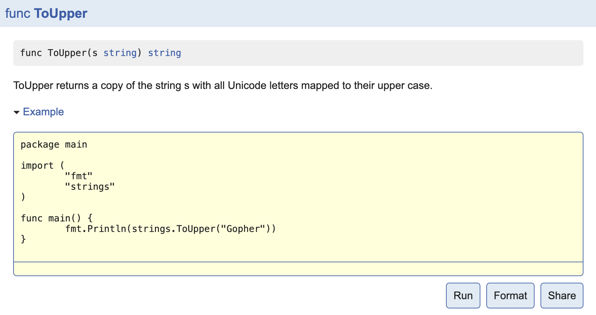

## `示例函数`

### 1.示例函数的格式

被`go test`特殊对待的第三种函数就是示例函数，它们的函数名以`Example`为前缀。它们既没有参数也没有返回值。标准格式如下：

```go
func ExampleName() {
    // ...
}
```

### 2.示例函数示例

下面的代码是我们为`Split`函数编写的一个示例函数：

```go
func ExampleSplit() {
	fmt.Println(split.Split("a:b:c", ":"))
	fmt.Println(split.Split("沙河有沙又有河", "沙"))
	// Output:
	// [a b c]
	// [ 河有 又有河]
}
```

为你的代码编写示例代码有如下三个用处：

1. 示例函数能够作为文档直接使用，例如基于web的godoc中能把示例函数与对应的函数或包相关联。

2. 示例函数只要包含了`// Output:`也是可以通过`go test`运行的可执行测试。

   ```bash
   split $ go test -run Example
   PASS
   ok      github.com/Q1mi/studygo/code_demo/test_demo/split       0.006s
   ```

3. 示例函数提供了可以直接运行的示例代码，可以直接在`golang.org`的`godoc`文档服务器上使用`Go Playground`运行示例代码。下图为`strings.ToUpper`函数在Playground的示例函数效果。

