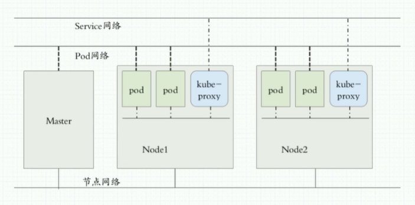

[toc]

## 网络规划

* Servive网络 192.168.0.0/16
* pod网络 172.7.0.0/16
* 在安装 docker 时需要配置，比如某节点的 ip 地址为 172.16.103.200，那么在配置需要把 /etc/docker/daemon.json 中配置 "bip": "172.7.200.1/24"
* 节点网络 172.16.103.0/24
  * `这个可以根据实际情况来，某些场景下节点是不能随便更改ip地址的`

 

## 节点规划

### 单节点集群

| 节点      | ip             | 服务                                                         | 角色                                                         |
| --------- | -------------- | ------------------------------------------------------------ | ------------------------------------------------------------ |
| lc103-200 | 172.16.103.200 | bind harbor kubelete kube-proxy kube-apiserver kube-controller-manager etcd  | k8s-master(主控节点) k8s-node(运算节点) DNS服务节点 私有镜像仓库节点 证书签发节点 |

### 多节点集群

| 节点  | ip   | 服务 |
| ----- | ---- | ---- |
| qoszw |      |      |

## 安装部署主控节点服务( 4个)

### Etcd

* 用的是https的连接 

* 所以etcd可以部署到别的机器上 不在集群也没关系 只要能连上

### kube-apiserver

* 自己找自己的apiserver的通过 127.0.0.1:8080

* 别人来找是通过 xxx.xxx.xxx.xxx：6443

* 但是后来用了反代，用vip的7443反代到了主控节点的6443

### kube-controller-manager

### kube-scheduler

## 安装部署运算节点服务( 2个)

### kubelet

### kube-proxy