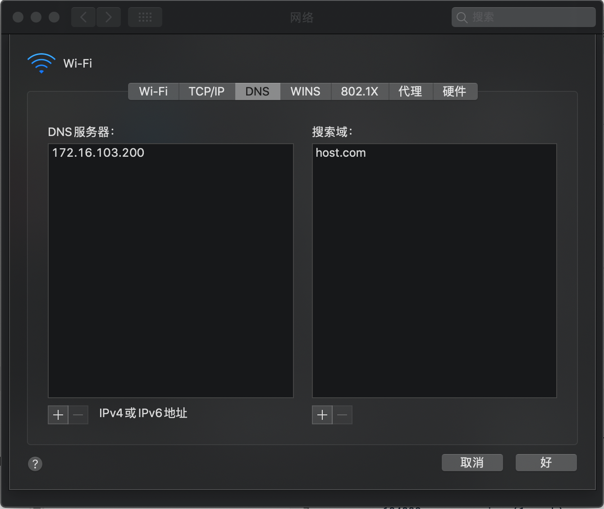

[toc]

# 配置 bind

只需要在提供dns服务的节点上配置即可

## DNS服务节点

### 1. 安装bind

```sh
yum install -y bind
```

### 2.修改配置 

#### 1. 主配置

```sh
vim /etc/named.conf
```

有以下修改内容

```conf
  listen-on port 53 { 172.16.103.200; };   # 监听端口53 下面一行本来有ipv6地址 需要删除
                                           # 这里须配置为提供服务的节点ip地址
  directory   "/var/named";                # 修改路径
  allow-query     { any; };                # 允许内机器都可以查
  forwarders      { 172.16.103.2; };　     # 上级 dns 虚拟机这里填的是网关地址，阿里云机器可以填223.5.5.5
  recursion yes;                           # 采用递归方法查询IP
  dnssec-enable no;
  dnssec-validation no;
```

#### 2. 区域文件

```sh
vim /etc/named.rfc1912.zones
```

增加两个zone配置，`od.com`为业务域，`host.com.zone`为主机域

```
zone "host.com" IN {
        type  master;
        file  "host.com.zone";
        allow-update { 172.16.103.200; };
};

zone "od.com" IN {
        type  master;
        file  "od.com.zone";
        allow-update { 172.16.103.200; };
};
```

#### 3. **配置主机域文件**

```sh
vim /var/named/host.com.zone
```

```
$ORIGIN host.com.
$TTL 600  ; 10 minutes                     # 过期时间十分钟 这里的分号是注释
@       IN SOA  dns.host.com. dnsadmin.host.com. (
        2021020601 ; serial                # 注意设置序列号，最好为 年月日+2位序号，每次修改都需要更新
        10800      ; refresh (3 hours)     # soa参数
        900        ; retry (15 minutes)
        604800     ; expire (1 week)
        86400      ; minimum (1 day)
        )
      NS   dns.host.com.
$TTL 60 ; 1 minute
lc103-200          A    172.16.103.200
dns                A    172.16.103.200
```

注意，这里加上所有可能的节点

#### 4. **配置业务域文件**

```sh
vim /var/named/od.com.zone
```

```
$ORIGIN od.com.
$TTL 600  ; 10 minutes
@       IN SOA  dns.od.com. dnsadmin.od.com. (
        2021020601 ; serial                # 注意设置序列号，最好为 年月日+2位序号，每次修改都需要更新
        10800      ; refresh (3 hours)
        900        ; retry (15 minutes)
        604800     ; expire (1 week)
        86400      ; minimum (1 day)
        )
        NS   dns.od.com.
$TTL 60 ; 1 minute
dns                A    172.16.103.200
```

### 3. 启动服务并测试

```sh
# 检查配置文件
named-checkconf

# 启动服务 并 设置自启动
systemctl start named; systemctl enable named

# 检查 named 服务是否正常启动
#		- 检查 53 端口
netstat -luntp | grep 53

# 检查是否可以解析到
#		- 输出应为：172.16.103.200
dig -t A lc103-200.host.com  @172.16.103.200 +shor 
```

### 4. 修改节点DNS - **`所有节点`**

当验证dns服务没有问题后，就可以使用dns节点作为dns服务器

```sh
vim /etc/sysconfig/network-scripts/ifcfg-ens33
```

修改dns配置如下：

```
...
GATEWAY=172.16.103.2
DNS1=172.16.103.200
```

重启服务：

```sh
systemctl restart network
```

测试网络连通性：

```
ping baidu.com
ping dns.host.com
```

查看dns配置：

```sh
cat /etc/resolv.conf
```

```
# Generated by NetworkManager
nameserver 10.4.7.11
```

配置短域名解析，在 `/etc/resolv.conf` 中添加内容：

```sh
vim /etc/resolv.conf
```

```
# Generated by NetworkManager
search host.com # 添加后解析主机A记录 可以不加域名 例如 dig -t A lc103-200  @172.16.103.200 +shor 
nameserver 10.4.7.11
```

> 注意，这里只配置主机域的短域名解析，不要配置业务域

## 本地节点

### mac



## 新增节点

###  1. **配置主机域文件**

```sh
vim /var/named/od.com.zone
```

在最后面加上新节点的地址

```
$ORIGIN host.com.
$TTL 600  ; 10 minutes                     # 过期时间十分钟 这里的分号是注释
@       IN SOA  dns.host.com. dnsadmin.host.com. (
        2021020601 ; serial                # 注意设置序列号，最好为 年月日+2位序号，每次修改都需要更新
        10800      ; refresh (3 hours)     # soa参数
        900        ; retry (15 minutes)
        604800     ; expire (1 week)
        86400      ; minimum (1 day)
        )
      NS   dns.host.com.
$TTL 60 ; 1 minute
lc103-200          A    172.16.103.200
dns                A    172.16.103.200
...
```

**重启服务**

```sh
systemctl restart named
```

## 新增业务

### 1. **配置业务域文件**

```sh
vim /var/named/od.com.zone
```

在后面添加内容

```
$ORIGIN od.com.
$TTL 600  ; 10 minutes
@       IN SOA  dns.od.com. dnsadmin.od.com. (
        2021020601 ; serial                # 注意设置序列号，最好为 年月日+2位序号，每次修改都需要更新
        10800      ; refresh (3 hours)
        900        ; retry (15 minutes)
        604800     ; expire (1 week)
        86400      ; minimum (1 day)
        )
        NS   dns.od.com.
$TTL 60 ; 1 minute
dns                A    172.16.103.200
...
```

**重启服务**

```sh
systemctl restart named
```

