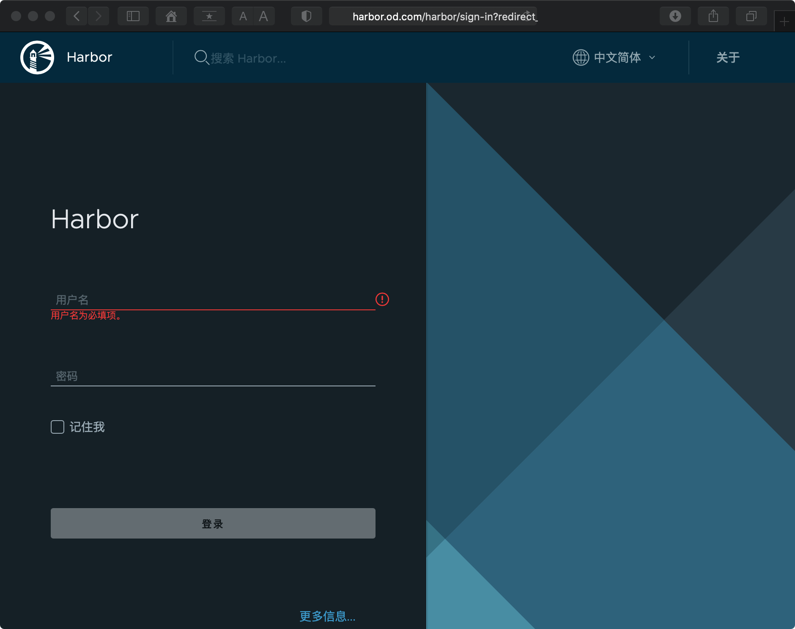
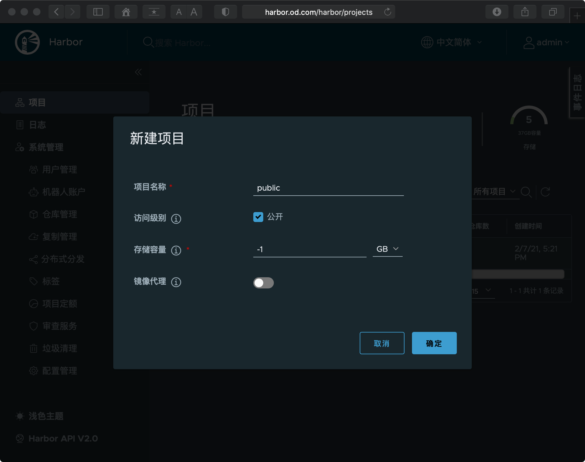
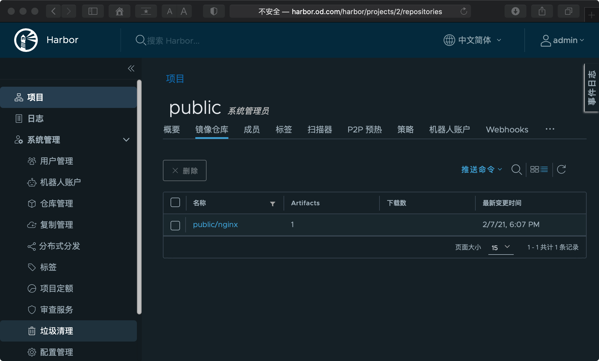

[toc]

## 安装 harbor

[git](https://goharbor.io/) [下载](https://github.com/goharbor/harbor/releases)

### 1. 下载并安装

```sh
mkdir -p /opt/packages
wget https://github.com/goharbor/harbor/releases/download/v2.2.0-rc1/harbor-offline-installer-v2.2.0-rc1.tgz
tar -zxf harbor-offline-installer-v2.2.0-rc1.tgz
mv harbor /opt/harbor-v2.2.0-rc1
ln -s /opt/harbor-v2.2.0-rc1 /opt/harbor
```

### 2. 修改配置

```sh
mkdir -p /date/harbor/logs			    # 创建数据目录，会在配置文件中配置
cp /opt/harbor/harbor.yml.tmpl /opt/harbor/harbor.yml
vim /opt/harbor/harbor.yml
```

以下为修改内容：

>  测试环境可以先注释掉 `https` 配置

```yaml
...
hostname: harbor.od.com
http:
  port: 180
harbor_admin_password: Harbor12345
data_volume: /data/harbor
...
log:
  location: /data/harbor/logs
```

* `hostname`: 这里注意和业务域保持一致
* `http`
  * `port`: 不要使用 80 端口，预留给后续的 negix 使用
* `harbor_admin_password`：这里是默认密码，生产环境注意修改密码
* `data_volume`: 根据实际情况修改

### 3. 启动 harbor

> harbor 依赖 docker-compose 做单机编排，所以需要先安装 docker-compose
>
> `yum install docker-compose -y`

```sh
sh /opt/harbor/install.sh
```

```sh

[Step 0]: checking if docker is installed ...

Note: docker version: 20.10.3

[Step 1]: checking docker-compose is installed ...

Note: docker-compose version: 1.18.0

[Step 2]: loading Harbor images ...
...

Creating registry ... done
Creating harbor-core ... done
Creating network "harborv220rc1_harbor" with the default driver
Creating nginx ... done
Creating harbor-portal ...
Creating registryctl ...
Creating registry ...
Creating redis ...
Creating harbor-db ...
Creating harbor-core ...
Creating harbor-jobservice ...
Creating nginx ...
✔ ----Harbor has been installed and started successfully.----
```

> 若没有注释 https 且没有正确配置，这里会报错

### 4. 设置开机启动

```sh
vim /etc/rc.d/rc.local  
```

新增以下内容：

```
# start harbor
cd /opt/harbor
/usr/docker-compose stop
/usr/docker-compose start
```

### 5. 代理

#### 1. 安装 nginx

```sh
yum install nginx -y
```

#### 2. 配置 代理

```sh
vim /etc/nginx/conf.d/harbor.conf
```

```
server {
    listen       80;
    server_name  harbor.od.com;
    
    # 避免出现上传失败的情况, 如果镜像过大，注意配置这里
    client_max_body_size 1000m;

    location / {
        proxy_pass http://127.0.0.1:180;
    }
}
```

#### 3. 启动 nginx

```
systemctl start nginx ; systemctl enable nginx
```

### 6. 配置dns解析

在 dns 服务节点上配置

```sh
vim /var/named/od.com.zone
```

```
$ORIGIN od.com.
$TTL 600  ; 10 minutes
@       IN SOA  dns.od.com. dnsadmin.od.com. (
        2021020602 ; serial                # 注意设置序列号，最好为 年月日+2位序号，每次修改都需要更新
        10800      ; refresh (3 hours)
        900        ; retry (15 minutes)
        604800     ; expire (1 week)
        86400      ; minimum (1 day)
        )
        NS   dns.od.com.
$TTL 60 ; 1 minute
dns                A    172.16.103.200
harbor             A    172.16.103.200
```

> 注意后滚序号

重启dns服务

```sh
systemctl restart named

# 测试解析
ping harbor.od.com
```

### 7. 测试登录

在本地浏览器输入 harbor.od.com 



使用 admin 和 Harbor12345 登录，然后新建项目



拉取镜像并推送到 harbor 中：

```sh
docker pull nginx:1.7.9
docker tag nginx:1.7.9  harbor.od.com/public/nginx:v1.7.9
docker login -u admin harbor.od.com
docker push harbor.od.com/public/nginx:v1.7.9
docker logout 
```

在 harbor 中查看：



