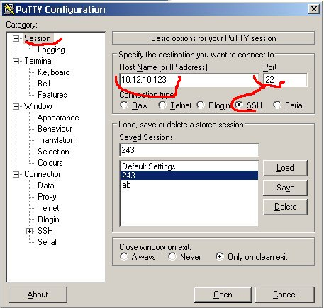
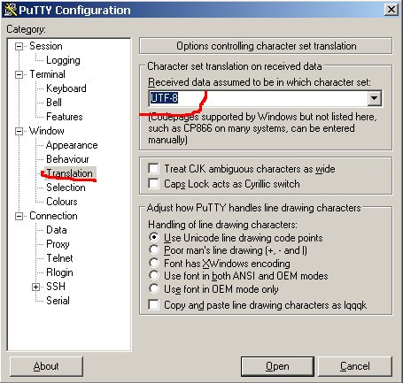
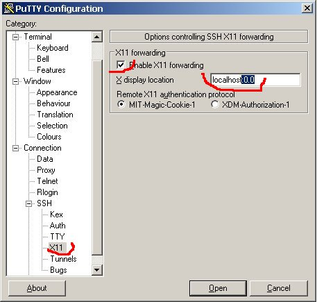

只用ssh登录ubuntu的时候 无法使用图形界面 QT ，gedit等，查了一下资料，最终实现了图形界面

 

首先就是ubuntu安装ssh客户端和服务器 并做相对于配置

一、服务器安装运行SSH服务。在Ubuntu下： 
安装

 

sudo apt-get install openssh-server

配置允许X11转发

代码:

sudo gedit /etc/ssh/sshd_config  ## 设置选项 X11Forwarding yes

启动服务

代码:

sudo /etc/init.d/ssh restart

二、客户端使用 *nix 连接。在Ubuntu下
安装ssh客户端

代码:

sudo apt-get install openssh-client

配置允许X11转发

代码:

 

sudo gedit /etc/ssh/ssh_config  ## 设置选项
ForwardAgent yes  ##
ForwardX11 yes ##
ForwardX11Trusted yes ## 这个要设置，上面二项可以不要

三、客户端使用 Windows 连接。（使用自由软件） 
Windows 下需要先安装 X Window 服务端 程序 XMing; 及 PuTTY 登陆程序。 
http://sourceforge.net/projects/xming 
[http://sourceforge.net/project/showfile ... _id=156984](http://sourceforge.net/project/showfiles.php?group_id=156984) 
[http://www.chiark.greenend.org.uk/~sgta ... nload.html](http://www.chiark.greenend.org.uk/~sgtatham/putty/download.html) 

安装运行XMing,运行后在托盘有图标，提示信息为”Xming Server:0.0” 类似 
PuTTY 的 SSH | X11 | X11 forwarding 要设置，图：

(fcitx输入法好像不出来，但可以从Windows程序复制粘贴文字到远程运行的程序。) 

 

**这一步很重要，要不然也是无法登录的  因为实际上调用图形界面的时候，就是启动这个软件，通过这个软件实现图形界面**