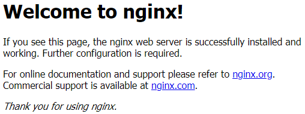
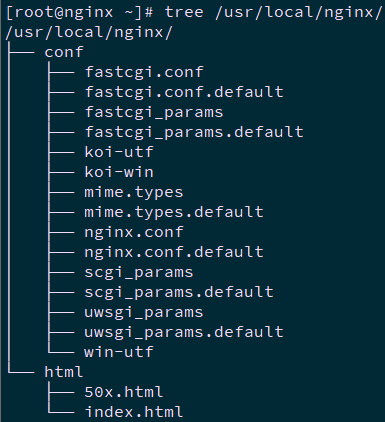

# [002.Nginx安装及启动](https://www.cnblogs.com/itzgr/p/13266215.html)


**目录**

- 一 Nginx yum安装
  - [1.1 前置准备](https://www.cnblogs.com/itzgr/p/13266215.html#_label0_0)
  - [1.2 配置yum源](https://www.cnblogs.com/itzgr/p/13266215.html#_label0_1)
  - [1.3 安装Nginx](https://www.cnblogs.com/itzgr/p/13266215.html#_label0_2)
  - [1.4 测试访问](https://www.cnblogs.com/itzgr/p/13266215.html#_label0_3)
  - [1.5 其他信息](https://www.cnblogs.com/itzgr/p/13266215.html#_label0_4)
- 二 Nginx源码编译安装
  - [2.1 依赖组件](https://www.cnblogs.com/itzgr/p/13266215.html#_label1_0)
  - [2.2 编译安装](https://www.cnblogs.com/itzgr/p/13266215.html#_label1_1)
  - [2.3 服务管理](https://www.cnblogs.com/itzgr/p/13266215.html#_label1_2)
  - [2.4 开机启动](https://www.cnblogs.com/itzgr/p/13266215.html#_label1_3)
  - [2.5 测试访问](https://www.cnblogs.com/itzgr/p/13266215.html#_label1_4)
  - [2.6 编译选项](https://www.cnblogs.com/itzgr/p/13266215.html#_label1_5)
- 三 Nginx目录及模块
  - [3.1 相关目录](https://www.cnblogs.com/itzgr/p/13266215.html#_label2_0)
  - [3.2 Nginx模块](https://www.cnblogs.com/itzgr/p/13266215.html#_label2_1)
- 四 Nginx变量及状态码
  - [4.1 Nginx变量](https://www.cnblogs.com/itzgr/p/13266215.html#_label3_0)
  - [4.2 http状态码](https://www.cnblogs.com/itzgr/p/13266215.html#_label3_1)

 

------

[回到顶部](https://www.cnblogs.com/itzgr/p/13266215.html#_labelTop)

## 一 Nginx yum安装


### 1.1 前置准备

```
  1 [root@nginx01 ~]# systemctl status firewalld.service	#检查防火墙
  2 [root@nginx01 ~]# getenforce				#检查SELinux
  3 Disabled
```

**提示：建议关闭防火墙，或通过如下方式放通相关80或443端口：**

```
  1 firewall-cmd --permanent --add-port=80/tcp
  2 firewall-cmd --permanent --add-port=443/tcp
```

### 1.2 配置yum源


```
  1 [root@nginx01 ~]# cat > /etc/yum.repos.d/nginx.repo <<EOF
  2 [nginx-stable]
  3 name=nginx stable repo
  4 baseurl=http://nginx.org/packages/centos/\$releasever/\$basearch/
  5 gpgcheck=1
  6 enabled=1
  7 gpgkey=https://nginx.org/keys/nginx_signing.key
  8 module_hotfixes=true
  9 
 10 [nginx-mainline]
 11 name=nginx mainline repo
 12 baseurl=http://nginx.org/packages/mainline/centos/\$releasever/\$basearch/
 13 gpgcheck=1
 14 enabled=0
 15 gpgkey=https://nginx.org/keys/nginx_signing.key
 16 module_hotfixes=true
 17 EOF
```

### 1.3 安装Nginx

```
  1 [root@nginx01 ~]# yum -y install nginx
  2 [root@nginx01 ~]# nginx -v
  3 nginx version: nginx/1.18.0
```


**提示：如上安装默认安装为当前最新稳定版，若需要安装开发版，可执行yum-config-manager --enable nginx-mainline，然后yum安装，不建议安装开发版。**

参考：https://nginx.org/en/linux_packages.html。

```
  1 [root@nginx01 ~]# systemctl start nginx
  2 [root@nginx01 ~]# systemctl enable nginx			#启动服务
```

### 1.4 测试访问

浏览器访问：http://172.24.8.71/

[](https://img2020.cnblogs.com/blog/680719/202007/680719-20200708121323316-1753840164.png)


### 1.5 其他信息

```
  1 [root@nginx01 ~]# nginx -V			    # 查看yum安装所编译的模块及参数
  2 nginx version: nginx/1.18.0
  3 built by gcc 4.8.5 20150623 (Red Hat 4.8.5-39) (GCC)
  4 built with OpenSSL 1.0.2k-fips  26 Jan 2017
  5 TLS SNI support enabled
  6 configure arguments: --prefix=/etc/nginx --sbin-path=/usr/sbin/nginx --modules-path=/usr/lib64/nginx/modules --conf-path=/etc/nginx/nginx.conf --error-log-path=/var/log/nginx/error.log --http-log-path=/var/log/nginx/access.log --pid-path=/var/run/nginx.pid --lock-path=/var/run/nginx.lock --http-client-body-temp-path=/var/cache/nginx/client_temp --http-proxy-temp-path=/var/cache/nginx/proxy_temp --http-fastcgi-temp-path=/var/cache/nginx/fastcgi_temp --http-uwsgi-temp-path=/var/cache/nginx/uwsgi_temp --http-scgi-temp-path=/var/cache/nginx/scgi_temp --user=nginx --group=nginx --with-compat --with-file-aio --with-threads --with-http_addition_module --with-http_auth_request_module --with-http_dav_module --with-http_flv_module --with-http_gunzip_module --with-http_gzip_static_module --with-http_mp4_module --with-http_random_index_module --with-http_realip_module --with-http_secure_link_module --with-http_slice_module --with-http_ssl_module --with-http_stub_status_module --with-http_sub_module --with-http_v2_module --with-mail --with-mail_ssl_module --with-stream --with-stream_realip_module --with-stream_ssl_module --with-stream_ssl_preread_module --with-cc-opt='-O2 -g -pipe -Wall -Wp,-D_FORTIFY_SOURCE=2 -fexceptions -fstack-protector-strong --param=ssp-buffer-size=4 -grecord-gcc-switches -m64 -mtune=generic -fPIC' --with-ld-opt='-Wl,-z,relro -Wl,-z,now -pie'
  7 [root@nginx01 ~]# rpm -ql nginx			# 查看所安装的文件
  8 [root@nginx01 ~]# rpm -qc nginx 		# 查看相关的配置文件
```

## 二 Nginx源码编译安装

### 2.1 依赖组件

```
  1 [root@nginx01 ~]# yum -y install gcc gcc-c++ wget autoconf pcre pcre-devel openssl openssl-devel openssh-clients net-tools vim ntp screen lrzsz bash-completion bash-completion-extras lvm2 make automake epel-release tree zlib zlib-devel libtool
```

**提示：部分依赖包为比如，如：**

**zlib库：zlib库是ngx_http_gzip_module（gzip压缩模块）所必需的**

**openssl库 ：--with-http_ssl_module使用该模块必需装openssl库，来实现http支持https协议。**


### 2.2 编译安装

```
  1 [root@nginx01 ~]# useradd -s /sbin/nologin -M nginx	#提前创建用户及用户组
  2 [root@nginx01 ~]# wget http://nginx.org/download/nginx-1.17.8.tar.gz
  3 [root@nginx01 ~]# tar -xvf nginx-1.17.8.tar.gz
  4 [root@nginx01 ~]# cd nginx-1.17.8/
  5 [root@nginx01 nginx-1.17.8]# ./configure \
  6 --conf-path=/usr/local/nginx/conf/nginx.conf \
  7 --error-log-path=/var/log/nginx/error.log \
  8 --group=nginx \
  9 --http-client-body-temp-path=/var/cache/nginx/client_temp \
 10 --http-fastcgi-temp-path=/var/cache/nginx/fastcgi_temp \
 11 --http-log-path=/var/log/nginx/access.log \
 12 --http-proxy-temp-path=/var/cache/nginx/proxy_temp \
 13 --http-scgi-temp-path=/var/cache/nginx/scgi_temp \
 14 --http-uwsgi-temp-path=/var/cache/nginx/uwsgi_temp \
 15 --lock-path=/var/run/nginx.lock \
 16 --pid-path=/var/run/nginx.pid \
 17 --prefix=/usr/local/nginx \
 18 --sbin-path=/usr/local/bin/nginx \
 19 --user=nginx \
 20 --with-http_gzip_static_module \
 21 --with-http_realip_module \
 22 --with-http_ssl_module \
 23 --with-http_stub_status_module \
 24 --with-http_sub_module \
 25 --with-http_v2_module \
 26 --with-stream \
 27 --with-stream_realip_module \
 28 --with-stream_ssl_module
 29 [root@nginx01 nginx-1.17.8]# make && make install
 30 [root@nginx01 ~]# nginx -V			        #查看安装版本
 31 [root@nginx01 ~]# tree /usr/local/nginx/		#查看目录结构
```

[](https://img2020.cnblogs.com/blog/680719/202007/680719-20200708121324078-964359007.png)

| **目录** | **作用**                |
| -------- | ----------------------- |
| conf     | 用于存储nginx配置文件   |
| html     | 用于存放静态网页        |
| logs     | 存放日志                |
| sbin     | 用于存放 nginx 执行命令 |


### 2.3 服务管理

```
  1 [root@nginx01 ~]# echo $PATH
  2 /usr/local/sbin:/usr/local/bin:/usr/sbin:/usr/bin:/root/bin
  3 [root@nginx01 ~]# mkdir -p /var/cache/nginx/
  4 [root@nginx01 ~]# ll /usr/local/bin/
  5 total 7.5M
  6 -rwxr-xr-x 1 root root 7.5M Mar  5 01:09 nginx
```

**提示：若nginx的prefix未编译系统PATH中，如/opt/nginx/，需要在PATH中，可通过如下方式添加：**

**echo 'PATH=/opt/nginx/:\$PATH' > /etc/profile.d/nginx.sh**

```
  1 [root@nginx01 ~]# nginx			              # 服务启动
  2 [root@nginx01 ~]# nginx -s stop		        # 服务关闭
  3 [root@nginx01 ~]# nginx -s reload	        # 重载配置文件
  4 [root@nginx01 ~]# nginx -s reopen	        # 重启Nginx
  5 [root@nginx01 ~]# nginx -s quit		        # 关闭Nginx
  6 [root@nginx01 ~]# nginx -t		            # 测试配置文件
  7 [root@nginx01 ~]# nginx -t -c 【file】	  # 使用额外的配置文件测试
  8 [root@nginx01 ~]# ps aux | grep nginx	    # 查看进程
  9 [root@nginx01 ~]# netstat -ano | grep 80	# 查看端口
```

### 2.4 开机启动

```
  1 [root@nginx01 ~]# vi /usr/lib/systemd/system/nginx.service
  2 [Unit]
  3 Description=nginx - high performance web server
  4 Documentation=http://nginx.org/en/docs/
  5 After=network-online.target remote-fs.target nss-lookup.target
  6 Wants=network-online.target
  7 
  8 [Service]
  9 Type=forking
 10 PIDFile=/var/run/nginx.pid
 11 ExecStart=/usr/local/bin/nginx -c /usr/local/nginx/conf/nginx.conf
 12 ExecReload=/bin/kill -s HUP $MAINPID
 13 ExecStop=/bin/kill -s TERM $MAINPID
 14 
 15 [Install]
 16 WantedBy=multi-user.target
 17 [root@nginx01 ~]# systemctl daemon-reload
 18 [root@nginx01 ~]# systemctl start nginx.service		#启动服务
 19 [root@nginx01 ~]# systemctl enable nginx.service	#开机启动
```


**说明：**


**Description：描述服务**

**After：描述服务类别**

**[Service]：服务运行参数的设置**

**Type=forking：是后台运行的形式**

**ExecStart：为服务的具体运行命令**

**ExecReload：为重启命令**

**ExecStop：为停止命令**

**PrivateTmp=True：表示给服务分配独立的临时空间**

**注意：[Service]的启动、重启、停止命令全部要求使用绝对路径**

**[Install]运行级别下服务安装的相关设置，可设置为多用户，即系统运行级别为3**

**systemctl start nginx.service　（启动nginx服务）**

**systemctl stop nginx.service　（停止nginx服务）**

**systemctl enable nginx.service （设置开机自启动）**

**systemctl disable nginx.service （停止开机自启动）**

**systemctl status nginx.service （查看服务当前状态）**

**systemctl restart nginx.service　（重新启动服务）**

**systemctl list-units --type=service （查看所有已启动的服务）**

### 2.5 测试访问

浏览器访问：http://172.24.8.71/


### 2.6 编译选项

```
  1 [root@nginx01 nginx-1.17.8]# ./configure --help		#查看编译选项
```

如下为常见编译选项及其释义：


| **编译选项**                                              | **作用**                           |
| --------------------------------------------------------- | ---------------------------------- |
| --prefix=/etc/nginx                                       | 程序安装目录和路径                 |
| --sbin-path=/usr/sbin/nginx                               | Nginx启动停止名                    |
| --modules-path=/usr/lib64/nginx/modules                   | Nginx模块路径                      |
| --conf-path=/etc/nginx/nginx.conf                         | Nginx主配置文件路径                |
| --error-log-path=/var/log/nginx/error.log                 | Nginx错误日志路径                  |
| --http-log-path=/var/log/nginx/access.log                 | Nginx访问日志路径                  |
| --pid-path=/var/run/nginx.pid                             | Nginx Pid路径                      |
| --lock-path=/var/run/nginx.lock                           | Nginx锁路径                        |
| --http-client-body-temp-path=/var/cache/nginx/client_temp | client头部临时缓存文件             |
| --http-proxy-temp-path=/var/cache/nginx/proxy_temp        | proxy临时缓存文件                  |
| --http-fastcgi-temp-path=/var/cache/nginx/proxy_temp      | fastcgi临时缓存文件                |
| --http-uwsgi-temp-path=/var/cache/nginx/uwsgi_temp        | uwsgi临时缓存文件                  |
| --http-scgi-temp-path=/var/cache/nginx/scgi_temp          | scgi临时缓存文件                   |
| --user=nginx                                              | 设置Nginx进程启动用户              |
| --group=nginx                                             | 设置Nginx进程启动用户组            |
| --with-cc-opt                                             | 设置额外的参数将被添加到CFLACS变量 |
| --with-id-opt                                             | 设置额外的参数，链接系统库         |

## 三 Nginx目录及模块

### 3.1 相关目录

如下以Nginx yum安装后的目录为例：

| **路径**                                                     | **类型** | **作用**                    |
| ------------------------------------------------------------ | -------- | --------------------------- |
| /etc/nginx /etc/nginx/nginx.conf /etc/nginx/conf.d /etc/nginx/conf.d/default.conf | 配置文件 | Nginx主配置文件             |
| /etc/nginx/fastcgi_params /etc/nginx/scgi_params /etc/nginx/uwsgi_params | 配置文件 | Cgi、Fastcgi、Uwsgi配置文件 |
| /etc/nginx/win-utf /etc/nginx/koi-utf /etc/nginx/koi-win     | 配置文件 | Nginx编码转换映射文件       |
| /etc/nginx/mime.types                                        | 配置文件 | http协议的Content-Type      |
| /etc/rc.d/init.d/nginx /etc/rc.d/init.d/nginx-debug /etc/sysconfig/nginx /etc/sysconfig/nginx-debug | 配置文件 | 配置系统守护进程管理器      |
| /etc/logrotate.d/nginx                                       | 配置文件 | Nginx日志轮询、日志切割     |
| /usr/sbin/nginx /usr/sbin/nginx-debug                        | 命令     | Nginx终端管理器命令         |
| /usr/share/doc/nginx-1.xx.x /usr/share/man/man8/nginx.8.gz   | 目录     | Nginx的帮助手册             |
| /var/cache/nginx                                             | 目录     | Nginx的缓存目录             |
| /var/log/nginx                                               | 目录     | Nginx的日志目录             |
| /etc/nginx/modules /etc/lib64/nginx /etc/lib64/nginx/modules | 目录     | Nginx的模块目录             |
| /usr/share/nginx /usr/share/nginx/html /usr/share/nginx/html/50x.html /usr/share/nginx/html/index.html | 目录     | Nginx默认站点目录           |


### 3.2 Nginx模块

Nginx模块分为Nginx官方模块和Nginx第三方模块。


| **Nginx编译选项**          | **模块作用**                                            |
| -------------------------- | ------------------------------------------------------- |
| ngx_http_core_module       | 包含一些核心的http参数配置，对应Nginx的配置区块部分。   |
| ngx_http_access_module     | 访问控制模块，用来控制网站用户对Nginx的访问。           |
| ngx_http_gzip_module       | 压缩模块，对Nginx返回的数据压缩，属于性能优化模块。     |
| ngx_http_fastcgi_module    | fastcgi模块，和动态应用相关的模块，例如PHP。            |
| ngx_http_proxy_module      | proxy代理模块。                                         |
| ngx_http_upstream_module   | 负载均衡模块，实现网站的负载均衡功能机健康检查。        |
| ngx_http_rewrite_module    | URL地址重写模块。                                       |
| ngx_http_limit_conn_module | 限制用户并发连接数及请求连接数。                        |
| ngx_http_limit_req_module  | 限制Nginx request processing rate根据定义的key。        |
| ngx_http_log_module        | 访问日志模块，以指定的格式记录Nginx客户访问日志等信息。 |
| ngx_http_auth_basic_module | Web认证模块，设置Web用户通过账号密码访问Nginx。         |
| ngx_http_ssl_module        | ssl模块，用于加密的http连接，如https。                  |


[回到顶部](https://www.cnblogs.com/itzgr/p/13266215.html#_labelTop)

## 四 Nginx变量及状态码


### 4.1 Nginx变量

ngx_http_core_module的内置变量通常有：http请求变量、Nginx内置变量、自定义变量。


$uri：当前请求的URI，不带参数；


$request_uri：请求的URI，带完整参数；


$host：http请求报文中的host首部，如果没有则以处理此请求的虚拟主机的主机名代替；


$hostname：Nginx服务运行所在主机的主机名；


$remote_addr：客户端IP；


$remote_prot：客户端端口；


$remote_user：使用用户认证时客户端用户输入的用户名；


$request_filename：用户请求中的URI经过本地root或alias转换后映射的本地文件路径；


$request_method：请求方法，GET、POST、PUT；


$server_addr：服务器地址；


$server_name：服务器名称；


$server_port：服务器端口；


$server_protocol：服务器向客户端发送响应时的协议，如http/1.1、http/1.0；


$scheme：在请求中使用scheme。如http://xxx.com中的http；


$http_HEADER：匹配请求报文中指定的HEADER；


$http_host：匹配请求报文中的host首部。


### 4.2 http状态码

http状态码是用以表示网页服务器HTTP响应状态的3位数字代码。可通过查看HTTP状态码来判断服务器状态，常见的有404、502等。

- 301：永久移动，被请求的资源已被永久移动位置；
- 302：请求的资源限制临时从不同的URI响应请求；
- 305：使用代理，被请求的资源必须通过指定的代理才能访问；
- 307：临时跳转，被请求的资源在临时从不同的URL响应请求；
- 400：错误请求；
- 402：需要付款，预留状态码，用于将来一些数字货币或者微支付；
- 403：禁止访问，服务器已理解请求，但拒绝执行它；
- 404：找不到对象，请求失败，资源不存在；
- 406：不可接受的，请求的资源内容特性无法满足请求头部中的条件，因而无法生成响应实体；
- 408：请求超时；
- 409：冲突，由于和被请求的资源的当前状态之间存在冲突，请求无法完成；
- 410：遗失的，被请求的资源在服务器上已经不再可用，而且没有任何已知的转发地址；
- 413：响应实体太大，服务器拒绝处理当前请求，请求超过服务器所能处理和允许的最大值；
- 417：期望失败。在请求头 Expect 中指定的预期内容无法被服务器满足；
- 418：我是一个茶壶。超文本咖啡罐控制协议，但是并没有被实际的HTTP服务器实现；
- 420：方法失效；
- 422：不可处理的实体。请求格式正确，但是由于含有语义错误，无法响应；
- 500：服务器内部错误。服务器遇到了一个未曾预料的状况，导致了它无法完成对请求的处理；
- 502：请求后端失败；
- 504：请求成功，但是响应超时。