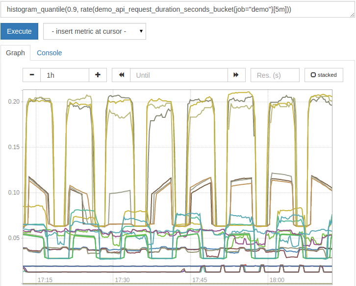

## 函数

[TOC]

### 聚合 sum(), min(), max()...

- `sum` (求和)
- `min` (最小值)
- `max` (最大值)
- `avg` (平均值)
- `stddev` (标准差)
- `stdvar` (标准差异)
- `count` (计数)
- `count_values` (对value进行计数)
- `bottomk` (后n条时序)
- `topk` (前n条时序)
- `quantile` (分布统计)

使用聚合操作的语法如下：

**\<aggr-op>([parameter,] \<vector expression>) [without|by (\<label list>)]**

* `without` 用于从计算结果中移除列举的标签，而保留其它标签。

* `by` 则正好相反，结果向量中只保留列出的标签，其余标签则移除。

通过without和by可以按照样本的问题对数据进行聚合。

### 求值 abs(), ln()...

---

#### **abs(v instant-vector)**

返回输入向量的所有样本的绝对值

---

#### **deriv(v range-vector)**

计算一个范围向量v中各个时间序列二阶导数，使用[简单线性回归](https://en.wikipedia.org/wiki/Simple_linear_regression)

deriv二阶导数返回值类型只能是gauges。

---

#### **exp(v instant-vector)**

输入一个瞬时向量, 返回各个样本值的 e 指数值，即为 e^N 次方。特殊情况如下所示：

`Exp(+inf) = +Inf Exp(NaN) = NaN`

---

#### **ln(v instance-vector)**

计算瞬时向量v中所有样本数据的自然对数。特殊例子：

`ln(+Inf) = +Inf ln(0) = -Inf ln(x<0) = NaN ln(NaN) = NaN`

---

#### **log2(v instant-vector)**

计算瞬时向量v中所有样本数据的二进制对数。

---

#### **log10(v instant-vector)**

计算瞬时向量v中所有样本数据的10进制对数。相当于ln()

---

#### **sqrt()**

输入：瞬时向量，输出：key: value = 度量指标： 样本值的平方根

---

### 判断不存在 absent()

---

#### **absent(v instant-vector)**

 如果赋值给它的向量具有样本数据，则返回空向量；如果传递的瞬时向量参数没有样本数据，则返回不带度量指标名称且带有标签的样本值为1的结果

当监控度量指标时，如果获取到的样本数据是空的， 使用 absent 方法对告警是非常有用的:

**absent**(nonexistent{job="myjob"})                               # => key: value = {job="myjob"}: 1
**absent**(nonexistent{job="myjob", instance=~".*"})   # => {job="myjob"} 1 so smart !
**absent**(sum(nonexistent{job="myjob"}))                     # => key:value {}: 0

### **取整** **ceil() floor() round()**

---

#### **ceil(v instant-vector)** 

是一个向上舍入为最接近的整数。

---

#### **floor(v instant-vector)**

与ceil()函数相反。 4.3 为 4 。

---

#### **round(v inst、ant-vector, to_nearest 1= scalar)**

与ceil和floor函数类似，输入：瞬时向量，输出：指定整数级的四舍五入值, 如果不指定，则是1以内的四舍五入。

### **计数** **changes**() resets() ...

---

#### **changes(v range-vector)**

输入一个范围向量， 返回这个范围向量内每个样本数据值变化的次数。

---

#### **resets**() 

一个范围向量，输出：key-value=没有度量指标，且有标签列表[在这个范围向量中每个度量指标被重置的次数]。在两个连续样本数据值下降，也可以理解为counter被重置。 示例：

resets(http_requests_total[5m])
 结果：
 {code="200",handler="label_values",instance="120.77.65.193:9090",job="prometheus",method="get"} 0
 {code="200",handler="query_range",instance="120.77.65.193:9090",job="prometheus",method="get"} 0
 {code="200",handler="prometheus",instance="120.77.65.193:9090",job="prometheus",method="get"}  0
 {code="200",handler="query",instance="120.77.65.193:9090",job="prometheus",method="get"}  0
 {code="422",handler="query",instance="120.77.65.193:9090",job="prometheus",method="get"}  0
 {code="200",handler="static",instance="120.77.65.193:9090",job="prometheus",method="get"}  0
 {code="200",handler="graph",instance="120.77.65.193:9090",job="prometheus",method="get"}  0
 {code="400",handler="query",instance="120.77.65.193:9090",job="prometheus",method="get"}  0

resets只能和counters一起使用。

---

#### **count_scalar(v instant-vector, scalar)**

输入一个瞬时向量，返回 key:value="scalar": 样本个数。

---

#### **count(v instant-vector)** 

输入一个瞬时向量，返回key:value=向量：样本个数，其中结果中的向量允许通过by条件分组。

### 消平波峰 clamp_max/min()

---

#### **clamp_max(v instant-vector, max scalar)**

输入一个瞬时向量和最大值，样本数据值若大于max，则改为max，否则不变

---

#### **clamp_min(v instant-vector, min scalar)**

输入一个瞬时向量和最小值，样本数据值若小于min，则改为min，否则不变

### 获取时间

---

#### **time()**

返回从1970-01-01到现在的秒数，注意：它不是直接返回当前时间，而是时间戳

---

#### **year(v=vector(time()) instant-vector)**

返回年份。

---

#### **day_of_month(v=vector(time()) instant-vector)**

返回被给定UTC时间所在月的第几天。返回值范围：1~31

---

#### **day_of_week(v=vector(time()) instant-vector)**

返回被给定UTC时间所在周的第几天。返回值范围：0~6. 0表示星期天。

---

#### **days_in_month(v=vector(time()) instant-vector)**

返回当月一共有多少天。返回值范围：28~31.

---

#### **month(v=vector(time()) instant-vector)**

返回给定UTC时间当前属于第几个月，结果范围：0~12。

---

#### **hour(v=vector(time()) instant-vector)**

返回被给定UTC时间的当前第几个小时，时间范围：0~23。

---

#### **minute(v=vector(time()) instant-vector)**

返回给定UTC时间当前小时的第多少分钟。结果范围：0~59。

### 获取时间戳

#### timestamp(v instant-vector)

returns the timestamp of each of the samples of the given vector as the number of seconds since January 1, 1970 UTC.

> *This function was added in Prometheus 2.0*

### 差值 delta() idelta()

---

#### **delta(v range-vector)**

计算一个范围向量v的第一个元素和最后一个元素之间的差值。返回值：key:value=度量指标：差值

下面这个表达式例子，返回过去两小时的CPU温度差：

delta(cpu_temp_celsius{host="zeus"}[2h])

delta函数返回值类型只能是gauges。

---

#### **idelta(v range-vector)**

输入一个范围向量，返回key: value = 度量指标： 每最后两个样本值差值

### **消除标签**

---

#### **drop_common_labels(instant-vector)**

输入一个瞬时向量，返回值是 key:value=度量指标：样本值，其中度量指标是去掉了具有相同标签。 

例如：
http_requests_total{code="200", host="127.0.0.1:9090", method="get"} : 4
http_requests_total{code="200", host="127.0.0.1:9090", method="post"} : 5

返回值: 
http_requests_total{method="get"} : 4
http_requests_total{code="200", method="post"} : 5

### **标签替换**

#### **label_replace(v instant-vector, dst_label string, replacement string, src_label string, regex string)**

对于v中的每个时间序列, 将正则表达式与标签值src_label匹配。如果匹配，则返回时间序列，标签值dst_label被替换的扩展替换。$1替换为第一个匹配子组，$2替换为第二个等。如果正则表达式不匹配，则时间序列不会更改。
	
另一种更容易的理解是：label_replace 函数，输入：瞬时向量，输出：key: value = 度量指标： 值（要替换的内容：首先，针对src_label标签，对该标签值进行regex正则表达式匹配。如果不能匹配的度量指标，则不发生任何改变；否则，如果匹配，则把dst_label标签的标签纸替换为replacement 下面这个例子返回一个向量值a带有foo标签：
	
label_replace(up{job="api-server", service="a:c"}, "foo", "$1", "service", "(.\*):.\*")

### **直方图**

---

#### **histogram_quatile(φ float, b instant-vector)** 

计算b向量的φ-直方图 (0 ≤ φ ≤ 1)

[参考中文文献](https://www.howtoing.com/how-to-query-prometheus-on-ubuntu-14-04-part-2/)

**从两组请求速率中创建并集**

 

**所有请求维度的计算分位数**

 

**某些请求维度的计算分位数**

 

**原始时间戳图**

 

**时间戳年龄图**

 

### **平滑值**

---

#### **holt_winters(v range-vector, sf scalar, tf scalar)**

基于范围向量v，生成事件序列数据平滑值。平滑因子sf越低, 对老数据越重要。趋势因子tf越高，越多的数据趋势应该被重视。0< sf, tf <=1。 holt_winters仅用于gauges

### **增长率**

---

#### **increase(v range-vector)**

输入一个范围向量，返回：key:value = 度量指标：last值-first值，自动调整单调性，如：服务实例重启，则计数器重置。与delta()不同之处在于delta是求差值，而increase返回最后一个减第一个值,可为正为负。

下面的表达式例子，返回过去5分钟，连续两个时间序列数据样本值的http请求增加值。

increase(http_requests_total{job="api-server"}[5m])

increase的返回值类型只能是counters，主要作用是增加图表和数据的可读性，使用rate记录规则的使用率，以便持续跟踪数据样本值的变化。

---

#### **irate(v range-vector)**

输入：范围向量，输出：key: value = 度量指标： (last值-last前一个值)/时间戳差值。它是基于最后两个数据点，自动调整单调性， 如：服务实例重启，则计数器重置。

下面表达式针对范围向量中的每个时间序列数据，返回两个最新数据点过去5分钟的HTTP请求速率。

irate(http_requests_total{job="api-server"}[5m])

irate只能用于绘制快速移动的计数器。因为速率的简单更改可以重置FOR子句，利用警报和缓慢移动的计数器，完全由罕见的尖峰组成的图形很难阅读。

---

#### **rate(v range-vector)**

输入：范围向量，输出：key: value = 不带有度量指标，且只有标签列表：(last值-first值)/时间差s

rate(http_requests_total[5m])

结果：
 {code="200",handler="label_values",instance="120.77.65.193:9090",job="prometheus",method="get"} 0
 {code="200",handler="query_range",instance="120.77.65.193:9090",job="prometheus",method="get"} 0
 {code="200",handler="prometheus",instance="120.77.65.193:9090",job="prometheus",method="get"}  0.2
 {code="200",handler="query",instance="120.77.65.193:9090",job="prometheus",method="get"}  0.003389830508474576
 {code="422",handler="query",instance="120.77.65.193:9090",job="prometheus",method="get"}  0
 {code="200",handler="static",instance="120.77.65.193:9090",job="prometheus",method="get"}  0
 {code="200",handler="graph",instance="120.77.65.193:9090",job="prometheus",method="get"}  0
 {code="400",handler="query",instance="120.77.65.193:9090",job="prometheus",method="get"}  0

rate()函数返回值类型只能用counters， 当用图表显示增长缓慢的样本数据时，这个函数是非常合适的。

注意：当rate函数和聚合方式联合使用时，一般先使用rate函数，再使用聚合操作, 否则，当服务实例重启后，rate无法检测到counter重置。

### **预测**

---

#### **predict_linear(v range-vector, t scalar)**

输入：范围向量和从现在起t秒后，输出：不带有度量指标，只有标签列表的结果值。

例如：predict_linear(http_requests_total{code="200",instance="120.77.65.193:9090",job="prometheus",method="get"}[5m], 5)

结果：
 {code="200",handler="query_range",instance="120.77.65.193:9090",job="prometheus",method="get"} 1
 {code="200",handler="prometheus",instance="120.77.65.193:9090",job="prometheus",method="get"}  4283.449995397104
 {code="200",handler="static",instance="120.77.65.193:9090",job="prometheus",method="get"}  22.99999999999999
 {code="200",handler="query",instance="120.77.65.193:9090",job="prometheus",method="get"}  130.90381188596754
 {code="200",handler="graph",instance="120.77.65.193:9090",job="prometheus",method="get"}  2
 {code="200",handler="label_values",instance="120.77.65.193:9090",job="prometheus",method="get"} 2

### **排序** **sort**()

---

#### **sort(v instant-vector)**

输入：瞬时向量，输出：key: value = 度量指标：样本值[升序排列]

---

#### **sort_desc(v instant-vector)**

输入：瞬时向量，输出：key: value = 度量指标：样本值[降序排列]

### **范围计算** \*_over_time()

#### \*_over_time()

下面的函数列表允许传入一个范围向量，返回一个带有聚合的瞬时向量:

- `avg_over_time(range-vector)`:     范围向量内每个度量指标的平均值。
- `min_over_time(range-vector)`:     范围向量内每个度量指标的最小值。
- `max_over_time(range-vector)`:     范围向量内每个度量指标的最大值。
- `sum_over_time(range-vector)`:     范围向量内每个度量指标的求和值。
- `count_over_time(range-vector)`:     范围向量内每个度量指标的样本数据个数。
- `quantile_over_time(scalar, range-vector)`: 范围向量内每个度量指标的样本数据值分位数，φ-quantile (0 ≤ φ ≤ 1)
- `stddev_over_time(range-vector)`:     范围向量内每个度量指标的总体标准偏差。
- `stdvar_over_time(range-vector)`:     范围向量内每个度量指标的总体标准方差