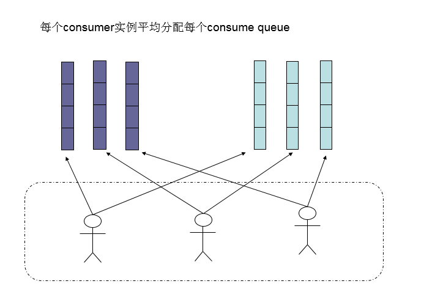

# RocketMQ中Topic、Tag如何正确使用

转载[ye17186](https://me.csdn.net/ye17186) 最后发布于2019-04-28 16:23:57 阅读数 4060 收藏

展开

### 一、概念

1、Topic：消息主题，通过 Topic 对不同的业务消息进行分类。

2、Tag：消息标签，用来进一步区分某个 Topic 下的消息分类，消息队列 RocketMQ 允许消费者按照 Tag 对消息进行过滤，确保消费者最终只消费到他关注的消息类型。

Topic 与 Tag 都是业务上用来归类的标识，区分在于 Topic 是一级分类，而 Tag 可以说是二级分类，关系如图所示。

### 二、区分

您可能会有这样的疑问：到底什么时候该用 Topic，什么时候该用 Tag？

建议您从以下几个方面进行判断：

1、**消息类型是否一致：**如普通消息，事务消息，定时消息，顺序消息，不同的消息类型使用不同的 Topic，无法通过 Tag 进行区分。

2、**业务是否相关联：**没有直接关联的消息，如淘宝交易消息，京东物流消息使用不同的 Topic 进行区分；而同样是天猫交易消息，电器类订单、女装类订单、化妆品类订单的消息可以用 Tag 进行区分。

3、**消息优先级是否一致：**如同样是物流消息，盒马必须小时内送达，天猫超市 24 小时内送达，淘宝物流则相对会会慢一些，不同优先级的消息用不同的 Topic 进行区分。

**4、消息量级是否相当：**有些业务消息虽然量小但是实时性要求高，如果跟某些万亿量级的消息使用同一个 Topic，则有可能会因为过长的等待时间而『饿死』，此时需要将不同量级的消息进行拆分，使用不同的 Topic。

示例：

以天猫交易平台为例，订单消息，支付消息属于不同业务类型的消息，分别创建 Topic_Order 和 Topic_Pay，其中订单消息根据商品品类以不同的 Tag 再进行细分，如电器类、男装类、女装类、化妆品类，最后他们都被各个不同的系统所接收。

通过合理的使用 Topic 和 Tag，可以让业务结构清晰，更可以提高效率。

# Rocketmq原理&最佳实践

[彦帧](https://www.jianshu.com/u/1fa908ca39cd)关注

142018.08.05 15:48:44字数 3,451阅读 189,396

## 一、 MQ背景&选型

消息队列作为高并发系统的核心组件之一，能够帮助业务系统解构提升开发效率和系统稳定性。主要具有以下优势：

- 削峰填谷（主要解决瞬时写压力大于应用服务能力导致消息丢失、系统奔溃等问题）
- 系统解耦（解决不同重要程度、不同能力级别系统之间依赖导致一死全死）
- 提升性能（当存在一对多调用时，可以发一条消息给消息系统，让消息系统通知相关系统）
- 蓄流压测（线上有些链路不好压测，可以通过堆积一定量消息再放开来压测）

目前主流的MQ主要是Rocketmq、kafka、Rabbitmq，Rocketmq相比于Rabbitmq、kafka具有主要优势特性有：
• 支持事务型消息（消息发送和DB操作保持两方的最终一致性，rabbitmq和kafka不支持）
• 支持结合rocketmq的多个系统之间数据最终一致性（多方事务，二方事务是前提）
• 支持18个级别的延迟消息（rabbitmq和kafka不支持）
• 支持指定次数和时间间隔的失败消息重发（kafka不支持，rabbitmq需要手动确认）
• 支持consumer端tag过滤，减少不必要的网络传输（rabbitmq和kafka不支持）
• 支持重复消费（rabbitmq不支持，kafka支持）

Rocketmq、kafka、Rabbitmq的详细对比，请参照下表格：

image.png

# 二、RocketMQ集群概述

### 1. RocketMQ集群部署结构

image.png

#### 1) Name Server

Name Server是一个几乎无状态节点，可集群部署，节点之间无任何信息同步。

#### 2) Broker

Broker部署相对复杂，Broker分为Master与Slave，一个Master可以对应多个Slave，但是一个Slave只能对应一个Master，Master与Slave的对应关系通过指定相同的Broker Name，不同的Broker Id来定义，BrokerId为0表示Master，非0表示Slave。Master也可以部署多个。

每个Broker与Name Server集群中的所有节点建立长连接，定时(每隔30s)注册Topic信息到所有Name Server。Name Server定时(每隔10s)扫描所有存活broker的连接，如果Name Server超过2分钟没有收到心跳，则Name Server断开与Broker的连接。

#### 3) Producer

Producer与Name Server集群中的其中一个节点(随机选择)建立长连接，定期从Name Server取Topic路由信息，并向提供Topic服务的Master建立长连接，且定时向Master发送心跳。Producer完全无状态，可集群部署。

Producer每隔30s（由ClientConfig的pollNameServerInterval）从Name server获取所有topic队列的最新情况，这意味着如果Broker不可用，Producer最多30s能够感知，在此期间内发往Broker的所有消息都会失败。

Producer每隔30s（由ClientConfig中heartbeatBrokerInterval决定）向所有关联的broker发送心跳，Broker每隔10s中扫描所有存活的连接，如果Broker在2分钟内没有收到心跳数据，则关闭与Producer的连接。

#### 4) Consumer

Consumer与Name Server集群中的其中一个节点(随机选择)建立长连接，定期从Name Server取Topic路由信息，并向提供Topic服务的Master、Slave建立长连接，且定时向Master、Slave发送心跳。Consumer既可以从Master订阅消息，也可以从Slave订阅消息，订阅规则由Broker配置决定。

Consumer每隔30s从Name server获取topic的最新队列情况，这意味着Broker不可用时，Consumer最多最需要30s才能感知。

Consumer每隔30s（由ClientConfig中heartbeatBrokerInterval决定）向所有关联的broker发送心跳，Broker每隔10s扫描所有存活的连接，若某个连接2分钟内没有发送心跳数据，则关闭连接；并向该Consumer Group的所有Consumer发出通知，Group内的Consumer重新分配队列，然后继续消费。

当Consumer得到master宕机通知后，转向slave消费，slave不能保证master的消息100%都同步过来了，因此会有少量的消息丢失。但是一旦master恢复，未同步过去的消息会被最终消费掉。

消费者对列是消费者连接之后（或者之前有连接过）才创建的。我们将原生的消费者标识由 {IP}@{消费者group}扩展为 {IP}@{消费者group}{topic}{tag}，（例如[xxx.xxx.xxx.xxx@mqtest_producer-group_2m2sTest_tag-zyk](http://xxx.xxx.xxx.xxx@mqtest_producer-group_2m2stest_tag-zyk/)）。任何一个元素不同，都认为是不同的消费端，每个消费端会拥有一份自己消费对列（默认是broker对列数量*broker数量）。新挂载的消费者对列中拥有commitlog中的所有数据。

[如果有需要，可以查看Rocketmq更多源码解析](https://segmentfault.com/a/1190000009797968)

## 三、 Rocketmq如何支持分布式事务消息

#### 场景

A（存在DB操作）、B（存在DB操作）两方需要保证分布式事务一致性，通过引入中间层MQ，A和MQ保持事务一致性（异常情况下通过MQ反查A接口实现check），B和MQ保证事务一致（通过重试），从而达到最终事务一致性。

**原理：大事务 = 小事务 + 异步**

#### 1. MQ与DB一致性原理（两方事务）

**流程图**

image.png

上图是RocketMQ提供的保证MQ消息、DB事务一致性的方案。

MQ消息、DB操作一致性方案：

1)发送消息到MQ服务器，此时消息状态为SEND_OK。此消息为consumer不可见。

2)执行DB操作；DB执行成功Commit DB操作，DB执行失败Rollback DB操作。

3)如果DB执行成功，回复MQ服务器，将状态为COMMIT_MESSAGE；如果DB执行失败，回复MQ服务器，将状态改为ROLLBACK_MESSAGE。注意此过程有可能失败。

4)MQ内部提供一个名为“事务状态服务”的服务，此服务会检查事务消息的状态，如果发现消息未COMMIT，则通过Producer启动时注册的TransactionCheckListener来回调业务系统，业务系统在checkLocalTransactionState方法中检查DB事务状态，如果成功，则回复COMMIT_MESSAGE，否则回复ROLLBACK_MESSAGE。

说明：

上面以DB为例，其实此处可以是任何业务或者数据源。

以上SEND_OK、COMMIT_MESSAGE、ROLLBACK_MESSAGE均是client jar提供的状态，在MQ服务器内部是一个数字。

TransactionCheckListener 是在消息的commit或者rollback消息丢失的情况下才会回调（上图中灰色部分）。这种消息丢失只存在于断网或者rocketmq集群挂了的情况下。当rocketmq集群挂了，如果采用异步刷盘，存在1s内数据丢失风险，异步刷盘场景下保障事务没有意义。所以如果要核心业务用Rocketmq解决分布式事务问题，建议选择同步刷盘模式。

#### 2. 多系统之间数据一致性（多方事务）

image.png

当需要保证多方（超过2方）的分布式一致性，上面的两方事务一致性（通过Rocketmq的事务性消息解决）已经无法支持。这个时候需要引入TCC模式思想（Try-Confirm-Cancel，不清楚的自行百度）。

以上图交易系统为例：

1）交易系统创建订单（往DB插入一条记录），同时发送订单创建消息。通过RocketMq事务性消息保证一致性

2）接着执行完成订单所需的同步核心RPC服务（非核心的系统通过监听MQ消息自行处理，处理结果不会影响交易状态）。执行成功更改订单状态，同时发送MQ消息。

3）交易系统接受自己发送的订单创建消息，通过定时调度系统创建延时回滚任务（或者使用RocketMq的重试功能，设置第二次发送时间为定时任务的延迟创建时间。在非消息堵塞的情况下，消息第一次到达延迟为1ms左右，这时可能RPC还未执行完，订单状态还未设置为完成，第二次消费时间可以指定）。延迟任务先通过查询订单状态判断订单是否完成，完成则不创建回滚任务，否则创建。 PS：多个RPC可以创建一个回滚任务，通过一个消费组接受一次消息就可以；也可以通过创建多个消费组，一个消息消费多次，每次消费创建一个RPC的回滚任务。 回滚任务失败，通过MQ的重发来重试。

以上是交易系统和其他系统之间保持最终一致性的解决方案。

#### 3.案例分析

##### 1) 单机环境下的事务示意图

**如下为A给B转账的例子。**

| 步骤 | 动作               |
| ---- | ------------------ |
| 1    | 锁定A的账户        |
| 2    | 锁定B的账户        |
| 3    | 检查A账户是否有1元 |
| 4    | A的账户扣减1元     |
| 5    | 给B的账户加1元     |
| 6    | 解锁B的账户        |
| 7    | 解锁A的账户        |

**以上过程在代码层面甚至可以简化到在一个事物中执行两条sql语句。**

##### 2) 分布式环境下事务

**和单机事务不同，A、B账户可能不在同一个DB中，此时无法像在单机情况下使用事物来实现。此时可以通过一下方式实现，将转账操作分成两个操作。**

a) A账户

| 步骤 | 动作               |
| ---- | ------------------ |
| 1    | 锁定A的账户        |
| 2    | 检查A账户是否有1元 |
| 3    | A的账户扣减1元     |
| 4    | 解锁A的账户        |

b) MQ消息
A账户数据发生变化时，发送MQ消息，MQ服务器将消息推送给转账系统，转账系统来给B账号加钱。

c) B账户

| 步骤 | 动作           |
| ---- | -------------- |
| 1    | 锁定B的账户    |
| 2    | 给B的账户加1元 |
| 3    | 解锁B的账户    |

## 四、 顺序消息

### 1. 顺序消息缺陷

发送顺序消息无法利用集群Fail Over特性消费顺序消息的并行度依赖于队列数量队列热点问题，个别队列由于哈希不均导致消息过多，消费速度跟不上，产生消息堆积问题遇到消息失败的消息，无法跳过，当前队列消费暂停。

### 2. 原理

produce在发送消息的时候，把消息发到同一个队列（queue）中,消费者注册消息监听器为MessageListenerOrderly，这样就可以保证消费端只有一个线程去消费消息。

注意：把消息发到同一个队列（queue），不是同一个topic，默认情况下一个topic包括4个queue

### 3. 扩展

可以通过实现发送消息的对列选择器方法，实现部分顺序消息。

举例：比如一个数据库通过MQ来同步，只需要保证每个表的数据是同步的就可以。解析binlog，将表名作为对列选择器的参数，这样就可以保证每个表的数据到同一个对列里面，从而保证表数据的顺序消费

## 五、 最佳实践

### 1. Producer

#### 1) Topic

一个应用尽可能用一个Topic，消息子类型用tags来标识，tags可以由应用自由设置。只有发送消息设置了tags，消费方在订阅消息时，才可以利用tags 在broker做消息过滤。

#### 2) key

每个消息在业务层面的唯一标识码，要设置到 keys 字段，方便将来定位消息丢失问题。服务器会为每个消息创建索引(哈希索引)，应用可以通过 topic，key来查询这条消息内容，以及消息被谁消费。由于是哈希索引，请务必保证key 尽可能唯一，这样可以避免潜在的哈希冲突。

//订单Id

String orderId= "20034568923546";

message.setKeys(orderId);

#### 3) 日志

消息发送成功或者失败，要打印消息日志，务必要打印 send result 和key 字段。

#### 4) send

send消息方法，只要不抛异常，就代表发送成功。但是发送成功会有多个状态，在sendResult里定义。

SEND_OK：消息发送成功

FLUSH_DISK_TIMEOUT：消息发送成功，但是服务器刷盘超时，消息已经进入服务器队列，只有此时服务器宕机，消息才会丢失

FLUSH_SLAVE_TIMEOUT：消息发送成功，但是服务器同步到Slave时超时，消息已经进入服务器队列，只有此时服务器宕机，消息才会丢失

SLAVE_NOT_AVAILABLE：消息发送成功，但是此时slave不可用，消息已经进入服务器队列，只有此时服务器宕机，消息才会丢失

### 2. Consumer

#### 1) 幂等

RocketMQ使用的消息原语是At Least Once，所以consumer可能多次收到同一个消息，此时务必做好幂等。

#### 2) 日志

消费时记录日志，以便后续定位问题。

#### 3) 批量消费

尽量使用批量方式消费方式，可以很大程度上提高消费吞吐量。

所有的消费均是客户端发起Pull请求的，告诉消息的offset位置，broker去查询并返回。但是有一点需要非常明确的是，消息消费后，消息其实**并没有**物理地被清除，这是一个非常特殊的设计。本文来探索此设计的一些细节。

## 消费完后的消息去哪里了？

消息的存储是一直存在于CommitLog中的，由于CommitLog是以文件为单位（而非消息）存在的，而且CommitLog的设计是只允许顺序写，且每个消息大小不定长，所以这决定了消息文件几乎不可能按照消息为单位删除（否则性能会极具下降，逻辑也非常复杂）。

所以消息被消费了，消息所占据的物理空间也不会立刻被回收。但消息既然一直没有删除，那RocketMQ怎么知道应该投递过的消息就不再投递？——答案是客户端自身维护——客户端拉取完消息之后，在响应体中，broker会返回下一次应该拉取的位置，PushConsumer通过这一个位置，更新自己下一次的pull请求。这样就保证了正常情况下，消息只会被投递一次。

## 什么时候清理物理消息文件？

那消息文件到底删不删，什么时候删？

消息存储在CommitLog之后，的确是会被清理的，但是这个清理只会在以下任一条件成立才会批量删除消息文件（CommitLog）：

1. 消息文件过期（默认72小时），且到达清理时点（默认是凌晨4点），删除过期文件。
2. 消息文件过期（默认72小时），且磁盘空间达到了水位线（默认75%），删除过期文件。
3. 磁盘已经达到必须释放的上限（85%水位线）的时候，则开始批量清理文件（无论是否过期），直到空间充足。

注：若磁盘空间达到危险水位线（默认90%），出于保护自身的目的，broker会拒绝写入服务。

## 这样设计带来的好处

消息的物理文件一直存在，消费逻辑只是听客户端的决定而搜索出对应消息进行，这样做，笔者认为，有以下几个好处：

1. 一个消息很可能需要被N个消费组（设计上很可能就是系统）消费，但消息只需要存储一份，消费进度单独记录即可。这给强大的消息堆积能力提供了很好的支持——一个消息无需复制N份，就可服务N个消费组。
2. 由于消费从哪里消费的决定权一直都是客户端决定，所以只要消息还在，就可以消费到，这使得RocketMQ可以支持其他传统消息中间件不支持的回溯消费。即我可以通过设置消费进度回溯，就可以让我的消费组重新像放快照一样消费历史消息；或者我需要另一个系统也复制历史的数据，只需要另起一个消费组从头消费即可（前提是消息文件还存在）。
3. 消息索引服务。只要消息还存在就能被搜索出来。所以可以依靠消息的索引搜索出消息的各种原信息，方便事后排查问题。

注：在消息清理的时候，由于消息文件默认是1GB，所以在清理的时候其实是在删除一个大文件操作，这对于IO的压力是非常大的，这时候如果有消息写入，写入的耗时会明显变高。这个现象可以在凌晨4点（默认删时间时点）后的附近观察得到。

RocketMQ官方建议Linux下文件系统改为Ext4，对于文件删除操作，相比Ext3有非常明显的提升。

https://github.com/apache/rocketmq-client-cpp

RocketMQ的数据存储及消息持久化

原创霁云HYY 最后发布于2020-01-22 09:39:04 阅读数 279  收藏
展开
RocketMQ分布式存储

RocketMQ作为一款消息中间件，必然少不了数据的存储，跟Kafka一样，RocketMQ也是采取的分布式存储，这样就不至于一个Broker宕机，就产生数据丢失的问题，那么RocketMQ是如何实现分布式存储的呢？

如果大家了解Kafka的话，就知道在Kafka中存在一个数据分片partition，每一个topic可以划分为多个partition，而每一个partition都只存放一部分的数据，这些partition分布在不同的Broker上，所有的partition加起来才是完整的数据，且partition在不同的Broker上都会存在副本，保证了Kafka的高可用。说了这么多Kafka，那么RocketMQ到底是怎么实现数据的分布式存储呢？

在RocketMQ的官网，可以找到下面这一段的描述：

MessageQueue：将Topic分为一个或多个子Topic。
这不就是RocketMQ中的“partition”吗，Broker，Topic和MessageQueue的关系如下图：

MessageQueue是RocketMQ中的数据分片，RocketMQ通过MessageQueue将Topic拆分为多个数据分片，在每个Broker机器上都存储了一部分数据。

既然知道了MessageQueue是分布式存储在Broker上，那么生产者是如何将产生的消息放入具体的MessageQueue中的呢？
生产者其实会从NameServer中获取到Topic的信息，RocketMQ在创建Topic的时候就需要制定MessageQueue，所以生产者进而就能获取到MessageQueue的信息，根据下图的策略就可以将数据分别写入到不同的MessageQueue中了，通过方法名就可以很直观的知道具体的选择方式，我就不再赘述了。

RocketMQ消息持久化

消息中间件除了写入消息和消费消息之外，也需要提供数据持久化的功能，一个典型的场景就是削峰，高峰期时大量的消息积压在MQ中，后期再慢慢消化。如果没有数据持久化的功能，第一内存有限，不一定能放得下那么多的消息数据，第二就是一旦MQ宕机，内存中的数据就会全部丢失。
所以Broker的数据存储实际上才是一个MQ最核心的环节。
那么RocketMQ是如何在持久化消息的同时，还保持如此大的吞吐量呢？

数据持久化的流程如上图所示。

1. 首先Broker接收到Producer的消息，会将消息顺序写入到CommitLog中，CommitLog日志文件中就存储了消息的信息，CommitLog是多个文件，每个文件最大1GB，写满了之后，会创建新的CommitLog文件，这里面的一个优化点就是消息是顺序写入 CommitLog中的，顺序写入不需要再进行寻址，比文件的随机写性能要高很多。
2. 消息写入的时候，并不是直接写入的磁盘中，而是先写入到了os cache中，写入内存的性能非常高，写入磁盘的话需要有IO的开销，会非常慢，而且这时写入的消息在消费时也可以直接从os cache中获取，同时加快消息消费的速度。
3. 写入了os cache中还不算已经持久化，因为消息还在内存中，不在磁盘上，这时会有os线程通过异步的方式将os cache中的消息写入到磁盘中，异步刷盘完成之后才算真正的数据持久化了（异步刷盘性能较高，如果需要保证消息不会丢失，还是要采取同步刷盘的策略）。

# RocketMQ——水平扩展及负载均衡详解

2016-12-19 MON 20:49

RocketMQ是一个分布式具有高度可扩展性的消息中间件。本文旨在探索在broker端，生产端，以及消费端是如何做到横向扩展以及负载均衡的。

## Broker端水平扩展

### Broker负载均衡

Broker是以group为单位提供服务。一个group里面分master和slave,master和slave存储的数据一样，slave从master同步数据（同步双写或异步复制看配置）。

通过nameserver暴露给客户端后，只是客户端关心（注册或发送）一个个的topic路由信息。路由信息中会细化为message queue的路由信息。而message queue会分布在不同的broker group。所以对于客户端来说，分布在不同broker group的message queue为成为一个服务集群，但客户端会把请求分摊到不同的queue。

而由于压力分摊到了不同的queue,不同的queue实际上分布在不同的Broker group，也就是说压力会分摊到不同的broker进程，这样消息的存储和转发均起到了负载均衡的作用。

Broker一旦需要横向扩展，只需要增加broker group，然后把对应的topic建上，客户端的message queue集合即会变大，这样对于broker的负载则由更多的broker group来进行分担。

并且由于每个group下面的topic的配置都是独立的，也就说可以让group1下面的那个topic的queue数量是4，其他group下的topic queue数量是2，这样group1则得到更大的负载。

### commit log

虽然每个topic下面有很多message queue，但是message queue本身并不存储消息。真正的消息存储会写在CommitLog的文件，message queue只是存储CommitLog中对应的位置信息，方便通过message queue找到对应存储在CommitLog的消息。

不同的topic，message queue都是写到相同的CommitLog 文件，也就是说CommitLog完全的顺序写。

具体如下图：

## Producer

Producer端，每个实例在发消息的时候，默认会轮询所有的message queue发送，以达到让消息平均落在不同的queue上。而由于queue可以散落在不同的broker，所以消息就发送到不同的broker下，如下图：

## Consumer负载均衡

### 集群模式

在集群消费模式下，每条消息只需要投递到订阅这个topic的Consumer Group下的一个实例即可。RocketMQ采用主动拉取的方式拉取并消费消息，在拉取的时候需要明确指定拉取哪一条message queue。

而每当实例的数量有变更，都会触发一次所有实例的负载均衡，这时候会按照queue的数量和实例的数量平均分配queue给每个实例。

默认的分配算法是AllocateMessageQueueAveragely，如下图：

还有另外一种平均的算法是AllocateMessageQueueAveragelyByCircle，也是平均分摊每一条queue，只是以环状轮流分queue的形式，如下图：

需要注意的是，集群模式下，queue都是只允许分配只一个实例，这是由于如果多个实例同时消费一个queue的消息，由于拉取哪些消息是consumer主动控制的，那样会导致同一个消息在不同的实例下被消费多次，所以算法上都是一个queue只分给一个consumer实例，一个consumer实例可以允许同时分到不同的queue。

通过增加consumer实例去分摊queue的消费，可以起到水平扩展的消费能力的作用。而有实例下线的时候，会重新触发负载均衡，这时候原来分配到的queue将分配到其他实例上继续消费。

但是如果consumer实例的数量比message queue的总数量还多的话，多出来的consumer实例将无法分到queue，也就无法消费到消息，也就无法起到分摊负载的作用了。所以需要控制让queue的总数量大于等于consumer的数量。

### 广播模式

由于广播模式下要求一条消息需要投递到一个消费组下面所有的消费者实例，所以也就没有消息被分摊消费的说法。

在实现上，其中一个不同就是在consumer分配queue的时候，会所有consumer都分到所有的queue。

