# [美团外卖广告智能算力的探索与实践](https://tech.meituan.com/2021/06/17/waimai-ai-advertisement.html)

## 1. 业务背景

目前，美团外卖日订单量已突破4000万，成为美团最为重要的业务之一。外卖广告服务也从最初的支撑单一业务线发展到现在的十余条业务线，服务整体承受的流量日益增长，所消耗的机器资源也达到了一定的规模。

在外卖场景下，流量呈现明显的双峰结构，即午餐和晚餐两个时段为流量波峰，其余时段流量较小。在这种流量特点下，外卖广告服务在高峰时段面临较大的性能压力，在非高峰时段存在大量算力冗余，从全局来看，机器算力分配效率低，流量价值仍然具有较大的挖掘空间。一方面，流量消耗的算力没有根据流量价值进行动态的分配，造成系统在高价值流量上算力分配不足，价值没有得到充分的挖掘，而在低价值流量上，却存在浪费大量算力的现象；另一方面，在非高峰时段，系统流量较低，导致系统的整体资源利用率偏低，限制了系统获取更高的业务收益。

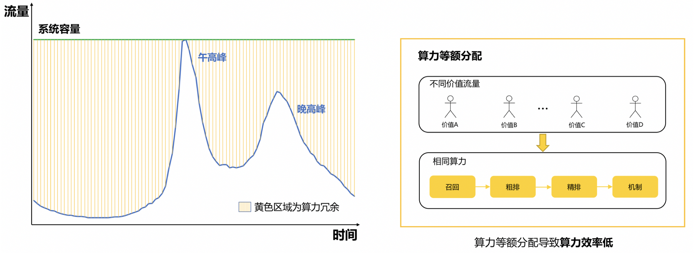

因此，算力需要进行更合理的分配来得到更加高效的利用。当前业界对于动态算力分配的研究较少，以阿里巴巴定向广告平台的DCAF[1]为代表，该方案根据流量价值进行差异化的算力分配，对不同价值的流量分配不同的候选队列长度，实现有限资源约束下的收益最大化。DCAF提供了一种优秀的解决方案，但该方案在外卖广告场景下存在一定的局限性。

针对外卖广告场景，外卖广告技术团队在DCAF方案的基础上进行了一系列探索和改进，首次进行了队列弹性分配和模型弹性分配相结合的尝试，并取得了不错的收益。一方面，在机器资源持平的情况下，CPM可以提升2.3%；另一方面，在业务收益持平的情况下，机器资源可以减少40%，最后我们在外卖列表广告精排阶段推全了机器资源持平的方案。

## 2. 整体思路

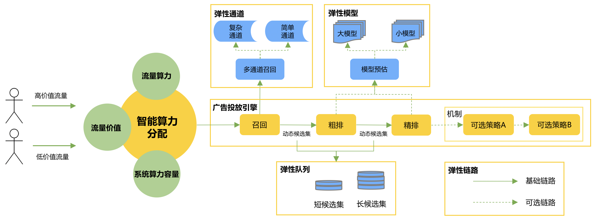

在外卖广告投放引擎中，为应对极大的在线流量压力和庞大的候选集，我们将整个检索过程设计成候选集依次递减的漏斗型级联架构，主要包含召回、粗排、精排、机制等模块。

实现智能算力的整体思路，是在系统算力容量约束下，对不同价值流量进行差异化算力分配，从而提高在广告检索过程中的算力分配效率，实现收益的最大化。智能算力主要包括以下四个要素：

**1. 流量价值量化**：流量价值指流量为平台、广告商家、用户三方带来的收益，系统需要具备量化流量价值的能力。

**2. 流量算力量化**：流量算力指流量在系统内消耗的机器资源，在外卖广告场景下，流量消耗的算力和候选集大小、召回通道数量、模型大小、链路复杂度等系统变量紧密相关，同样系统需要具备量化流量算力的能力。

**3. 系统算力容量量化**：系统算力容量指系统的机器资源总和，和流量算力量化的量纲一致，通常可以通过压测等手段获取系统的算力容量；在系统算力分配过程中，需要保证总体流量算力消耗不超过系统的算力容量。

**4. 智能算力分配**：基于以上三个要素，在广告投放引擎全链路进行智能算力分配，我们把算力分配的手段定义为“**弹性动作**”，在外卖广告场景下，我们主要归纳了以下四种动作： - **弹性队列**：线上检索是一个漏斗的过程，不同价值流量可以在级联漏斗的各模块中分配不同候选队列长度。 - **弹性模型**：在模型预估服务中，不同价值流量可以分配不同模型，大模型相对小模型预估效果更好的同时消耗的算力也更多。 - **弹性通道**：在多通道召回中，不同价值流量可以分配不同的召回通道。 - **弹性链路**：在检索链路上，不同价值流量可以分配不同复杂度的检索链路。

这些弹性动作的可选范围，定义为“**弹性档位**”，如队列长度100和200对应弹性队列的两个不同档位。**在智能算力下，算力的分配过程即弹性动作和弹性档位的智能决策过程**。

### 挑战分析

为了让智能算力在外卖广告场景下落地，我们主要面临着如下的挑战：

- 问题求解
  - **挑战点**：智能算力的目标是最优化算力资源分配，这就要求我们对“在系统算力约束下，最大化流量收益”这个问题进行求解。
  - **应对思路**：参考已有方案，将问题拆解为流量价值预估、流量算力预估以及算力分配三个子问题进行求解，并针对外卖广告场景进行探索和改进。
- 系统稳定性保障
  - **挑战点**：将系统算力分配托管给智能算力框架，从等额算力分配到智能算力分配，不仅需要保证智能算力框架本身的稳定性，更需要保证系统全链路的平稳运行。
  - **应对思路**：除了监控报警、熔断降级等常规保障手段，我们实现了基于系统状态的实时调控功能，保障系统稳定性。
- 通用性&扩展性
  - **挑战点**：兼顾基础能力的复用和个性化能力的扩展，支撑外卖广告推荐和搜索两大方向，多个业务场景的接入。
  - **应对思路**：核心组件以SDK形式提供可复用、可扩展能力，同时基于通用的价值评估指标、算力评估指标和智能算力框架，支撑多弹性动作的组合决策和多业务场景的高效接入。

## 3. 方案设计

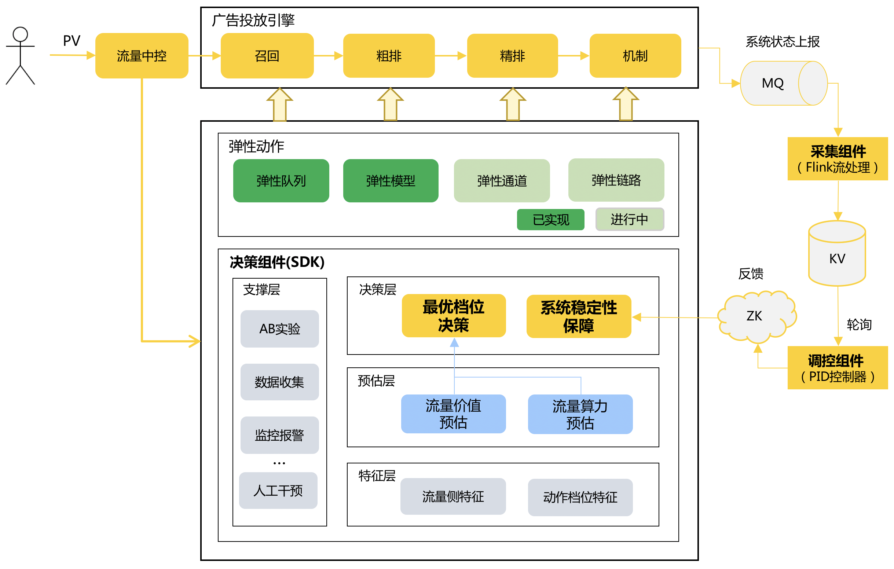

经过工程团队和算法团队深度Co-Design后，我们设计了一套多动作组合决策的智能算力框架。整个框架由决策组件、采集组件和调控组件组成，其中决策组件作为智能算力框架的核心，以SDK形式嵌入应用服务，提供可复用可扩展的多动作组合**最优档位决策能力**和**系统稳定性保障能力**，为广告投放引擎的各阶段赋能；采集组件和调控组件为系统稳定性保障提供支撑。下面主要对最优档位决策和系统稳定性保障两个模块进行详细介绍。

### 3.1 最优档位决策

在业内已有弹性队列求解方案的基础上，我们进行一系列探索和改进： - 通过选用更加通用的流量算力评估指标，同时增加流量算力预估模块，保证量化指标通用的同时提高精确度，解决**算力量化不通用和不精确**的问题。 - 通过构建特殊档位，首次尝试了**弹性队列和弹性模型的结合**，解决了**部分流量无法建模**的问题。

基于以上策略，我们实现了多弹性动作组合最优化档位决策。

#### 3.1.1 问题建模

**现有方案**

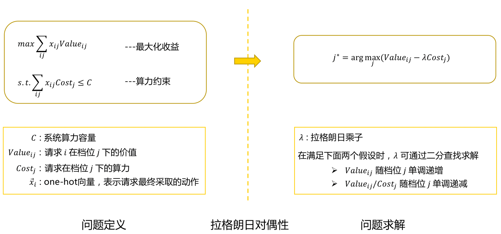

DCAF[1]将该问题转化为对应的对偶问题进行求解，得到决策公式，实现弹性队列分配。

**方案改进**

上述建模方案在外卖广告场景中存在以下问题：

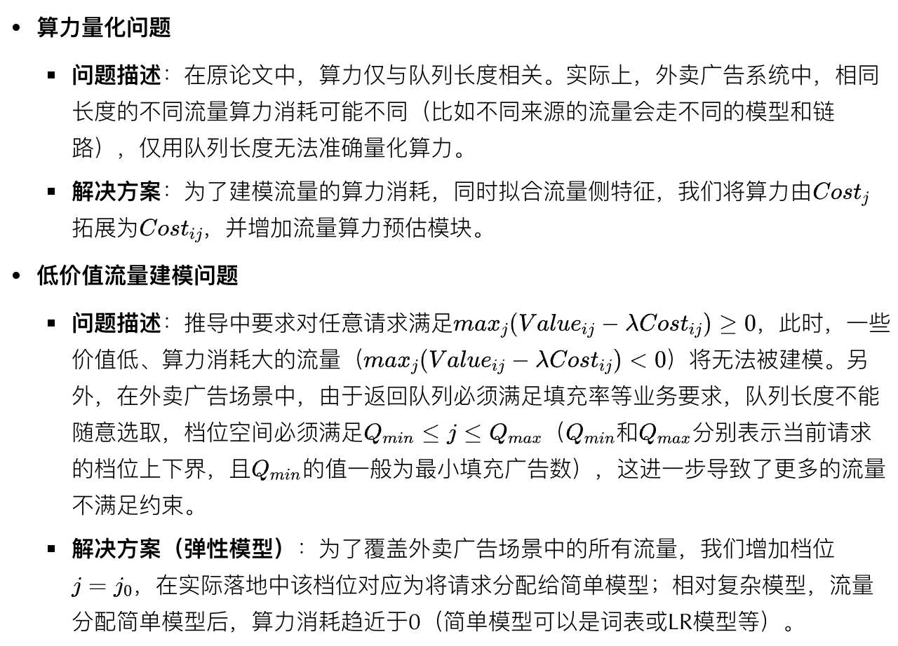

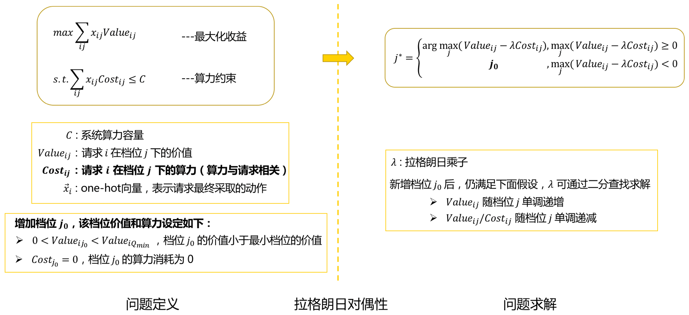

如图所示，由于档位j=j0j=j0的算力和价值已知，无需对不同模型的价值和算力进行预估，后续的流量价值预估和流量算力预估工作都面向弹性队列即可。

#### 3.1.2 决策框架

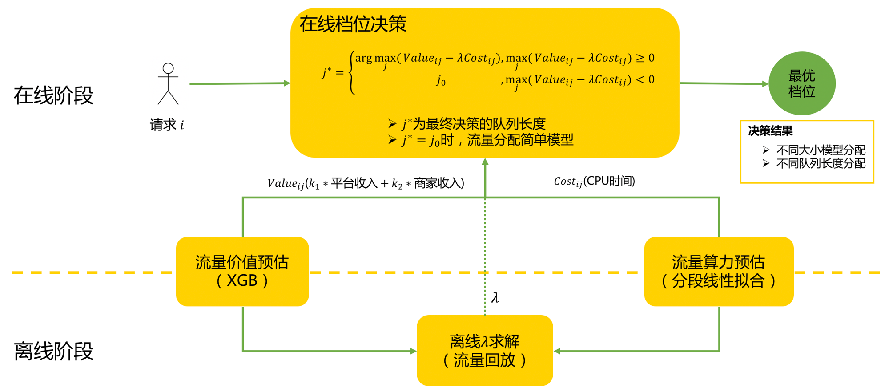

如图所示，最优档位决策模块分为离线和在线两个阶段，包含如下四个子模块： - **流量价值预估模块**（离线+在线）：预估流量在不同档位下的价值。 - **流量算力预估模块**（离线+在线）：预估流量在不同档位下的算力。 - **离线 λ 求解模块**（离线）：通过回放历史流量，利用二分查找算法求解最优 λ。 - **在线决策模块**（在线）：对线上流量，基于档位决策公式计算最优档位，并根据计算结果分配不同模型和队列长度。

#### 3.1.3 流量价值预估

流量价值预估是智能算力决策的核心，要求具备一定准确性。而线上进行模型预估会增加检索链路耗时，我们采用离线XGB模型预估+在线查找词表的方案，既保证了预估的准确性，又足够轻量。

**价值评估指标选取**：一般来说，流量价值指当前流量为广告平台带来的收入；在外卖广告场景中，我们关注平台收入的同时，也关注商家的收入，因此我们的流量预估的指标选定为k1∗平台收入+k2∗商家收入k1∗平台收入+k2∗商家收入。

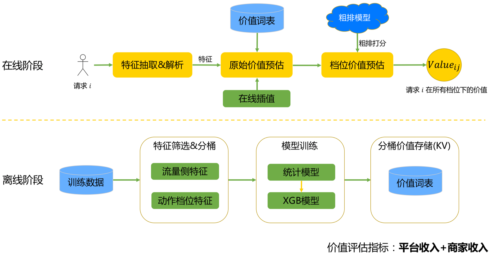

如图所示，流量价值预估模块包含离线和在线两个阶段。

**离线阶段**： - **特征筛选&分桶**：基于离线特征重要性分析和分布情况，进行特征筛选和分桶。 - **模型训练** - 主要问题：初期我们采用统计方案，在特征分桶较多的情况下，数据稀疏问题严重，且队列长度越大，数据越稀疏。 - 解决方案：采用XGB模型代替统计方案，增强泛化能力。 - **分桶价值存储**：不同特征分桶的价值预估结果以KV结构写入词表。

**在线阶段**： - **特征抽取&解析**：进行特征抽取、解析，按照离线分桶规则生成Key值。 - **原始价值预估**：根据Key值查找对应分桶的价值，然后通过线性插值计算原始队列长度下请求的价值。 - **档位价值预估**：如下图所示，借助粗排打分，通过计算不同档位下价值的衰减情况，实现不同档位的价值预估。

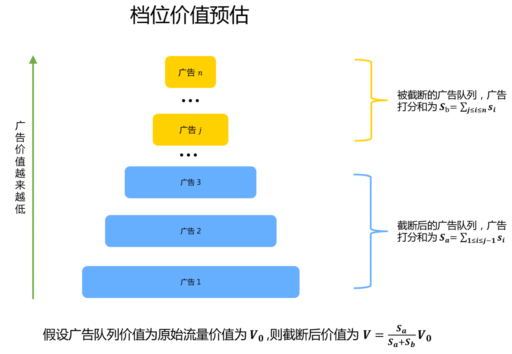

#### 3.1.4 流量算力预估

业内智能算力的落地以弹性队列为主，一般采用队列长度作为流量算力评估指标，而队列长度作为流量算力评估指标面临以下两个问题： - **通用性问题**：在弹性模型、弹性通道和弹性链路中流量算力消耗不由队列长度唯一确定，比如不同来源的流量可能走不同模型（不同模型算力消耗可能不同）。 - **精确度问题**：外卖广告场景下，即使对于弹性队列动作，流量算力消耗和队列长度也不是简单的线性关系。

**算力评估指标选取**：为了解决以上问题，我们采用流量消耗的CPU时间作为流量算力评估指标。

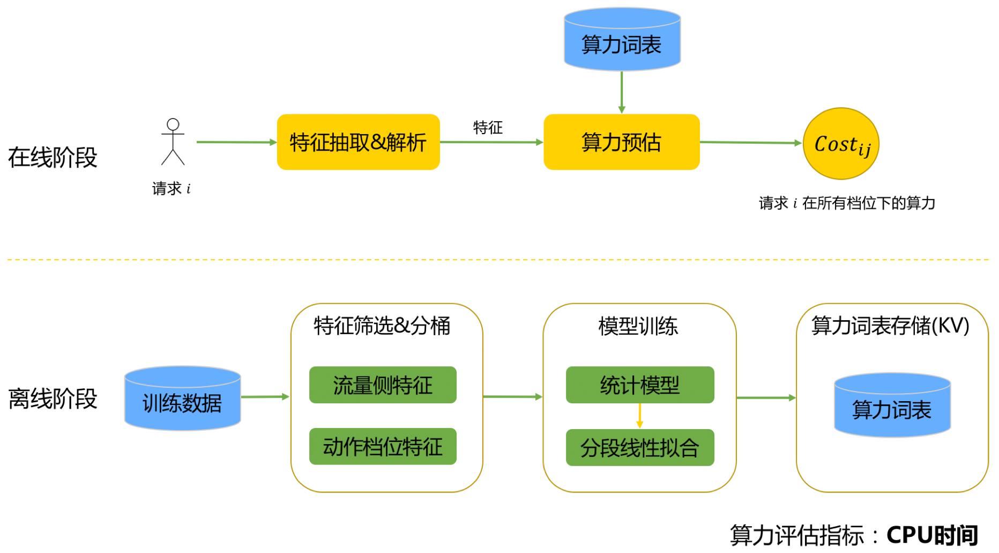

如图所示，流量算力预估包括离线和在线两个阶段。

**离线阶段**： - **特征筛选&分桶**：基于离线特征重要性分析和分布情况，进行特征筛选和分桶。 - **模型训练** - 训练过程：首先将样本划分到不同特征分桶中（同一分桶中队列长度不同，其他特征相同），然后分别对不同分桶拟合算力和队列长度的关系。 - 主要问题：由于数据分布不平均，队列长度大于一定阈值后，由于数据稀疏，分桶内算力统计值开始出现波动，不利于线上决策。 - 为了解决数据稀疏的问题，并拟合真实业务中的**拆包现象**，我们使用了**分段线性拟合**方案，将算力和队列长度之间的关系拟合为分段线性函数（下图是某个特征分桶内算力和队列长度关系拟合结果）。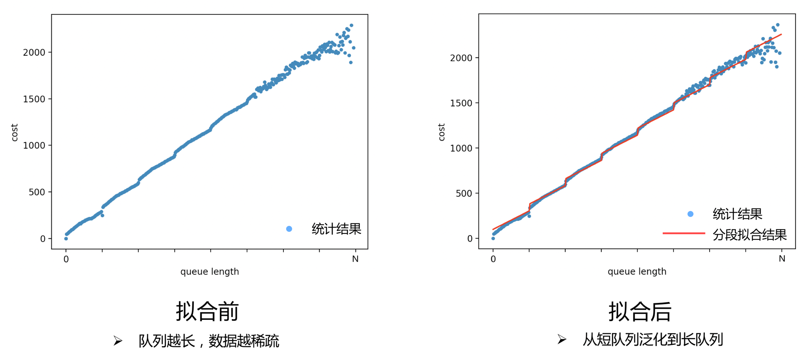- **算力词表存储**：不同特征分桶的算力预估结果以KV结构写入词表。

**在线阶段**： - **特征抽取&解析**：进行特征抽取、解析，按照离线分桶规则生成Key值。 - **算力预估**：根据Key值查找对应分桶的算力。

#### 3.1.5 档位决策

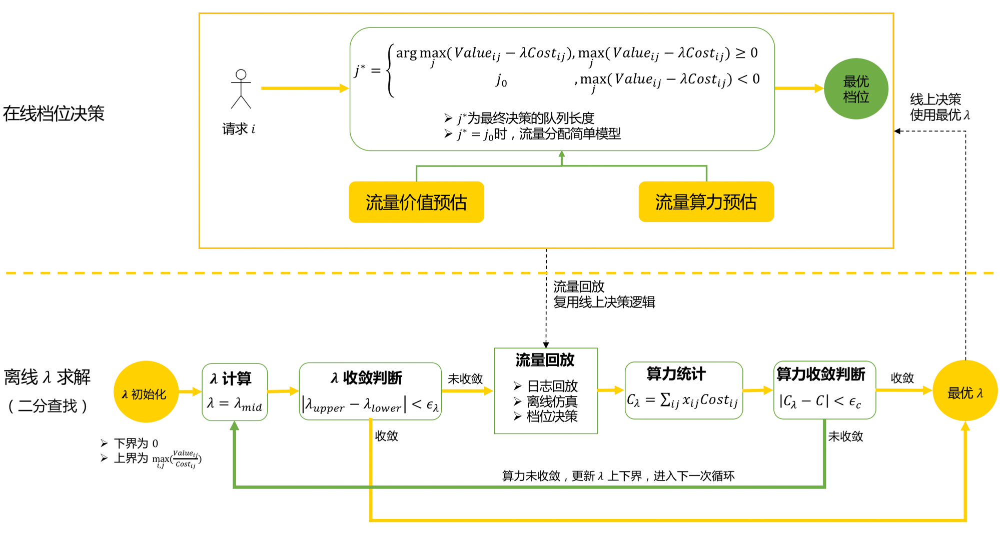

**1. 离线 λ 求解**

基于价值预估和算力预估模块，通过回放历史流量，利用二分查找算法求解最优 λ。

离线 λ 求解的核心步骤是流量回放：通过重放历史同时段流量，复用线上逻辑，为每个请求模拟决策当前 λ 下的最优档位。

**主要问题及解决方案**

- 问题描述：离线流量大，将流量划分为多个时间片后，λ 的求解过程需要进行多次流量回放，仿真复杂度高。
- 解决方案：通过流量采样、多个时间片并行化求解等方案，快速求解最优 λ。

**2. 在线档位决策**

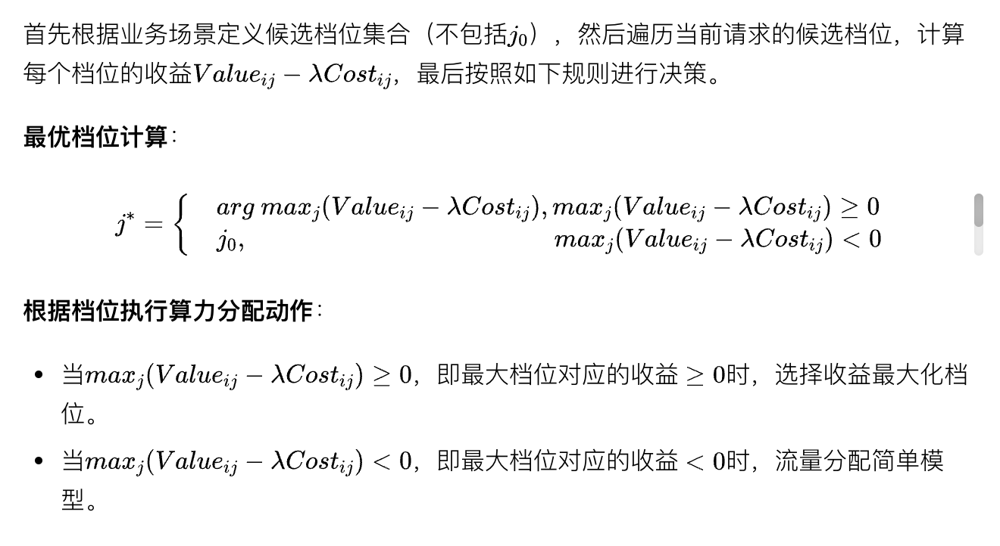

### 3.2 系统稳定性保障

在智能算力下，系统从等额算力分配转换成动态算力分配，为保障系统服务稳定性，我们提供了熔断降级等常规措施，还实现了基于系统状态的PID实时调控功能。

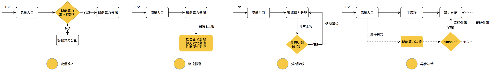

- **流量准入**：提供分广告位、城市、时段等不同流量准入规则，控制智能算力流量。
- **监控报警**：提供PV和系统整体两个维度的档位、性能、算力等变化监控和阈值报警。
- **熔断降级**：实时监控智能算力的异常，达到配置的异常阈值后，智能算力会自动熔断降级，进行等额算力分配。
- **异步决策**：为保障主流程整体链路耗时不增长，智能算力决策是一个异步的过程，超时后进行等额算力分配。

#### 3.2.2 基于系统状态的PID实时调控

PID（Proportion Integration Differentiation）是一个通过比例、积分、微分进行控制的主流控制算法，我们通过对系统状态的实时监控和变化感知，基于PID算法对系统状态进行实时调控，保证系统状态的稳定。

系统状态通常可以用系统的CPU/GPU利用率、QPS、RT（Avg、TP99、TP999等）、调用失败率（FailRate）等指标衡量。

**调控目标**

调控目标应该选取最能够快速反映出系统状态变化的指标，基于这个原则，我们选取了TP999、FailRate、CpuUtils作为调控目标。

**调控策略**

基于PID调控器，支持多种调控策略： - **调控动作档位**：对于弹性队列，可以调控队列长度的系数或者上限，从而调节候选队列长度。 - **调控决策公式**：可以通过调控决策公式的 λ 系数，从而调节系统整体的算力消耗。

**调控过程**

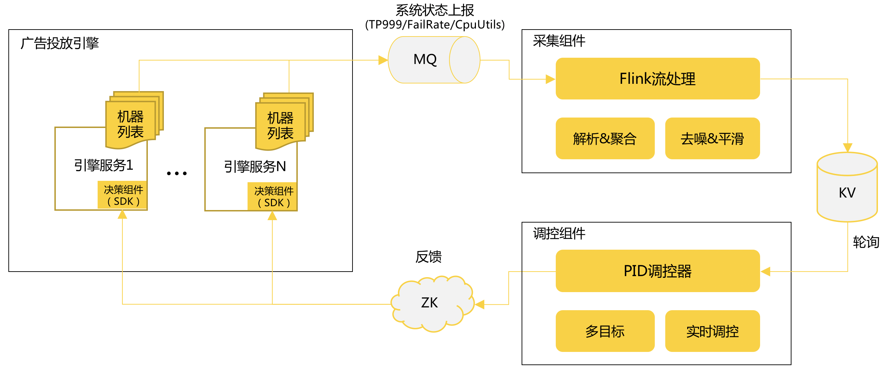

- **系统状态上报**：投放引擎服务通过监控系统，实时反馈系统当前状态，同步到MQ，其中核心指标具有10s的时效性。
- **采集组件**：基于Flink流处理框架，实时解析聚合系统状态数据，并进行去噪和平滑处理，处理后的数据写到KV存储。
- **调控组件**：基于PID算法，通过轮询感知系统状态变化，根据选择的调控目标，实时调控系统算力，将调控结果反馈到投放引擎的决策组件，形成调控闭环。

智能算力接入PID实时调控后，在系统负载偏高时，可以快速稳定有效的反馈调节，将系统性能保持在目标水位。

## 4. 实验

### 4.1 实验设置

- **系统算力容量的选取**：为了保证线上系统能根据实时流量快速调整，结合外卖的流量特点，我们选择15min作为最小的调控单元；实际场景中，我们选取过去多天内流量最大且性能稳定的高峰期时间片，并统计该时间片内消耗的总CPU时间作为系统算力容量C。
- **Baseline选取**：选取线上无智能算力的流量作为对照组。
- **流量价值预估**：选取最近多天流量作为训练数据，使用XGB模型进行预估并将结果写入词表。
- **流量算力预估**：选取最近多天流量作为训练数据，将算力随队列长度的变化拟合为分段线性函数，并将最终预估结果写入词表。
- **离线 λ 求解**：外卖场景中，同环比流量变化趋势基本一致，我们通过重放昨日流量，离线计算当日每个时间片内（15分钟为一个时间片）最优 λ 并存储为词表。
- **实验思路**：离线仿真时使用的系统算力容量C可控制线上算力的消耗，故而可通过调节离线求解使用的系统算力容量C实现机器资源持平或业务收益持平的实验。

### 4.2 实验一：机器资源持平，提高业务收益

|                                | CPM        | ROI    | CTR    | CVR    | 机器资源 |
| :----------------------------- | :--------- | :----- | :----- | :----- | :------- |
| **Baseline**（系统算力容量=C） | +0.00%     | +0.00% | +0.00% | +0.00% | +0.00%   |
| **智能算力**（系统算力容量=C） | **+2.36%** | -1.40% | +0.94% | +0.09% | +0.46%   |

**收益来源分析**

- 流量高峰时段，保证系统稳定的同时，通过差异化算力分配提升业务收益。
- 非流量高峰时段，提高系统资源利用率，将空闲机器资源转化为业务收益。

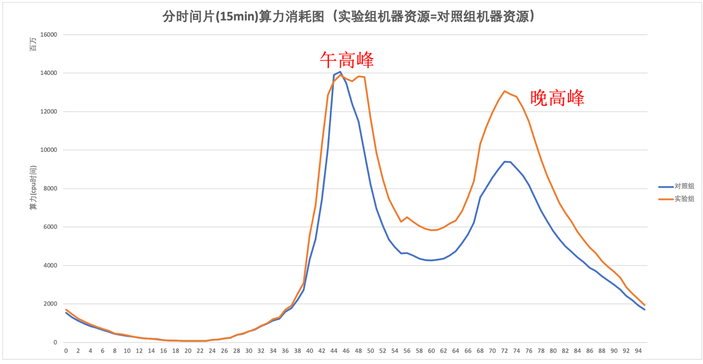

### 4.3 实验二：业务收益持平，减少机器资源

|                                      | CPM    | ROI    | CTR    | CVR    | 机器资源   |
| :----------------------------------- | :----- | :----- | :----- | :----- | :--------- |
| **Baseline**（系统算力容量=C）       | +0.00% | +0.00% | +0.00% | +0.00% | +0.00%     |
| **智能算力**（系统算力容量=60% * C） | +0.70% | -1.22% | +0.15% | +0.85% | **-40.8%** |

**收益来源分析**： - 通过压制午高峰和晚高峰算力消耗，达到减少机器资源的目标。从下图可以看出，在高峰时段，实验组的机器资源消耗约占对照组的60%。 - 同时，在高峰时段进行差异化算力分配，在非高峰时段提高资源利用率，填平整体业务收益。

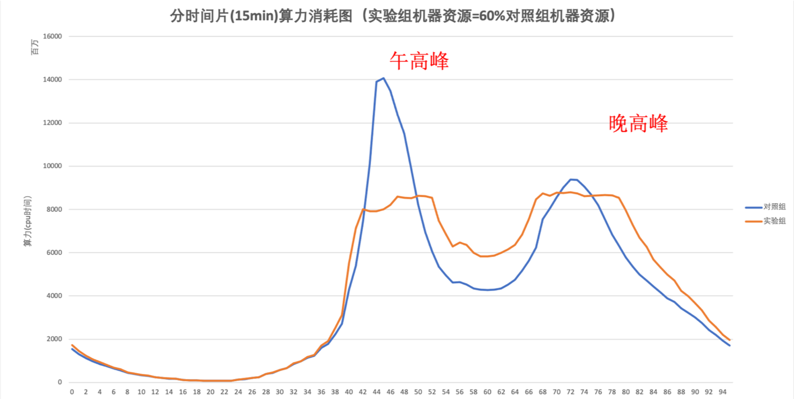

## 5. 总结与展望

这篇文章主要从最优档位决策和系统稳定性保障两个方面，介绍了智能算力在外卖广告从0到1建设过程中的思考和优化思路。

未来在算法策略上，我们将尝试基于进化算法和强化学习算法，对系统全链路组合下的算力最优分配问题进行建模和求解；在引擎架构上，对系统仿真能力、在线决策能力和稳定性保障能力进行持续优化，同时尝试和公司弹性伸缩系统相结合，发挥智能算力的更大价值。

## 6. 参考文献

[1] Jiang, B., Zhang, P., Chen, R., Luo, X., Yang, Y., Wang, G., … & Gai, K. (2020). DCAF: A Dynamic Computation Allocation Framework for Online Serving System. arXiv preprint arXiv:2006.09684.